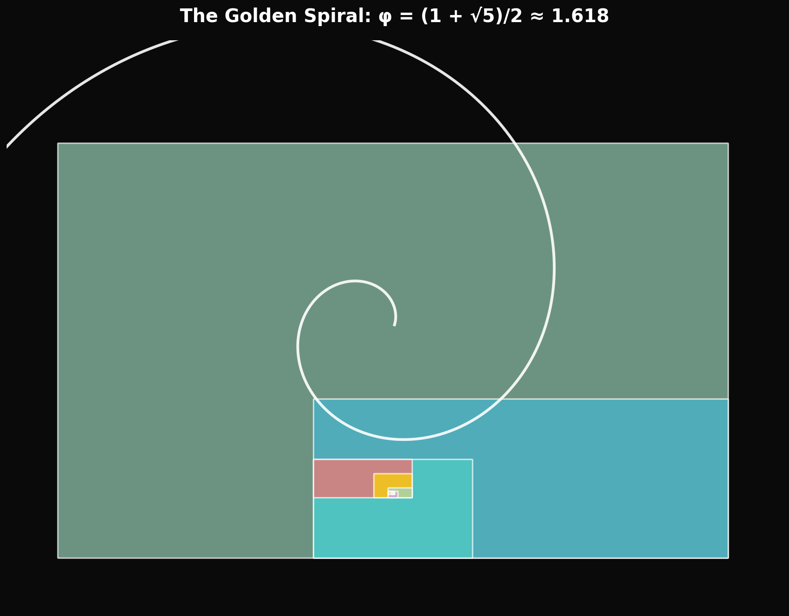
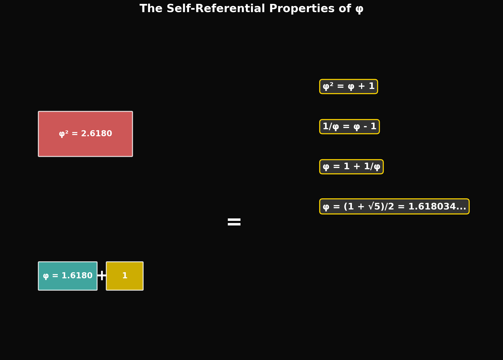
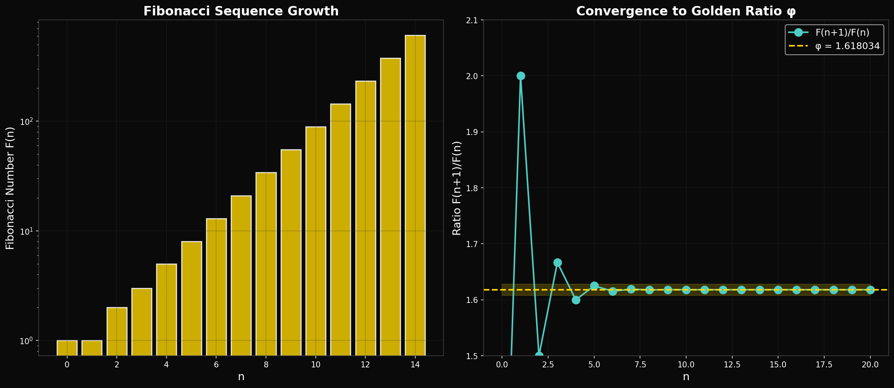

# Lesson 1: Foundations of φ-Mathematics
## *The Mathematical DNA of the Universe*

---

## Learning Objectives

By the end of this lesson, you will be able to:
1. Calculate the golden ratio φ and verify its unique self-referential properties
2. Identify φ-based patterns in natural systems and physical constants
3. Apply Fibonacci sequences to scaling problems
4. Understand why φ appears in optimization problems throughout nature

---

## The Golden Ratio: More Than a Number


*The golden rectangle and spiral - each subdivision maintains the φ ratio*

### Definition and Calculation

The golden ratio φ (phi) is defined as:

```
φ = (1 + √5) / 2 = 1.6180339887498948...
```

**Python Verification:**
```python
import numpy as np

# Calculate phi
phi = (1 + np.sqrt(5)) / 2
print(f"φ = {phi}")  # 1.6180339887498948

# Verify the self-referential property
print(f"φ² = {phi**2}")      # 2.618... = φ + 1
print(f"1/φ = {1/phi}")      # 0.618... = φ - 1
print(f"φ - 1 = {phi - 1}")  # Same as 1/φ!
```

### The Self-Referential Property


*The unique self-referential properties of the golden ratio*

φ is the ONLY positive number where:
- **φ² = φ + 1** (squaring it adds one)
- **1/φ = φ - 1** (its reciprocal subtracts one)

This creates an infinite cascade of relationships:

| Power | Expression | Value |
|-------|------------|-------|
| φ⁻² | 2 - φ | 0.382 |
| φ⁻¹ | φ - 1 | 0.618 |
| φ⁰ | 1 | 1.000 |
| φ¹ | φ | 1.618 |
| φ² | φ + 1 | 2.618 |
| φ³ | 2φ + 1 | 4.236 |
| φ⁴ | 3φ + 2 | 6.854 |

---

## The Fibonacci Connection

### The Sequence

The Fibonacci sequence begins: 0, 1, 1, 2, 3, 5, 8, 13, 21, 34, 55, 89, 144...

Each term is the sum of the two preceding terms:
```
F(n) = F(n-1) + F(n-2)
```

### Convergence to φ


*Fibonacci ratios F(n)/F(n-1) rapidly converge to φ = 1.618...*

The ratio of consecutive Fibonacci numbers converges to φ:

| F(n)/F(n-1) | Ratio |
|-------------|-------|
| 1/1 | 1.000 |
| 2/1 | 2.000 |
| 3/2 | 1.500 |
| 5/3 | 1.667 |
| 8/5 | 1.600 |
| 13/8 | 1.625 |
| 21/13 | 1.615 |
| 34/21 | 1.619 |
| 55/34 | 1.618 |
| 89/55 | 1.618 |

**Why this matters:** Any process that "remembers" its last two states and combines them will naturally evolve toward φ-based ratios.

---

## SpaceX Engineering Connection: Fibonacci in Structural Design

### The Problem: Stress Distribution in Rocket Structures

When a Falcon 9 booster lands, the landing legs must absorb massive impact forces. The stress waves propagate through the structure at the speed of sound in metal (~5,000 m/s). If these waves encounter abrupt impedance changes (sudden thickness variations), they concentrate at those points—causing failure.

### The φ-Based Solution: Parametric Cascade Elements

**Patent 63/995,649** proposes using Fibonacci-scaled structural elements:

```
L(n) = L₀ × φⁿ

Where:
  L₀ = base length unit
  n = cascade level (0, 1, 2, 3, ...)
```

At each φ-scaled junction, the acoustic impedance step is the same (because the ratio is always φ), so no single junction acts as a stress concentrator. The stress distributes across ALL junctions evenly.

**Calculation Exercise:**
```python
# Fibonacci cascade structural element
phi = 1.618

L0 = 0.01  # 1 cm base unit

for n in range(8):
    L_n = L0 * phi**n
    print(f"Level {n}: {L_n*100:.2f} cm")
```

Output:
```
Level 0: 1.00 cm
Level 1: 1.62 cm
Level 2: 2.62 cm
Level 3: 4.24 cm
Level 4: 6.85 cm
Level 5: 11.09 cm
Level 6: 17.94 cm
Level 7: 29.03 cm
```

---

## The Golden Angle: φ in Rotation

### Definition

The golden angle is:
```
θ_g = 360° / φ² = 137.5077...°
```

Or in radians:
```
θ_g = 2π / φ² = 2.39996... rad
```

### Why Plants Use It

Sunflowers, pinecones, and phyllotaxis (leaf arrangement) all use the golden angle. **Why?**

Because 137.5° is the most *irrational* angle—it never creates perfect overlaps at any rotation count. This means:
- Each new seed/leaf gets maximum exposure to light
- Each new element occupies a unique position in the spiral

### SpaceX Application: Reaction Wheel Gimbal Angles

Reaction wheels on spacecraft must be mounted at angles that prevent "gimbal lock" (where two axes align, losing a degree of freedom). The golden angle provides optimal axis separation because it never repeats at any harmonic.

---

## The Unity Equation: φ Partitions 1

### The Fundamental Identity

The Husmann Decomposition framework discovered that:

```
1/φ + 1/φ³ + 1/φ⁴ = 1.0000000000... (exact)
```

**Verification:**
```python
phi = (1 + np.sqrt(5)) / 2

term1 = 1/phi       # 0.6180339887498949
term2 = 1/phi**3    # 0.2360679774997897
term3 = 1/phi**4    # 0.1458980337503155

unity = term1 + term2 + term3
print(f"Sum = {unity}")  # 1.0000000000000000
```

### Physical Interpretation

This unity partition may explain the cosmic energy distribution:
- **1/φ ≈ 61.8%** → Dark energy (expansion)
- **1/φ³ ≈ 23.6%** → Dark matter (structure)
- **1/φ⁴ ≈ 14.6%** → Ordinary matter (what we see)

Compare to observed values:
- Dark energy: 68.3%
- Dark matter: 26.8%
- Ordinary matter: 4.9%

The match is suggestive. The discrepancy is a research question.

---

## Exercises

### Tier 1: Foundation (Must Do)

1. **Calculate φ³, φ⁴, and φ⁵.** Verify that each equals the sum of the previous two powers (like Fibonacci).

2. **The golden angle in degrees is 137.5077°.** Calculate how many rotations by this angle are needed before you return within 1° of the starting position. (Hint: this is related to Fibonacci numbers)

3. **Verify the unity equation** using a calculator or Python: 1/φ + 1/φ³ + 1/φ⁴ = 1

### Tier 2: Application (Should Do)

4. **Stress Wave Problem:** A stress wave travels through a Fibonacci-cascade beam with L₀ = 2 cm. If the wave speed is 5,000 m/s, how long does it take to traverse levels 0 through 5?

5. **Fibonacci Approximation:** Show that F(n)/F(n-1) differs from φ by approximately 1/(φ × F(n)²). Test for n = 10.

### Tier 3: Challenge (Want to Try?)

6. **The Binet Formula:** The n-th Fibonacci number can be calculated directly:
   ```
   F(n) = (φⁿ - ψⁿ) / √5

   Where ψ = (1 - √5) / 2 = -0.618...
   ```

   Implement this in Python and verify for n = 0 through 15. Why does this formula work when ψ is negative?

7. **Research Question:** The fine structure constant α ≈ 1/137. The Husmann framework proposes α = 1/(N × W) where N ≈ 294 brackets and W ≈ 0.467 is a wall fraction. Calculate 294 × 0.467 and compare to 137. What would need to be true for this to be more than coincidence?

---

## Summary

| Concept | Definition | Physical Significance |
|---------|------------|----------------------|
| φ (phi) | (1 + √5) / 2 = 1.618... | Self-referential ratio appearing throughout nature |
| φ² = φ + 1 | The defining property | Creates infinite scaling cascade |
| 1/φ = φ - 1 | Reciprocal property | Enables both scaling up AND down |
| Golden angle | 360°/φ² = 137.5° | Optimal non-repeating rotation |
| Fibonacci | F(n) = F(n-1) + F(n-2) | Natural process → φ convergence |
| Unity equation | 1/φ + 1/φ³ + 1/φ⁴ = 1 | Possible cosmic energy partition |

---

## Connection to Next Lesson

In **Lesson 2: The Unity Equation**, we will:
- Explore the three-source model (DE, DM, M)
- Understand the "breathing" cycle of the universe
- Calculate specific φ-partition predictions

---

*© 2026 Thomas A. Husmann / iBuilt LTD. All rights reserved.*
*Licensed under CC BY-NC-SA 4.0 for academic and research use.*
