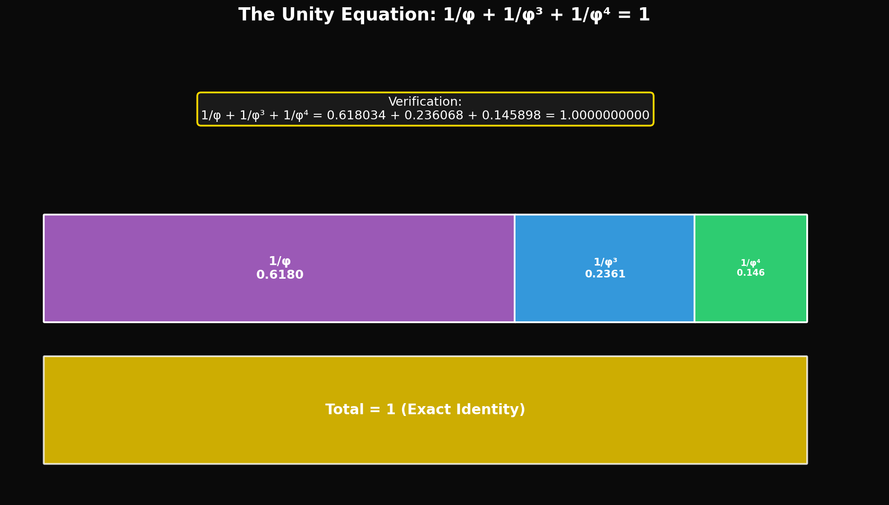
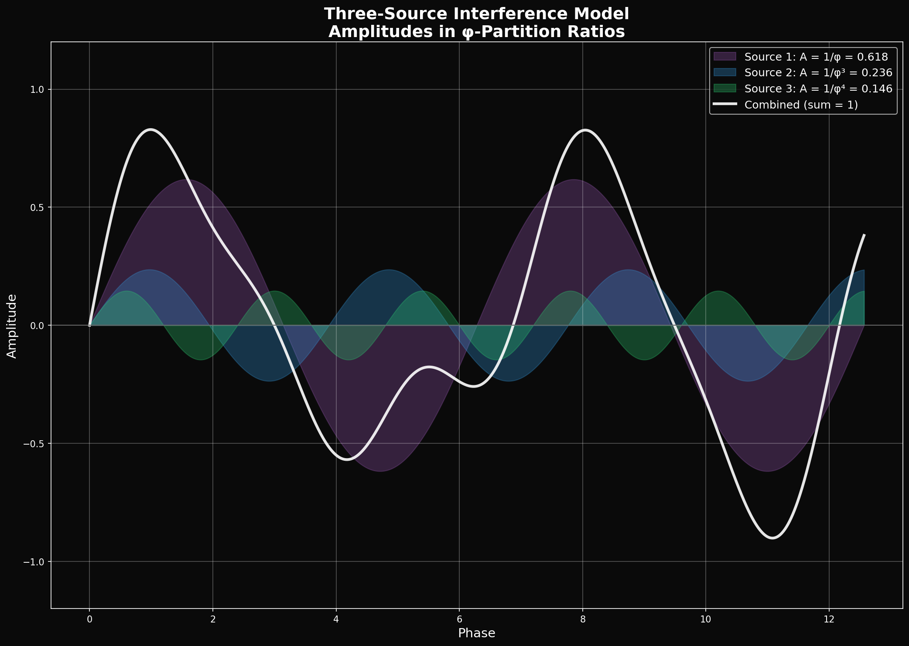
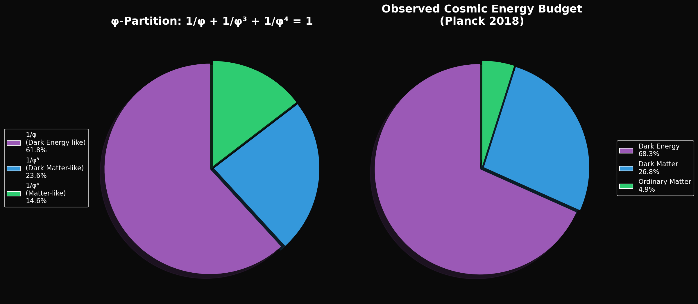

# Lesson 2: The Unity Equation
## *How Three Forces Create One Universe*

---

## Learning Objectives

By the end of this lesson, you will be able to:
1. State the Unity Equation and verify its mathematical exactness
2. Map the three φ-terms to physical cosmological components
3. Calculate the "breathing" cycle of universe expansion and contraction
4. Apply the three-source interference model to physical phenomena

---

## The Mathematical Foundation


*The Unity Equation: 1/φ + 1/φ³ + 1/φ⁴ = 1 exactly*

### The Exact Identity

The Husmann Decomposition framework is built on a single mathematical identity:

```
1/φ + 1/φ³ + 1/φ⁴ = 1
```

This is NOT an approximation. It is mathematically exact.

**Proof:**
```python
import sympy as sp

# Define phi symbolically
phi = (1 + sp.sqrt(5)) / 2

# Calculate the sum
term1 = 1/phi
term2 = 1/phi**3
term3 = 1/phi**4

total = sp.simplify(term1 + term2 + term3)
print(f"Sum = {total}")  # Output: 1
```

The simplification uses the identity φ² = φ + 1 recursively.

### Why This Matters

Any physical quantity that partitions into three components with these exact ratios may be fundamentally φ-structured. The observed cosmic energy density is remarkably close to this partition.

---

## The Three-Source Model


*Three waves with φ-ratio amplitudes combine to create structured patterns*

### Component Mapping

| φ-Term | Fraction | Proposed Physical Mapping |
|--------|----------|---------------------------|
| 1/φ | 0.6180 (61.8%) | **σ₁** — Dark Energy (cosmic expansion) |
| 1/φ³ | 0.2361 (23.6%) | **σ₃** — Dark Matter (structural binding) |
| 1/φ⁴ | 0.1459 (14.6%) | **σ₅** — Ordinary Matter (what we observe) |

### Comparison to Observation


*φ-partition prediction vs. observed cosmic energy distribution*

The ΛCDM (Lambda Cold Dark Matter) model gives observed fractions from cosmic microwave background measurements:

| Component | ΛCDM Observed | φ-Prediction | Difference |
|-----------|--------------|--------------|------------|
| Dark Energy | 68.3% | 61.8% | -6.5% |
| Dark Matter | 26.8% | 23.6% | -3.2% |
| Ordinary Matter | 4.9% | 14.6% | +9.7% |

**Critical Question:** Is the discrepancy:
1. Evidence against the framework?
2. A measurement that requires refinement?
3. An indication of additional physics (like the "observer embedding" factor)?

The framework proposes explanation (3): the five-to-three band folding during observation changes the apparent ratios.

---

## The Five-to-Three Collapse

### The Full Spectral Structure

In the AAH (Aubry-André-Harper) critical state, the energy spectrum has FIVE bands:

```
σ₁ : σ₂ : σ₃ : σ₄ : σ₅ = 1/φ : gap : 1/φ³ : gap : 1/φ⁴
```

The "gap" bands (σ₂ and σ₄) are fractal Cantor-set structures with zero measure—they exist mathematically but carry no weight.

### Upon Observation

When measured by an embedded observer (like us), the fractal bands collapse. The middle bands merge with adjacent bands, producing the observed THREE components:

```
Observed: DE, DM, M (three measurable components)
Underlying: σ₁, σ₂, σ₃, σ₄, σ₅ (five spectral bands)
```

This is analogous to how quantum superpositions collapse upon measurement—but applied to the entire cosmic structure.

---

## The Breathing Universe Cycle

### Conceptual Framework

The universe doesn't simply expand OR contract—it oscillates between states dominated by different σ-bands:

1. **INHALE (Contraction)**: Matter-dominated era
   - Gravity pulls structure together
   - Stars form, galaxies cluster
   - σ₅ (Matter) temporarily dominates locally

2. **EXHALE (Expansion)**: Energy-dominated era
   - Dark energy accelerates expansion
   - Structure disperses
   - σ₁ (Dark Energy) dominates globally

### The Breathing Period

The characteristic timescale for one "breath" spans approximately:

```
T_breath ≈ 293.92 brackets in φ-space

Where:
  1 bracket = log_φ(scale ratio)
  Full universe span ≈ 294 brackets from Planck to Hubble scale
```

**Calculation:**
```python
import numpy as np

# Planck length
L_Planck = 1.616e-35  # meters

# Hubble radius (observable universe)
L_Hubble = 8.8e26  # meters

phi = (1 + np.sqrt(5)) / 2

# Bracket count
N = np.log(L_Hubble / L_Planck) / np.log(phi)
print(f"Universe spans {N:.2f} brackets")  # ~293.92
```

---

## SpaceX Connection: Three-Source Thrust Vectoring

### The Engineering Analogy

A rocket in flight is controlled by three thrust sources:
1. **Main engines** (primary thrust)
2. **Cold gas thrusters** (attitude adjustment)
3. **Grid fins / Aerodynamic surfaces** (atmospheric control)

These three sources must interfere constructively to maintain stability.

### Falcon 9 Landing Example

During boostback and landing, Falcon 9 uses:
- 1 or 3 Merlin engines for primary deceleration
- Nitrogen cold-gas thrusters for attitude control
- Titanium grid fins for aerodynamic steering

The control system must continuously balance these three sources—analogous to the cosmic DE-DM-M balance.

**Real Engineering Challenge:** On December 2018, booster B1050 suffered a stalled grid fin hydraulic pump. The rocket compensated using only engines and thrusters—demonstrating the redundancy of the three-source system.

Source: [Falcon 9 first-stage landing tests - Wikipedia](https://en.wikipedia.org/wiki/Falcon_9_first-stage_landing_tests)

---

## Interference Patterns

### Constructive Interference

When the three sources align:
```
ψ_total = ψ_DE + ψ_DM + ψ_M

At constructive nodes:
  |ψ_total|² = maximum
  → Stable structures (galaxies, stars, planets)
```

### Destructive Interference

When sources cancel:
```
At destructive nodes:
  |ψ_total|² = minimum
  → Voids, cosmic web filaments
```

### The Cosmic Web

The large-scale structure of the universe (superclusters, filaments, voids) emerges from this three-source interference pattern. Matter collects at constructive interference nodes.

---

## Exercises

### Tier 1: Foundation (Must Do)

1. **Verify the Unity Equation:**
   Calculate 1/φ + 1/φ³ + 1/φ⁴ to 10 decimal places. Show your work.

2. **Ratio Calculation:**
   If the universe's total energy density is 1.0, and φ-partitioning is exact, what is the energy density of each component in units of the critical density ρ_c?

3. **Bracket Calculation:**
   If L₁ = 1 meter, what physical scale corresponds to:
   - 10 brackets up (larger)?
   - 10 brackets down (smaller)?

### Tier 2: Application (Should Do)

4. **Discrepancy Analysis:**
   The observed dark matter fraction is 26.8%, but φ-prediction gives 23.6%. Calculate the "folding factor" F such that:
   ```
   23.6% × F = 26.8%
   ```
   What physical mechanism might produce this factor?

5. **Cosmic Web Modeling:**
   If galaxies form at constructive interference maxima of a three-source wave pattern, and the sources have wavelengths in ratio 1 : 1/φ : 1/φ², at what spatial separations would you expect the strongest galaxy clustering?

### Tier 3: Challenge (Want to Try?)

6. **The Observer Embedding Problem:**
   If we (observers) are embedded IN the σ₅ band, we cannot directly measure σ₂ and σ₄. Design an indirect measurement that could detect their existence through their effect on σ₁, σ₃, or σ₅.

7. **Five-Band to Three-Band Folding:**
   Mathematically model how five bands with weights:
   ```
   w₁ = 1/φ, w₂ = ε₂, w₃ = 1/φ³, w₄ = ε₄, w₅ = 1/φ⁴
   ```
   (where ε₂, ε₄ are small "gap" weights) would fold into three observable bands if the gaps distribute their weight to adjacent bands. What values of ε₂ and ε₄ would produce the observed ΛCDM ratios?

---

## Key Equations Summary

| Equation | Meaning |
|----------|---------|
| 1/φ + 1/φ³ + 1/φ⁴ = 1 | Unity partition (exact) |
| φ² = φ + 1 | Self-reference identity |
| N ≈ 294 | Bracket count (Planck → Hubble) |
| Constructive: ψ_total = max | Structure formation sites |
| Destructive: ψ_total = min | Void formation sites |

---

## Connection to Next Lesson

In **Lesson 3: Bracket Space**, we will:
- Define the φ-based coordinate system for scale
- Calculate bracket positions for physical objects
- Understand the "wall" structure at bracket boundaries
- Derive the fine structure constant from bracket geometry

---

*© 2026 Thomas A. Husmann / iBuilt LTD. All rights reserved.*
*Licensed under CC BY-NC-SA 4.0 for academic and research use.*
