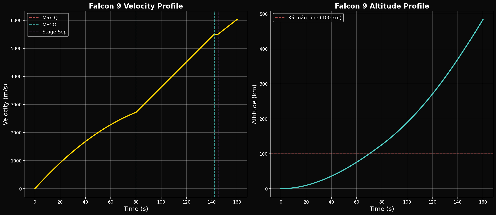
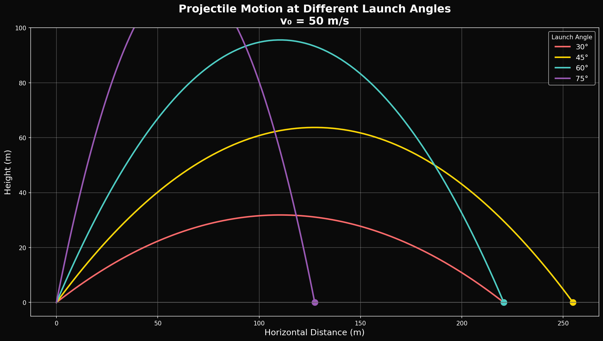

# Year 1, Unit 1: Measurement, Kinematics & Graphing
## *Reading the Language of Motion*

**Duration:** 15 Days
**Grade Level:** 10th Grade
**Prerequisites:** Algebra 1

---

## Anchoring Question

> *When SpaceX streams a Falcon 9 launch with a real-time velocity graph on screen, what is that graph actually telling us — and how do we read it?*


*Velocity and altitude profiles during a typical Falcon 9 launch*

---

## Learning Objectives

By the end of this unit, you will be able to:
1. Convert between SI units using dimensional analysis
2. Distinguish scalar vs. vector quantities; perform vector addition
3. Interpret and construct position-time and velocity-time graphs
4. Apply the four kinematic equations to constant-acceleration problems
5. Analyze projectile motion as two independent 1D motions
6. Connect bracket-space concepts to real-world scale analysis

---

## Day 1-2: SI Units and Measurement

### The Foundation of Physics

Physics begins with measurement. Without numbers, we have opinions. With measurements, we have science.

### The SI System

| Quantity | SI Unit | Symbol |
|----------|---------|--------|
| Length | meter | m |
| Mass | kilogram | kg |
| Time | second | s |
| Temperature | kelvin | K |
| Electric current | ampere | A |
| Amount of substance | mole | mol |
| Luminous intensity | candela | cd |

### SpaceX Hook: How Fast is a Falcon 9?

At Max-Q (maximum aerodynamic pressure), Falcon 9 travels approximately:
- **1,680 m/s** (meters per second)
- **6,048 km/h** (kilometers per hour)
- **3,760 mph** (miles per hour)
- **Mach 4.9** (4.9 times the speed of sound)

**Exercise:** Convert 1,680 m/s to km/h using dimensional analysis:
```
1,680 m/s × (1 km / 1000 m) × (3600 s / 1 hr) = 6,048 km/h
```

### Powers of Ten and Bracket Space

The universe spans enormous scales. Bracket space gives us a φ-based coordinate system:

| Object | Size | Bracket |
|--------|------|---------|
| Planck length | 1.6 × 10⁻³⁵ m | 0 |
| Proton | 10⁻¹⁵ m | ~96 |
| Atom | 10⁻¹⁰ m | ~119 |
| Human | 1.7 m | ~168 |
| Earth | 1.3 × 10⁷ m | ~200 |
| Hubble radius | 8.8 × 10²⁶ m | ~294 |

---

## Day 3-4: Vectors and Scalars

### Scalar Quantities

**Scalars** have magnitude only:
- Speed (50 m/s)
- Mass (549,054 kg — Falcon 9 liftoff mass)
- Temperature (3,500 K — Raptor combustion)
- Energy (7.6 MN of thrust)

### Vector Quantities

**Vectors** have magnitude AND direction:
- Velocity (1,680 m/s upward)
- Displacement (400 km above Earth)
- Force (7.6 MN at 0° from vertical)
- Acceleration (4.05 m/s² at liftoff)

### SpaceX Application: ISS Velocity

The ISS travels at 7.7 km/s — but relative to what?
- Relative to Earth's surface: 7.7 km/s
- Relative to the Sun: 7.7 + 30 = 37.7 km/s (depending on position)
- Relative to itself: 0 km/s

**Lesson:** Velocity is always relative. State your reference frame!

### Vector Addition

```
     ↑ v_vertical = 1,600 m/s
     |
     |---→ v_horizontal = 500 m/s

|v_total| = √(1600² + 500²) = √(2,560,000 + 250,000) = √2,810,000 = 1,676 m/s

θ = tan⁻¹(500/1600) = 17.4° from vertical
```

---

## Day 5-6: Motion Graphs

### Position-Time Graphs

The **slope** of a position-time graph equals velocity.

```
Position (m)
    |       /
    |      /
    |     /
    |    /
    |   /
    |  /
    | /
    |/_______________
           Time (s)

slope = Δx/Δt = velocity
```

### Velocity-Time Graphs

The **slope** of a velocity-time graph equals acceleration.
The **area** under a velocity-time graph equals displacement.

```
Velocity (m/s)
    |
    |___________
    |          |
    |          |
    |__________|___________
                    Time (s)

Area = v × t = displacement
```

### SpaceX Telemetry Reading

During a Falcon 9 launch, the on-screen display shows:
- **Velocity:** Increasing curve (acceleration)
- **Altitude:** Increasing more slowly at first (position)

At T+80s (Max-Q), the velocity graph shows approximately linear increase — meaning nearly constant acceleration as the rocket pushes through maximum air resistance.

---

## Day 7-8: Kinematic Equations

### The Four Equations

For constant acceleration:

| Equation | Variables | Use When Missing |
|----------|-----------|------------------|
| v = v₀ + at | v, v₀, a, t | Δx |
| Δx = v₀t + ½at² | Δx, v₀, a, t | v |
| v² = v₀² + 2aΔx | v, v₀, a, Δx | t |
| Δx = ½(v₀ + v)t | Δx, v₀, v, t | a |

### Derivation from v-t Graph

These equations aren't magical — they come from the geometry of a velocity-time graph:

```
v (m/s)
    |          ___→ v
    |        /|
    |      /  |
    |    /    |
    |  /      |
v₀ |/________|________
   0          t        Time (s)

Area under graph (trapezoid) = ½(v₀ + v)t = Δx
Height difference = at = v - v₀
```

### SpaceX Calculation: Falcon 9 Liftoff

**Given:**
- v₀ = 0 m/s (at rest on pad)
- a = 4.05 m/s² (initial acceleration)
- t = 80 s (time to Max-Q)

**Find:** Velocity and altitude at Max-Q

**Solution:**
```
v = v₀ + at = 0 + (4.05)(80) = 324 m/s

Wait — actual Max-Q velocity is ~1,680 m/s! What's wrong?
```

**The Answer:** Acceleration is NOT constant! As fuel burns, mass decreases, so acceleration increases throughout the flight. The real velocity-time curve is not linear — it's exponential.

This is why computational physics (numerical integration) is essential for real rocket trajectories.

---

## Day 9-10: Free Fall

### The Constant: g = 9.8 m/s²

Near Earth's surface, all objects fall with the same acceleration (ignoring air resistance):

```
g = 9.8 m/s² (downward)
```

### SpaceX Application: Booster Descent

After MECO (Main Engine Cut-Off), the Falcon 9 first stage falls freely until it reignites for landing burns.

**Thought Experiment:** If the booster reaches 68 km altitude moving upward at 2,100 m/s and then coasts (no thrust), how high will it go?

```
v² = v₀² + 2aΔx
0² = 2100² + 2(-9.8)Δx
Δx = 2100² / (2 × 9.8) = 4,410,000 / 19.6 = 225,000 m = 225 km

Maximum altitude = 68 + 225 = 293 km
```

**Reality Check:** This is simplified. The real booster:
- Experiences varying gravity (g decreases with altitude)
- Has atmospheric drag (minimal at 68+ km)
- Performs flip maneuvers
- Reignites engines for boostback burn

---

## Day 11-12: Projectile Motion


*Multiple launch angles showing range vs. maximum height trade-off*

### The Key Insight

Projectile motion is TWO independent motions:
- **Horizontal:** constant velocity (no acceleration in x)
- **Vertical:** constant acceleration (g downward)

```
Horizontal: x = v₀ₓt
Vertical:   y = v₀ᵧt - ½gt²
```

### Maximum Range

For a projectile launched at angle θ with initial speed v₀:

```
Range R = (v₀² sin 2θ) / g

Maximum range occurs at θ = 45°
```

### SpaceX Application: Starship Point-to-Point

Imagine Starship flying from New York to Shanghai (suborbital, not orbital):

**Question:** What launch angle maximizes range?

**Answer:** In vacuum, 45°. But with atmosphere, slightly less (about 40-43°) because:
- Higher trajectory spends more time in thin air
- Lower trajectory has more drag but shorter path

This is why real trajectory optimization requires computational simulation.

---

## Day 13: Misconceptions and φ-Preview

### Common Misconceptions

1. **"Heavier objects fall faster"** — No! All objects have the same g (in vacuum)
2. **"At the top of the arc, acceleration is zero"** — No! Acceleration is always g, even when v = 0
3. **"Objects need force to keep moving"** — No! Newton's First Law: objects maintain velocity without force

### The Golden Ratio in Motion

**Tier 3 Preview:** The Fibonacci sequence appears in many natural motions:

- Spiral galaxies follow logarithmic spirals (related to φ)
- Rabbit population growth follows Fibonacci
- Phyllotaxis (leaf arrangement) uses the golden angle

**Question:** Could kinematics itself have φ-structure? The Husmann framework proposes that all physical scales are organized by bracket space at φ-intervals.

---

## Day 14-15: Review and Assessment

### Unit 1 Summary

| Concept | Key Equation | SpaceX Connection |
|---------|--------------|-------------------|
| Units | Dimensional analysis | Launch telemetry conversion |
| Vectors | v = √(vₓ² + vᵧ²) | Thrust vectoring |
| v-t graphs | slope = a, area = Δx | Real-time launch displays |
| Kinematics | v² = v₀² + 2aΔx | Liftoff acceleration |
| Free fall | g = 9.8 m/s² | Booster descent |
| Projectile | x, y independent | Suborbital trajectories |

### Sample Exam Problem

**Problem:** A Falcon 9 accelerates from 0 to 1,680 m/s in 80 seconds.

a) What is the average acceleration?
b) How far has it traveled (assuming constant acceleration)?
c) Why is this calculation a simplification of reality?

**Solutions:**
```
a) a = Δv/Δt = 1680/80 = 21 m/s²

b) Δx = ½at² = ½(21)(80²) = 67,200 m = 67.2 km

c) Simplification because:
   - Acceleration is NOT constant (mass decreases as fuel burns)
   - Gravity decreases with altitude
   - Drag varies with speed and altitude
   - Thrust varies with atmospheric pressure
```

---

## Problem Sets

### Tier 1: Foundation (Must Do)

1. Convert 7,660 m/s (ISS orbital speed) to km/h and mph.

2. A velocity-time graph shows v = 0 at t = 0 and v = 20 m/s at t = 5 s (straight line). Calculate: (a) acceleration, (b) displacement.

3. An object is dropped from 100 m. How long until it hits the ground? What is its final velocity?

### Tier 2: Application (Should Do)

4. A Falcon 9 booster reaches 68 km altitude at 2,100 m/s upward. Calculate: (a) time until it stops, (b) maximum altitude, (c) total time in the air (ignoring engine burns).

5. A ball is thrown horizontally from a 45 m cliff at 15 m/s. Calculate: (a) time of flight, (b) horizontal distance, (c) impact velocity (magnitude and direction).

### Tier 3: Challenge (Want to Try?)

6. **Bracket Analysis:** The ISS orbits at 400 km altitude. Calculate its bracket position relative to Earth's surface. How many brackets does a Soyuz rocket cross during ascent?

7. **Variable Acceleration:** Write a Python script using Euler's method to simulate a rocket with variable mass:
   ```python
   # Given:
   # Initial mass: 549,054 kg
   # Mass flow rate: 2,507 kg/s
   # Thrust: 7,607,000 N
   # Duration: 162 s (first stage burn)
   # Calculate velocity and altitude every 0.1 seconds
   ```

---

## Resources

### SpaceX Technical Data
- [Falcon 9 User's Guide](https://www.spacex.com/media/falcon-users-guide-2021-09.pdf)
- [SpaceX Launch Statistics](https://www.spacex.com/launches/)

### Physics References
- OpenStax Physics, Chapters 2-4
- Khan Academy: One-Dimensional Motion

### Repository Tools
- `basic_trajectory.py` — Simple projectile simulation
- `phi_demo.py` — Golden ratio demonstration

---

## Connection to Unit 2

In **Unit 2: Forces & Newton's Laws**, we will:
- Explain WHY acceleration happens (forces)
- Draw free-body diagrams for rockets
- Calculate thrust, weight, and drag
- Understand why Falcon 9 needs active stabilization

---

*© 2026 Thomas A. Husmann / iBuilt LTD. All rights reserved.*
*Licensed under CC BY-NC-SA 4.0 for academic and research use.*
