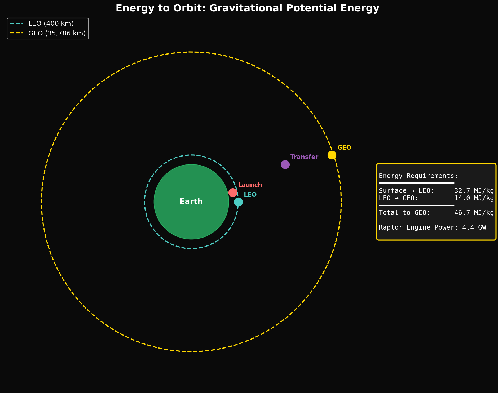

# Year 1, Unit 3: Work, Energy & Power
## *The Universal Currency of Physics*

**Duration:** 15 Days
**Grade Level:** 10th Grade
**Prerequisites:** Units 1-2 (Kinematics, Forces)

---

## Anchoring Question

> *It costs SpaceX about $2,700 per kilogram to put something in low Earth orbit. How much energy, in Joules, does it take to get 1 kg there — and why is that number so staggeringly large?*


*Energy required to reach various orbital altitudes*

---

## Learning Objectives

By the end of this unit, you will be able to:
1. Calculate work using W = Fd cos θ
2. Apply the work-energy theorem
3. Distinguish and calculate kinetic, gravitational PE, and elastic PE
4. Apply conservation of energy to real systems
5. Calculate power and efficiency in rocket systems

---

## Day 1-2: What is Work?

### The Physics Definition

**Work** is energy transferred by a force acting through a distance:

```
W = F × d × cos θ

Where:
  W = work (Joules)
  F = force (Newtons)
  d = displacement (meters)
  θ = angle between force and displacement
```

### Key Cases

| Scenario | cos θ | Work |
|----------|-------|------|
| Force parallel to motion (θ = 0°) | 1 | W = Fd (positive) |
| Force perpendicular (θ = 90°) | 0 | W = 0 |
| Force opposite to motion (θ = 180°) | -1 | W = -Fd (negative) |

### SpaceX Hook: Hovering Does No Work

A Falcon 9 performing a hover test (engines at 1g thrust, zero acceleration) does **no mechanical work** on itself!

Why? The rocket isn't moving (d = 0), so W = F × 0 = 0.

But wait — the engines are still burning fuel. Where does that energy go?
- Kinetic energy of exhaust gases
- Heat in the exhaust plume
- Sound waves (lots of them)

The rocket does work ON the exhaust, not on itself.

---

## Day 3-4: Kinetic Energy

### Definition

Kinetic energy is the energy of motion:

```
KE = ½mv²
```

### The Work-Energy Theorem

The net work done on an object equals its change in kinetic energy:

```
W_net = ΔKE = ½mv_f² - ½mv_i²
```

### SpaceX Calculation: ISS Kinetic Energy

The ISS has mass m = 420,000 kg and orbits at v = 7,660 m/s.

```
KE = ½ × 420,000 × (7,660)²
KE = ½ × 420,000 × 58,675,600
KE = 1.23 × 10¹³ J = 12.3 TJ (terajoules)
```

**Comparison:** This is equivalent to:
- 2.9 kilotons of TNT
- The annual electricity consumption of ~1,000 US homes
- 340,000 gallons of gasoline

---

## Day 5-6: Gravitational Potential Energy

### Definition

Gravitational PE is stored energy due to position in a gravitational field:

```
PE = mgh (near Earth's surface, h << R_Earth)

Or more generally:
PE = -GMm/r (at any distance from a massive body)
```

### Energy to Reach Orbit

To lift 1 kg to 400 km altitude:

```
PE = mgh = 1 × 9.8 × 400,000 = 3,920,000 J = 3.92 MJ
```

But that's only the PE change. The payload also needs orbital velocity:

```
KE = ½ × 1 × (7,660)² = 29.3 MJ
```

**Total energy per kg:** 3.92 + 29.3 = **33.2 MJ/kg**

At typical rocket efficiency (~40%), you need ~83 MJ of propellant energy per kg of payload.

---

## Day 7: Lab — Pendulum Energy

### Procedure

1. Measure pendulum length L and mass m
2. Release from height h
3. Measure velocity at bottom using photogate
4. Compare: mgh → ½mv²

### Conservation Check

```
PE_top = KE_bottom
mgh = ½mv²
gh = ½v²
v = √(2gh)
```

---

## Day 8-9: Conservation of Energy

### The Fundamental Principle

In a closed system with no non-conservative forces:

```
E_total = KE + PE = constant
```

### Escape Velocity

To escape Earth's gravity, a spacecraft needs enough KE to climb out of Earth's gravitational potential well:

```
At infinity: KE = 0, PE = 0 → E_total = 0

At Earth's surface:
½mv² - GMm/r = 0
v = √(2GM/r) = √(2 × 9.8 × 6,371,000) = 11,186 m/s ≈ 11.2 km/s
```

### SpaceX Application: Why Two Stages?

A single-stage rocket can't reach orbit because:
1. It must carry fuel to lift its own fuel
2. After burning fuel, it carries empty tanks (dead mass)

Two stages solve this by discarding empty mass mid-flight:
- Stage 1: Lifts everything to ~80 km, ~2,000 m/s
- Stage 2: Lighter vehicle completes to orbit

This is a direct consequence of energy conservation and the rocket equation.

---

## Day 10-11: Springs and Elastic PE

### Hooke's Law

```
F = -kx (spring force)

PE_elastic = ½kx²
```

### SpaceX Application: Vibration Isolation

Satellite payloads experience intense vibrations during launch. Isolation systems use springs and dampers to protect delicate instruments:

- Typical payload vibration: 5-100 Hz, up to 10g
- Isolation systems reduce transmitted force by 90%+

The spring constant k must be tuned so the natural frequency f = (1/2π)√(k/m) is below the launch vibration spectrum.

---

## Day 12-13: Power and Efficiency

### Power Definition

```
P = W/t = Energy/time (Watts = Joules/second)

Also: P = Fv (force × velocity)
```

### Raptor Engine Power

Each Raptor engine produces:
- Thrust: 2,300 kN (vacuum)
- Exhaust velocity: ~3,700 m/s

**Kinetic power in exhaust:**
```
P = ½ × (mass flow rate) × v²
  = ½ × 650 kg/s × (3,700)²
  = 4.4 × 10⁹ W = 4.4 GW per engine
```

**Compare:**
- Typical nuclear power plant: 1 GW
- Hoover Dam: 2 GW
- Three Raptor engines: 13 GW (more than 6 nuclear plants!)

### Efficiency

```
η = (useful energy out) / (total energy in) × 100%
```

Raptor efficiency (kinetic energy of exhaust / chemical energy of propellant):
- Theoretical max (Carnot): ~91%
- Actual: ~60-70%

The 30-40% loss goes to:
- Incomplete combustion
- Heat loss to nozzle walls
- Boundary layer viscous losses
- Radiation

---

## Day 14-15: Review and Assessment

### Unit Summary

| Concept | Key Equation | SpaceX Connection |
|---------|--------------|-------------------|
| Work | W = Fd cos θ | Work done by thrust |
| KE | ½mv² | Orbital kinetic energy |
| PE | mgh or -GMm/r | Energy to reach altitude |
| Conservation | KE + PE = constant | Escape velocity |
| Power | P = W/t = Fv | Engine power output |

### The Complete Picture: Energy to Orbit

| Component | Energy per kg |
|-----------|--------------|
| Gravitational PE (400 km) | 3.92 MJ |
| Orbital KE (7.66 km/s) | 29.3 MJ |
| Drag losses | ~1 MJ |
| Gravity losses | ~2 MJ |
| **Total delivered** | **~36 MJ/kg** |
| Propulsive efficiency | ~40% |
| **Propellant energy needed** | **~90 MJ/kg** |

At $2,700/kg to orbit, you're paying about $0.03 per megajoule of delivered energy — roughly competitive with electricity!

---

## Problem Sets

### Tier 1: Foundation (Must Do)

1. Calculate the work done by a 1000 N force pushing a crate 5 m: (a) horizontally, (b) at 30° above horizontal, (c) vertically upward while crate moves horizontally.

2. A 2 kg ball is dropped from 10 m. Calculate: (a) PE at top, (b) KE at bottom, (c) speed at bottom.

3. How much power is needed to lift a 100 kg astronaut 10 m in 5 seconds?

### Tier 2: Application (Should Do)

4. A Falcon 9 second stage (mass 4,000 kg payload + 111,500 kg stage) must reach 9,400 m/s orbital velocity. Calculate the kinetic energy that must be imparted. If the burn takes 400 seconds, what average power is required?

5. A satellite in LEO (400 km) needs to transfer to GEO (36,000 km). Calculate the change in PE per kg. What additional ΔKE is needed? (Hint: orbital velocity is lower at higher altitude.)

### Tier 3: Challenge (Want to Try?)

6. **Specific Orbital Energy:** The specific orbital energy (energy per unit mass) is ε = −GM/(2a) for an elliptical orbit with semi-major axis a. For a Hohmann transfer to Mars, calculate ε for: (a) Earth orbit, (b) transfer ellipse, (c) Mars orbit. What total Δε is needed?

7. **φ-Energy Analysis:** The Husmann framework suggests energy levels follow φ-scaling. If the ground state energy is E₀, calculate the ratio E₁/E₀ if energy levels follow E_n = E₀ × φⁿ. Compare to the hydrogen atom (E_n ∝ 1/n²). What physical difference does φ-scaling imply?

---

*© 2026 Thomas A. Husmann / iBuilt LTD. All rights reserved.*
*Licensed under CC BY-NC-SA 4.0 for academic and research use.*
