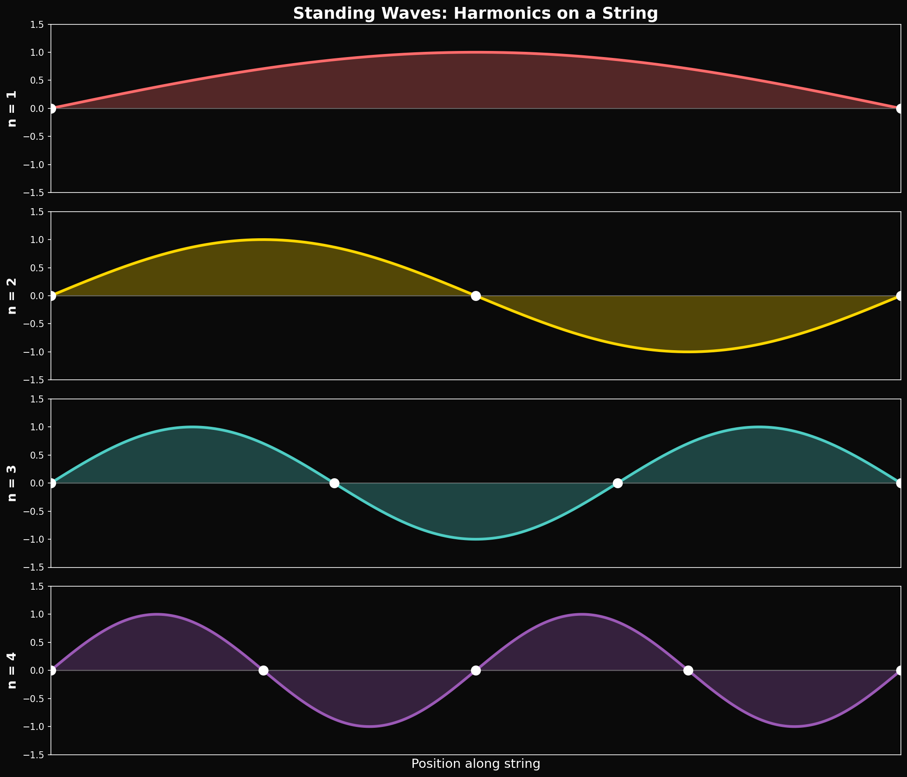
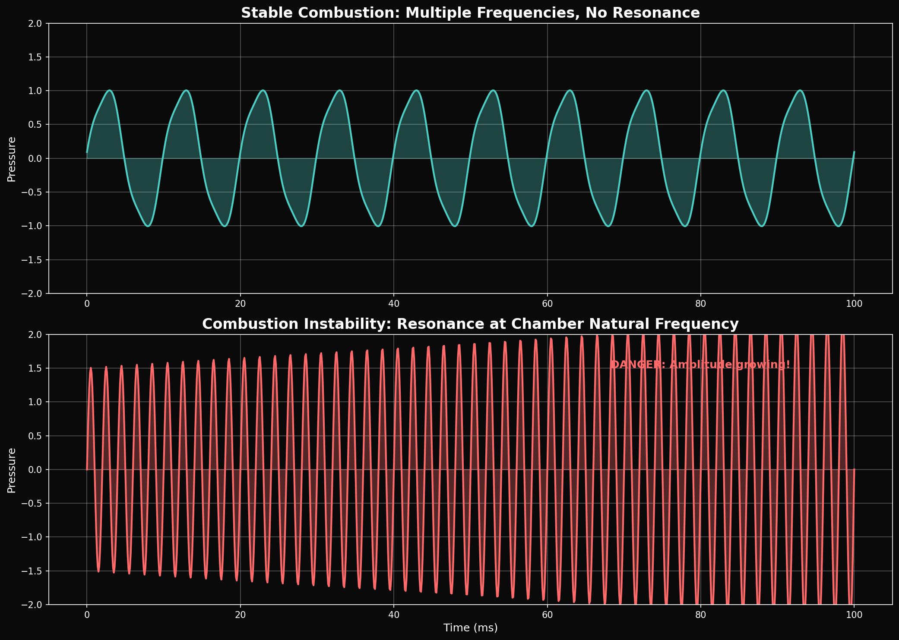

# Year 1, Unit 5: Waves & Sound
## *Vibrations That Build (or Destroy) Rockets*

**Duration:** 15 Days
**Grade Level:** 10th Grade
**Prerequisites:** Units 1-4

---

## Anchoring Question

> *Raptor engines nearly destroyed Starship's launch mount on the first integrated test. The cause was partly acoustic — shock waves and resonance. How do sound waves destroy structures, and how do engineers design around this?*


*Standing wave patterns showing nodes and antinodes*


*Stable vs. unstable combustion pressure oscillations*

---

## Learning Objectives

By the end of this unit, you will be able to:
1. Distinguish wave types (transverse vs. longitudinal)
2. Apply the wave equation v = fλ
3. Understand superposition, interference, and beats
4. Analyze standing waves and resonance
5. Calculate Doppler shift for moving sources/observers
6. Connect wave physics to rocket engineering challenges

---

## Day 1-2: Wave Types and Anatomy

### What is a Wave?

A **wave** is a disturbance that transfers energy without transferring matter.

### Wave Types

**Transverse waves:** Displacement perpendicular to propagation
- Examples: Light, water surface waves, guitar strings
- Easy to visualize, easy to polarize

**Longitudinal waves:** Displacement parallel to propagation
- Examples: Sound, compression waves in solids
- Harder to visualize, cannot be polarized

### Wave Anatomy

```
     Wavelength λ
   ←───────────────→
   ↑
 A │    ∧       ∧    ← Crest
   │   / \     / \
───│──/───\───/───\─── ← Equilibrium
   │ /     \ /     \
   │/       ∨       ∨← Trough
   ↓
Amplitude A
```

| Property | Symbol | Unit |
|----------|--------|------|
| Wavelength | λ | meters |
| Frequency | f | Hz (1/s) |
| Period | T = 1/f | seconds |
| Amplitude | A | meters |
| Wave speed | v | m/s |

---

## Day 3-4: The Wave Equation

### The Fundamental Relationship

```
v = f × λ

Wave speed = frequency × wavelength
```

### SpaceX Application: Raptor Combustion Frequency

The Raptor engine's main combustion chamber has a characteristic resonance frequency. If instabilities occur at this frequency, pressure oscillations amplify destructively.

**Calculate:** If sound speed in hot combustion gases is ~1,000 m/s and the chamber diameter is ~0.3 m, what is the fundamental resonant frequency?

```
For a cylindrical chamber, fundamental mode: λ ≈ 2 × diameter = 0.6 m
f = v/λ = 1000 / 0.6 = 1,667 Hz
```

This is in the range where combustion instabilities can occur. Engineers must design baffles and injectors to prevent energy buildup at this frequency.

---

## Day 5-6: Superposition and Interference

### The Superposition Principle

When two waves meet, their displacements ADD:

```
y_total = y₁ + y₂
```

### Constructive Interference

Waves in phase (crests aligned): y_total = 2A

### Destructive Interference

Waves 180° out of phase (crest meets trough): y_total = 0

### Beats

Two waves with slightly different frequencies create **beats**:

```
f_beat = |f₁ - f₂|
```

### SpaceX Application: Combustion Instability

**The Problem:** In a rocket combustion chamber, pressure oscillations can occur at multiple frequencies. If two modes have close frequencies, they create beats — periodic surges in pressure that can tear the engine apart.

**The F-1 Engine (Saturn V):** Early tests showed severe combustion instability. NASA solved it by:
1. Adding baffles to disrupt resonant modes
2. Redesigning the injector pattern
3. Extensive bomb testing (deliberately triggering instability to test recovery)

**Raptor:** Uses similar strategies plus real-time monitoring to detect instability onset.

---

## Day 7: Lab — Standing Waves on Strings

### Setup

A string fixed at both ends with a vibration generator at one end.

### Standing Wave Condition

Only certain frequencies produce standing waves:

```
f_n = n × (v / 2L)    where n = 1, 2, 3, ...

Or: L = n × (λ/2)     (string length = whole number of half-wavelengths)
```

### Nodes and Antinodes

- **Nodes:** Points of zero displacement (destructive interference)
- **Antinodes:** Points of maximum displacement (constructive interference)

### Data Collection

| Harmonic n | Frequency f_n | Wavelength λ_n | Wave Speed v |
|------------|---------------|----------------|--------------|
| 1 (fundamental) | | | |
| 2 | | | |
| 3 | | | |

---

## Day 8-9: Sound Waves

### Sound in Different Media

Sound is a longitudinal pressure wave. Speed depends on medium:

| Medium | Speed of Sound | Why? |
|--------|---------------|------|
| Air (20°C) | 343 m/s | Low density, moderate stiffness |
| Water | 1,480 m/s | Higher stiffness |
| Steel | 5,960 m/s | Very high stiffness |
| Combustion gases (~3000K) | ~1,000 m/s | High temperature, low density |

### Decibels

Sound intensity is measured in decibels (dB):

```
β = 10 log₁₀(I / I₀)

Where I₀ = 10⁻¹² W/m² (threshold of hearing)
```

| Source | Sound Level |
|--------|-------------|
| Whisper | 20 dB |
| Normal conversation | 60 dB |
| Rock concert | 110 dB |
| Rocket launch (1 km) | 140 dB |
| Rocket launch (pad) | 180 dB |

### SpaceX Application: Sound Suppression System

The Starbase launch mount uses a **deluge system** that pumps 300,000 kg of water in 7 seconds during launch.

**Why water?**
1. Water absorbs acoustic energy through viscous dissipation
2. Evaporating water carries away energy (latent heat)
3. Water mist breaks up coherent shock structures

**Calculation:** If 300,000 kg of water absorbs 1% of the acoustic energy from 33 Raptors (each producing ~230 MW of thrust power, ~1% as sound), how much does each liter absorb?

```
Acoustic power ≈ 33 × 230 MW × 0.01 = 76 MW
If 1% absorbed by water: 0.76 MW
Per liter (kg): 0.76 × 10⁶ W / 300,000 kg = 2.5 W/kg

Over 7 seconds: 2.5 × 7 = 17.5 J/kg

This raises water temperature by: ΔT = Q/(mc) = 17.5 / 4186 = 0.004°C
```

The thermal effect is minimal — the main effect is acoustic impedance matching and wave disruption.

---

## Day 10-11: Resonance

### Natural Frequency

Every object has natural frequencies at which it "wants" to vibrate.

### Resonance Condition

When driving frequency = natural frequency → maximum energy transfer → maximum amplitude

### The Tacoma Narrows Bridge

In 1940, the Tacoma Narrows Bridge collapsed due to aeroelastic flutter — wind vortices excited the bridge's torsional natural frequency.

**Video:** Watch the famous collapse footage. Notice how the oscillations grow over time as energy accumulates.

### Starship IFT-1 Launch Mount Damage

On April 20, 2023, Starship's first integrated test caused severe damage to the launch mount:
- Concrete was blasted away
- Steel structures were bent
- Debris scattered over wide area

**Contributing factors:**
1. No water deluge system (not yet installed)
2. Acoustic resonance between mount structure and engine frequencies
3. Direct flame impingement

The upgraded mount (IFT-2 onward) includes:
- Water deluge system
- Reinforced concrete with steel plate covering
- Flame diverter redesign

---

## Day 12-13: The Doppler Effect

### Moving Source or Observer

When a wave source or observer moves, the observed frequency shifts:

```
Moving source (toward observer):
f_observed = f_source × v_wave / (v_wave - v_source)

Moving observer (toward source):
f_observed = f_source × (v_wave + v_observer) / v_wave
```

### SpaceX Application: Telemetry Signals

A rocket moving at 3 km/s transmits telemetry at 2.0 GHz. What frequency is received on the ground?

```
f_observed = 2.0 × 10⁹ × c / (c - 3000)
           = 2.0 × 10⁹ × 1.00001
           = 2.00002 × 10⁹ Hz

Δf = 20 kHz shift
```

This shift must be compensated in the ground station receivers.

---

## Day 14-15: Review and Assessment

### Unit Summary

| Concept | Key Equation | SpaceX Connection |
|---------|--------------|-------------------|
| Wave equation | v = fλ | Combustion chamber modes |
| Interference | y = y₁ + y₂ | Instability beat frequencies |
| Standing waves | f_n = n(v/2L) | Structural resonances |
| Sound intensity | β = 10 log(I/I₀) | Launch acoustics |
| Resonance | f_drive = f_natural | Mount damage mechanism |
| Doppler | f' = f × v/(v±v_s) | Telemetry frequency shift |

### φ-Connection Preview

The Husmann framework suggests that stable oscillatory systems (atoms, orbits, galaxies) exist at frequencies related by Fibonacci ratios:

```
f_n / f_{n-1} → φ as n → ∞
```

Neural oscillations (brain waves) approximately follow this pattern:
- Delta: 4 Hz
- Theta: 7 Hz (4 × 1.75)
- Alpha: 11 Hz (7 × 1.57)
- Beta: 18 Hz (11 × 1.64)
- Gamma: 29 Hz (18 × 1.61 ≈ φ)

Could this explain why certain frequency ratios feel "harmonious"?

---

## Problem Sets

### Tier 1: Foundation (Must Do)

1. A wave has frequency 500 Hz and wavelength 0.68 m. Calculate its speed.

2. Two speakers produce 440 Hz and 444 Hz tones. What is the beat frequency?

3. A rocket launch produces 180 dB at 100 m. What intensity is this in W/m²?

### Tier 2: Application (Should Do)

4. A combustion chamber is 0.4 m in diameter. Sound speed in the hot gas is 1,200 m/s. Calculate the first three resonant frequencies for standing waves across the diameter.

5. A siren on an ambulance emits 800 Hz. If the ambulance approaches at 30 m/s, what frequency does a stationary observer hear? (v_sound = 343 m/s)

### Tier 3: Challenge (Want to Try?)

6. **Acoustic Power:** A Raptor engine produces approximately 2,300 kN of thrust. If 0.5% of thrust power converts to acoustic power, and this radiates as a hemisphere from a point source, what is the sound intensity at 1 km? What is this in dB?

7. **Fibonacci Frequencies:** If a system's resonant frequencies follow f_n = f₁ × φ^(n-1), and f₁ = 1 Hz:
   - Calculate f₁ through f₁₀
   - What are the ratios f_n/f_{n-1} for each step?
   - Compare to Fibonacci ratios F_n/F_{n-1}

---

## Resources

### Videos
- Tacoma Narrows Bridge collapse
- Starship IFT-1 launch (full video with audio)
- Slow-motion rocket engine ignition

### Reading
- SpaceX water deluge system development
- NASA F-1 combustion instability history

---

*© 2026 Thomas A. Husmann / iBuilt LTD. All rights reserved.*
*Licensed under CC BY-NC-SA 4.0 for academic and research use.*
