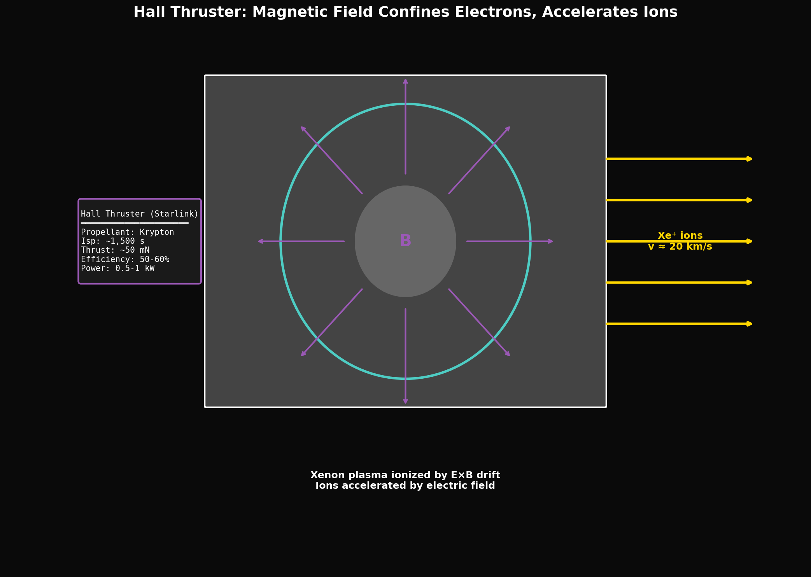

# Year 1, Unit 7: Magnetism & Electromagnetism
## *Fields That Move Spacecraft Without Fuel*

**Duration:** 15 Days
**Grade Level:** 10th Grade
**Prerequisites:** Unit 6 (Electricity)

---

## Anchoring Question

> *Hall-effect ion thrusters on satellites use electric and magnetic fields to accelerate xenon ions to 30 km/s. No moving parts. No chemical combustion. How does an electromagnetic field push a rocket?*


*Hall effect thruster: E×B drift creates plasma confinement and ion acceleration*

---

## Learning Objectives

By the end of this unit, you will be able to:
1. Describe magnetic fields and field lines
2. Calculate force on moving charges (F = qvB)
3. Explain electromagnetic induction (Faraday's Law)
4. Analyze motors and generators
5. Connect EM concepts to advanced propulsion systems

---

## Day 1-2: Magnetic Fields

### Sources of Magnetic Fields

- Permanent magnets (aligned atomic dipoles)
- Current-carrying wires (moving charges)
- Earth's core (dynamo effect)

### Field Lines

- Point from N to S (outside the magnet)
- Form closed loops (no magnetic monopoles!)
- Density indicates field strength

### SpaceX Application: Magnetorquers

Spacecraft use **magnetorquers** (electromagnets) to orient themselves using Earth's magnetic field:

```
Torque = μ × B

Where:
  μ = magnetic dipole moment of the coil (A·m²)
  B = Earth's magnetic field (~30-60 μT)
```

No propellant needed! The spacecraft "pushes" against Earth's field.

**Limitation:** Doesn't work far from Earth (weak field) or for fast maneuvers (low torque).

---

## Day 3-4: Force on Moving Charges

### The Lorentz Force

A moving charge in a magnetic field experiences a force:

```
F = q × v × B (magnitude: F = qvB sin θ)
```

**Direction:** Use the right-hand rule
- Fingers: velocity direction
- Curl toward: B field direction
- Thumb: force on POSITIVE charge (reverse for negative)

### Circular Motion in Magnetic Fields

The magnetic force is always perpendicular to velocity → circular path:

```
r = mv / (qB)   (cyclotron radius)
```

### SpaceX Application: Hall Thruster Physics

Hall thrusters work by:
1. Electrons spiral along magnetic field lines (trapped)
2. Electric field accelerates xenon ions through the electron cloud
3. Ions exit at 15-50 km/s

```
Hall thruster parameters:
  - Ion velocity: ~30 km/s
  - Specific impulse: ~1,500-3,000 s
  - Efficiency: ~50-70%
  - Power: 1-5 kW typical (up to 20 kW for high-power versions)
```

**Starlink uses Hall thrusters** (krypton propellant) for orbit raising and station-keeping.

Source: [Starlink - Wikipedia](https://en.wikipedia.org/wiki/Starlink)

---

## Day 5-6: Force on Current-Carrying Wires

### The Force

```
F = I × L × B (magnitude: F = ILB sin θ)
```

### Direction

Right-hand rule:
- Fingers: current direction
- Curl toward: B field
- Thumb: force direction

### SpaceX Connection: Rail Gun Launch Assist

**Concept (not yet implemented by SpaceX):** A rail gun uses magnetic forces to accelerate payloads:

```
Two parallel rails carry current I
Magnetic field B between rails
Current through projectile experiences force F = ILB
```

**Challenges:**
- Enormous currents needed (millions of amps)
- Rail erosion from arc discharge
- G-forces too high for most payloads

---

## Day 7: Lab/Build — DC Motor

### Build a Simple Motor

Components:
- Magnet
- Coil (3-5 turns of wire)
- Power source
- Support structure

### How It Works

1. Current flows through coil
2. Magnetic force on each side of coil creates torque
3. Coil rotates
4. Commutator reverses current at each half-turn
5. Rotation continues

---

## Day 8-9: Electromagnetic Induction

### Faraday's Law

A changing magnetic flux induces an EMF (voltage):

```
EMF = -ΔΦ / Δt

Where Φ = B × A (magnetic flux)
```

### Lenz's Law

The induced current opposes the change that caused it.

### SpaceX Application: Tether Propulsion

A conducting tether moving through Earth's magnetic field generates EMF:

```
EMF = v × B × L

Where:
  v = orbital velocity (~7.7 km/s)
  B = Earth's field (~30 μT)
  L = tether length (km)
```

**Example:**
```
EMF = 7,700 × 30 × 10⁻⁶ × 20,000 = 4,620 V
```

A 20 km tether generates ~4.6 kV!

This EMF can:
1. **Power spacecraft** (tether as generator)
2. **Provide thrust** (current through tether + B field = force)

No propellant needed! The "fuel" is orbital energy.

---

## Day 10-11: Generators and AC/DC

### Generator Principle

Rotating coil in magnetic field → changing flux → induced EMF:

```
EMF = N × B × A × ω × sin(ωt)

Peak EMF = NBAω
```

### AC vs DC

- **AC (Alternating Current):** Naturally produced by rotating generators
- **DC (Direct Current):** Required for electronics; convert using rectifiers

### SpaceX Application: Why ISS Uses DC

Solar panels produce DC. Batteries store DC. Most electronics use DC.

Converting to AC and back would waste ~10% of power.

**Solution:** ISS distributes DC power (120V) throughout the station. Individual devices convert to their required voltages.

---

## Day 12: Transformers

### Principle

Changing current in primary coil → changing flux → induced EMF in secondary coil:

```
V_s / V_p = N_s / N_p

(Voltage ratio = turns ratio)

Also: V_p × I_p = V_s × I_s (power conservation)
```

### Step-Up vs Step-Down

- **Step-up:** N_s > N_p → increases voltage (for transmission)
- **Step-down:** N_s < N_p → decreases voltage (for devices)

---

## Day 13-14: Mini-Project — Space Propulsion Analysis

### Choose One System

Each student analyzes ONE electromagnetic propulsion system:

| System | Mechanism | Status |
|--------|-----------|--------|
| Ion thruster | Electric field accelerates ions | Operational |
| Hall thruster | Crossed E and B fields | Operational (Starlink!) |
| Magnetorquer | Torque against planetary field | Operational |
| Electrodynamic tether | Current + B field = thrust | Demonstrated |
| Solar sail | Photon momentum (EM radiation pressure) | Operational |

### Report Components

1. **How it works** (physics principles)
2. **Key equations** (with example calculations)
3. **Current applications** (real missions)
4. **Limitations** (what it can't do)
5. **Future potential** (could SpaceX use this?)

---

## Day 15: Presentations and Quiz

### Presentation Format

5 minutes per student:
- 2 min: Physics explanation
- 2 min: Application example
- 1 min: Future potential

### Unit Summary

| Concept | Key Equation | SpaceX Connection |
|---------|--------------|-------------------|
| Magnetic field | B (Tesla) | Magnetorquers |
| Lorentz force | F = qvB | Hall thrusters |
| Wire force | F = ILB | Rail guns (future?) |
| Faraday's Law | EMF = -ΔΦ/Δt | Tether propulsion |
| Transformers | V_s/V_p = N_s/N_p | Power distribution |

---

## Problem Sets

### Tier 1: Foundation (Must Do)

1. A proton (q = 1.6 × 10⁻¹⁹ C) moves at 10⁶ m/s through a 0.5 T field. Calculate the magnetic force.

2. A 2 m wire carries 5 A perpendicular to a 0.3 T field. Calculate the force on the wire.

3. A coil of 100 turns has area 0.01 m². If B changes from 0 to 0.5 T in 0.1 s, what EMF is induced?

### Tier 2: Application (Should Do)

4. A Hall thruster accelerates xenon ions (mass 2.18 × 10⁻²⁵ kg) to 30 km/s. If thrust is 100 mN, calculate the mass flow rate of xenon (in mg/s).

5. An electrodynamic tether is 10 km long, moving at 7.7 km/s through a 40 μT field. Calculate: (a) induced EMF, (b) current if tether resistance is 1000 Ω, (c) Lorentz force on tether.

### Tier 3: Challenge (Want to Try?)

6. **Cyclotron Frequency:** In a Hall thruster, electrons spiral along magnetic field lines at the cyclotron frequency f_c = qB/(2πm_e). For B = 0.02 T, calculate f_c. Compare to typical microwave frequencies (1-100 GHz).

7. **φ-Connection:** The quantum of magnetic flux is Φ₀ = h/(2e) = 2.07 × 10⁻¹⁵ Wb. Calculate Φ₀ × 10²⁰. Compare to φ. Is this coincidence or connection?

---

*© 2026 Thomas A. Husmann / iBuilt LTD. All rights reserved.*
*Licensed under CC BY-NC-SA 4.0 for academic and research use.*
