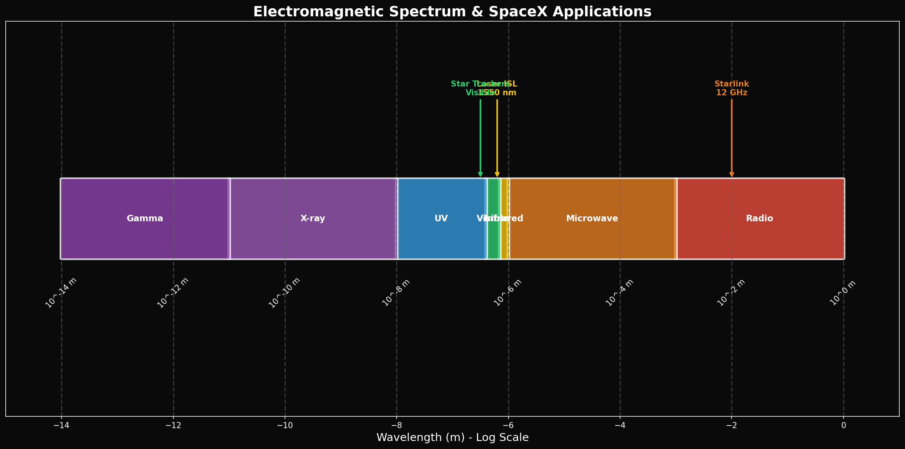
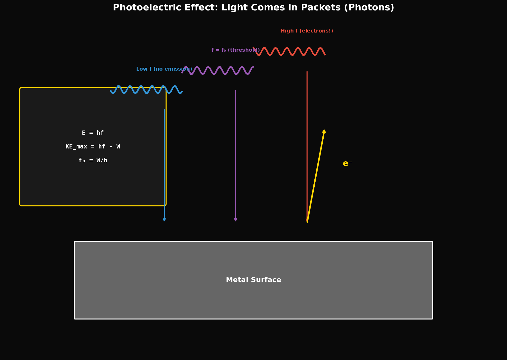

# Year 1, Unit 8: Light, Optics & Modern Physics Introduction
## *From Star Trackers to Quantum Vacuum*

**Duration:** 15 Days
**Grade Level:** 10th Grade
**Prerequisites:** Units 1-7

---

## Anchoring Question

> *Starlink satellites use laser inter-satellite links to route data at the speed of light. Star trackers use light from known stars to determine attitude with 0.001° precision. How do we use light itself as an instrument?*


*The electromagnetic spectrum with SpaceX applications*


*Einstein's photoelectric effect: Light behaves as particles (photons)*

---

## Learning Objectives

By the end of this unit, you will be able to:
1. Describe the electromagnetic spectrum and calculate wave properties
2. Apply laws of reflection and refraction (Snell's Law)
3. Analyze lens systems using ray diagrams and the thin lens equation
4. Explain the photoelectric effect and its failure to classical physics
5. Preview the quantum nature of light and the φ-vacuum model

---

## Day 1-2: The Electromagnetic Spectrum

### Light as Electromagnetic Wave

Light is oscillating electric and magnetic fields traveling at:

```
c = 3 × 10⁸ m/s (exact: 299,792,458 m/s)
```

### The Spectrum

| Region | Wavelength | Frequency | Application |
|--------|------------|-----------|-------------|
| Radio | > 1 mm | < 300 GHz | Communication |
| Microwave | 1 mm - 1 m | 300 MHz - 300 GHz | Radar, satellites |
| Infrared | 700 nm - 1 mm | 300 GHz - 430 THz | Heat sensing |
| Visible | 400-700 nm | 430-750 THz | Human vision |
| Ultraviolet | 10-400 nm | 750 THz - 30 PHz | Sterilization |
| X-ray | 0.01-10 nm | 30 PHz - 30 EHz | Medical imaging |
| Gamma | < 0.01 nm | > 30 EHz | Nuclear physics |

### SpaceX Application: Mars Communication Delay

Calculate round-trip signal time to Mars at opposition (closest approach, ~54 million km):

```
t = 2d/c = 2 × 54 × 10⁹ m / (3 × 10⁸ m/s) = 360 seconds = 6 minutes
```

At conjunction (far side of Sun, ~400 million km):
```
t = 2 × 400 × 10⁹ / (3 × 10⁸) = 2,667 s ≈ 44 minutes
```

**Implication:** Mars missions require autonomous control. No remote piloting possible!

---

## Day 3-4: Law of Reflection

### The Law

```
θ_incident = θ_reflected (measured from normal)
```

### Plane Mirrors

Image properties:
- Same size as object
- Same distance behind mirror
- Laterally inverted
- Virtual (rays don't actually meet)

### SpaceX Application: Star Trackers

Star trackers use reflection and refraction to:
1. Focus starlight onto CCD sensors
2. Match observed star patterns to catalog
3. Calculate precise 3D orientation

**Accuracy:** Better than 0.001° (3.6 arcseconds)

**How two observations determine 3D:**
- One star gives a cone of possible orientations
- Two stars intersect to give exact attitude
- Three+ stars provide redundancy and error checking

---

## Day 5-6: Refraction and Snell's Law

### The Phenomenon

Light bends when entering a different medium because its speed changes:

```
n = c / v   (index of refraction)
```

| Medium | n |
|--------|---|
| Vacuum | 1.000 |
| Air | 1.0003 |
| Water | 1.33 |
| Glass | 1.5 |
| Diamond | 2.4 |

### Snell's Law

```
n₁ sin θ₁ = n₂ sin θ₂
```

### SpaceX Application: GPS Signal Bending

GPS signals pass through the ionosphere and atmosphere. Both cause refraction:

- **Ionosphere:** Frequency-dependent delay (corrected using two frequencies)
- **Troposphere:** Bends signals near horizon

This is why GPS accuracy degrades for satellites near the horizon.

---

## Day 7: Lab — Snell's Law Verification

### Procedure

1. Place semicircular lens on ray table
2. Shine laser at center (no refraction there)
3. Measure incident and refracted angles
4. Calculate n = sin θ₁ / sin θ₂
5. Repeat for multiple angles

### Data Table

| θ₁ (°) | θ₂ (°) | sin θ₁ | sin θ₂ | n |
|--------|--------|--------|--------|---|
| 10 | | | | |
| 20 | | | | |
| 30 | | | | |
| 40 | | | | |
| 50 | | | | |

Average n = _____ (compare to accepted value for acrylic: 1.49)

---

## Day 8-9: Lenses

### Thin Lens Equation

```
1/d_o + 1/d_i = 1/f

Where:
  d_o = object distance
  d_i = image distance
  f = focal length (positive for converging, negative for diverging)
```

### Magnification

```
M = h_i / h_o = -d_i / d_o
```

### Ray Diagram Rules

1. Ray parallel to axis → through focal point
2. Ray through center → straight through
3. Ray through focal point → parallel to axis

### SpaceX Application: Starlink Laser Terminal Optics

Starlink's laser inter-satellite links (LISL) use:
- Transmitter lens: Focus laser beam for long-distance travel
- Receiver lens: Collect incoming light onto detector

**Challenge:** Thermal changes cause focal length drift. Active thermal control required!

---

## Day 10-11: Optical Instruments

### The Human Eye

- Cornea + lens focus light on retina
- Focal length adjusts (accommodation)
- Aperture (pupil) controls light intake

### Vision in Space

**Challenges:**
- **Glare:** Unfiltered sunlight is 137,000 lux (vs. 10,000 lux on bright Earth day)
- **Dark adaptation:** Eyes need 20+ minutes to fully adapt to darkness
- **Radiation damage:** UV and cosmic rays damage the lens over time

**Solutions:**
- Sun visors on helmets
- UV-filtering windows
- Time limits for EVA operations

### Microscopes and Telescopes

Both use multiple lenses to magnify:
- **Microscope:** Object close to lens
- **Telescope:** Object at infinity

---

## Day 12: The Photoelectric Effect

### The Classical Prediction (WRONG)

Wave theory predicted:
- Brighter light → more energetic electrons
- Any frequency should work (given enough intensity)
- Time delay before emission starts

### The Experimental Reality

- Electron energy depends on FREQUENCY, not intensity
- Below threshold frequency → NO electrons, regardless of intensity
- Emission is instantaneous

### Einstein's Explanation (1905)

Light comes in packets (photons) with energy:

```
E = h × f

Where h = 6.626 × 10⁻³⁴ J·s (Planck's constant)
```

Each photon either has enough energy to eject an electron or it doesn't. Brighter light = more photons, but same energy per photon.

**This was the birth of quantum mechanics.**

### SpaceX Application: Solar Cell Physics

Solar cells ARE the photoelectric effect!

- Photon energy E = hf
- Bandgap energy E_g (minimum to free electron)
- If E > E_g → electron freed → current
- If E < E_g → photon wasted (heat)

**Efficiency limit:** Photons below bandgap waste their energy. Photons above bandgap waste excess energy as heat.

Maximum theoretical efficiency: ~33% (Shockley-Queisser limit)

---

## Day 13-14: Introduction to the Frontier — The φ-Vacuum

### Beyond Classical Physics

This unit revealed:
1. Light is a wave (interference, diffraction)
2. Light is particles (photoelectric effect)

**Wave-particle duality** is the core mystery of quantum mechanics.

### The Husmann Decomposition Preview

The curriculum's capstone framework proposes:
- Spacetime vacuum has STRUCTURE (not empty)
- Structure is quasicrystalline (φ-based like Penrose tilings)
- This structure explains constants like α ≈ 1/137

### The AAH Hamiltonian Concept

At the critical point α = 1/φ, energy levels form a **Cantor set** — a fractal structure with:
- Self-similarity at all scales
- Zero measure (infinitely sparse but infinitely detailed)
- Connection to dark matter/energy partitions

### Student Reading Assignment

Read the abstract of Patent 63/995,401 (Self-Assembling Quasicrystalline Coating):

**Questions to consider:**
1. What is the core physical claim?
2. What evidence supports it?
3. What would it take to verify it?
4. How does this connect to the photoelectric effect (quantum nature of light)?

---

## Day 15: Portfolio Presentations and Final Assessment

### Year 1 Closing Statement

> *"You now speak the language. Everything in Year 2 is that language, spoken faster, with more precision, toward harder problems. The universe doesn't change — your ability to see it does."*

### Portfolio Requirements

Each student compiles:
1. Best work from each unit (self-selected)
2. One reflection: "What confused me most — and how did I resolve it?"
3. One connection: "How does this relate to space exploration?"
4. One frontier question: "What do I want to learn in Year 2/3?"

---

## Unit 8 Summary

| Concept | Key Equation | SpaceX Connection |
|---------|--------------|-------------------|
| EM waves | c = fλ | Communication delay |
| Reflection | θ_i = θ_r | Star trackers |
| Snell's Law | n₁ sin θ₁ = n₂ sin θ₂ | GPS corrections |
| Thin lens | 1/d_o + 1/d_i = 1/f | Laser terminals |
| Photoelectric | E = hf | Solar cells |
| φ-vacuum | (frontier) | Framework preview |

---

## Problem Sets

### Tier 1: Foundation (Must Do)

1. Calculate the wavelength of a 100 GHz microwave signal.

2. Light travels from air (n=1) into glass (n=1.5) at 30° from normal. What is the refracted angle?

3. A lens has focal length 10 cm. An object is placed 15 cm away. Find: (a) image distance, (b) magnification.

### Tier 2: Application (Should Do)

4. Mars is at opposition (54 million km). A message is sent and a reply returns. How long does this take? If Mars is at conjunction (401 million km), how long?

5. The photoelectric threshold for sodium is 2.3 eV. (a) What is the threshold frequency? (b) If light of 5 eV photons shines on it, what is the maximum kinetic energy of emitted electrons?

### Tier 3: Challenge (Want to Try?)

6. **Starlink Laser Link:** Two Starlink satellites 2,000 km apart communicate via laser. If beam divergence is 0.001°, what is the beam diameter at the receiver? If transmitted power is 1 W, what is the intensity at the receiver?

7. **φ and Photons:** The energy of a visible photon (λ = 550 nm) is E = hc/λ ≈ 2.25 eV. The fine structure constant α ≈ 1/137. Calculate: α × (rest mass energy of electron in eV) / (photon energy). Is the result close to any Fibonacci number or φ power?

---

## Resources

### Videos
- "The Story of Light" — PBS Nova
- SpaceX Starlink laser link demo
- Photoelectric effect simulation

### Repository Tools
- `phi_demo.py` — Golden ratio calculations
- `basic_trajectory.py` — Light travel time simulation

---

## Connection to Year 2

In **Year 2**, we will:
- Derive equations instead of just applying them
- Use calculus concepts (rates of change, integrals)
- Study rotational mechanics (spacecraft attitude)
- Explore thermodynamics (rocket nozzle physics)
- Analyze quasicrystals and the AAH model

---

*© 2026 Thomas A. Husmann / iBuilt LTD. All rights reserved.*
*Licensed under CC BY-NC-SA 4.0 for academic and research use.*
