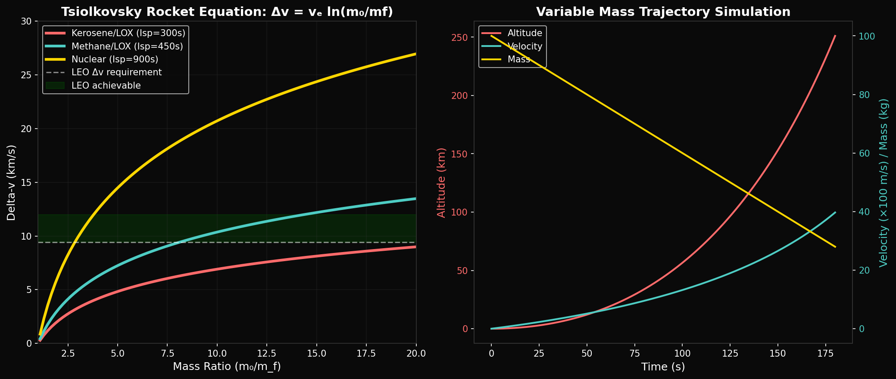
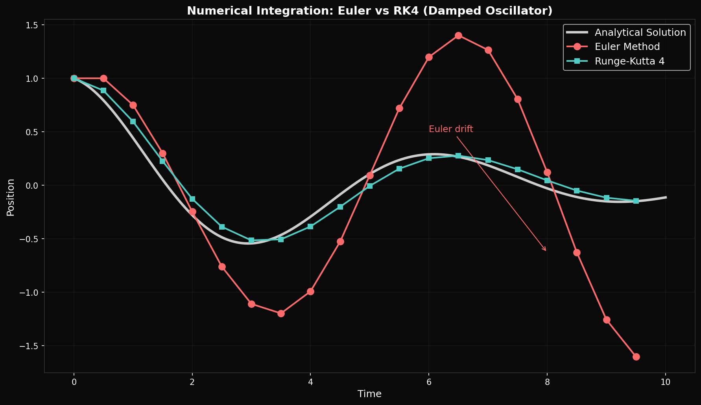

# Year 2, Unit 1: Advanced Kinematics
## *When Acceleration Isn't Constant*

**Duration:** 15 Days
**Grade Level:** 11th Grade
**Prerequisites:** Year 1 complete, Pre-Calculus

---

## Anchoring Question

> *A Falcon 9 rocket doesn't accelerate at a constant rate — as it burns fuel, it gets lighter, and acceleration increases. The Tsiolkovsky rocket equation relates velocity change to mass ratio. How do we handle motion when the rules themselves are changing?*


*Tsiolkovsky rocket equation: Δv = vₑ ln(m₀/mf)*


*Euler vs. RK4 numerical integration comparison*

---

## Learning Objectives

By the end of this unit, you will be able to:
1. Analyze motion with variable acceleration using calculus concepts
2. Apply numerical integration to predict trajectories
3. Derive and apply the Tsiolkovsky rocket equation
4. Model variable-mass systems mathematically
5. Use computational tools to simulate realistic rocket flights

---

## Day 1-2: Review and Extension — Calculus of Motion

### The Fundamental Relationships

```
Position:     x(t)
Velocity:     v(t) = dx/dt
Acceleration: a(t) = dv/dt = d²x/dt²
```

### Integration Reverses Differentiation

```
If a(t) is given:
  v(t) = v₀ + ∫a(t)dt
  x(t) = x₀ + ∫v(t)dt
```

### Example: Constant Acceleration

If a = constant:
```
v(t) = v₀ + at
x(t) = x₀ + v₀t + ½at²
```

These are our familiar kinematic equations — but what if a isn't constant?

---

## Day 3-4: Variable Acceleration

### Linear Acceleration: a(t) = a₀ + bt

```
v(t) = v₀ + a₀t + ½bt²
x(t) = x₀ + v₀t + ½a₀t² + (1/6)bt³
```

### Sinusoidal Acceleration: a(t) = A sin(ωt)

```
v(t) = v₀ - (A/ω)cos(ωt) + (A/ω)
x(t) = x₀ + v₀t - (A/ω²)sin(ωt) + (A/ω)t
```

### SpaceX Application: Throttle Profiles

Falcon 9 throttles engines during ascent:
- **Max-Q throttle down:** Reduce thrust at maximum dynamic pressure
- **Gravity turn:** Continuously varying pitch angle
- **MECO timing:** Engine cutoff at precise velocity

---

## Day 5-6: The Rocket Equation

### The Tsiolkovsky Rocket Equation

**The most important equation in rocketry:**

```
Δv = v_e × ln(m₀/m_f)

Where:
  Δv = change in velocity
  v_e = exhaust velocity = g × Isp
  m₀ = initial mass (with propellant)
  m_f = final mass (dry mass)
```

### Derivation

Starting from Newton's second law for variable mass:
```
F = ma = m(dv/dt)

Thrust F = -v_e(dm/dt)  (mass flow rate × exhaust velocity)

m(dv/dt) = -v_e(dm/dt)

dv = -v_e(dm/m)

∫dv = -v_e ∫(dm/m)

Δv = v_e × ln(m₀/m_f)
```

### The Tyranny of the Rocket Equation

Why the mass ratio matters so much:

| Mass Ratio (m₀/m_f) | ln(ratio) | Δv (if v_e = 3000 m/s) |
|---------------------|-----------|------------------------|
| 2 | 0.69 | 2.1 km/s |
| 3 | 1.10 | 3.3 km/s |
| 5 | 1.61 | 4.8 km/s |
| 10 | 2.30 | 6.9 km/s |
| 20 | 3.00 | 9.0 km/s |

**To reach orbit (~9.4 km/s):** Need mass ratio > 20 with chemical rockets!

---

## Day 7-8: Staging Analysis

### Why Stage?

Single stage to orbit requires extreme mass ratio. Staging discards empty tankage.

### Two-Stage Optimization

For total Δv split between stages:
```
Δv_total = Δv₁ + Δv₂

Δv₁ = v_e × ln(m₀₁/m_f₁)
Δv₂ = v_e × ln(m₀₂/m_f₂)
```

### Falcon 9 Staging

**First Stage (Merlin 1D):**
- Propellant: ~411,000 kg
- Dry mass: ~22,000 kg
- Isp (sea level): 282 s → v_e = 2,765 m/s
- Δv contribution: ~3.5 km/s

**Second Stage (Merlin Vacuum):**
- Propellant: ~111,000 kg
- Dry mass: ~4,000 kg
- Isp (vacuum): 348 s → v_e = 3,414 m/s
- Δv contribution: ~6.0 km/s

**Total Δv: ~9.5 km/s** ✓ (Enough for LEO)

---

## Day 9-10: Numerical Integration

### When Calculus Gets Hard

Real rocket trajectories involve:
- Variable thrust
- Changing atmospheric density
- Gravity that varies with altitude
- Earth's rotation

**Solution:** Numerical integration

### Euler Method

```python
def euler_integrate(x0, v0, a_func, dt, t_max):
    """Simple numerical integration"""
    t = 0
    x, v = x0, v0
    trajectory = [(t, x, v)]

    while t < t_max:
        a = a_func(t, x, v)
        v_new = v + a * dt
        x_new = x + v * dt
        t += dt
        x, v = x_new, v_new
        trajectory.append((t, x, v))

    return trajectory
```

### Runge-Kutta 4 (More Accurate)

```python
def rk4_step(x, v, a_func, t, dt):
    """Fourth-order Runge-Kutta step"""
    k1v = a_func(t, x, v)
    k1x = v

    k2v = a_func(t + dt/2, x + k1x*dt/2, v + k1v*dt/2)
    k2x = v + k1v*dt/2

    k3v = a_func(t + dt/2, x + k2x*dt/2, v + k2v*dt/2)
    k3x = v + k2v*dt/2

    k4v = a_func(t + dt, x + k3x*dt, v + k3v*dt)
    k4x = v + k3v*dt

    v_new = v + (k1v + 2*k2v + 2*k3v + k4v) * dt / 6
    x_new = x + (k1x + 2*k2x + 2*k3x + k4x) * dt / 6

    return x_new, v_new
```

---

## Day 11-12: Trajectory Simulation

### Complete Falcon 9 Simulation

```python
import numpy as np

# Constants
g0 = 9.81           # m/s² at sea level
R_earth = 6.371e6   # m
M_earth = 5.972e24  # kg
G = 6.674e-11       # N·m²/kg²

def gravity(altitude):
    """Gravity as function of altitude"""
    r = R_earth + altitude
    return G * M_earth / r**2

def atmospheric_density(altitude):
    """Simple exponential atmosphere model"""
    scale_height = 8500  # m
    rho_0 = 1.225        # kg/m³ at sea level
    return rho_0 * np.exp(-altitude / scale_height)

def drag(velocity, altitude, Cd=0.3, A=10.5):
    """Aerodynamic drag"""
    rho = atmospheric_density(altitude)
    return 0.5 * rho * velocity**2 * Cd * A

def rocket_acceleration(t, altitude, velocity, stage_params):
    """Net acceleration including thrust, gravity, drag"""
    thrust = stage_params['thrust']
    mass = stage_params['mass_func'](t)

    a_thrust = thrust / mass
    a_gravity = -gravity(altitude)
    a_drag = -drag(velocity, altitude) / mass

    return a_thrust + a_gravity + a_drag
```

### Analysis Questions

1. At what altitude does drag become negligible?
2. What is the optimal throttle profile for fuel efficiency?
3. How does staging timing affect total Δv?

---

## Day 13: Lab — Trajectory Optimization

### Assignment

Using the provided simulation code:

1. **Baseline:** Run simulation with constant 100% thrust
2. **Max-Q throttle:** Reduce to 70% thrust when dynamic pressure peaks
3. **Gravity turn:** Implement pitch program
4. **Compare:** Which profile reaches orbit most efficiently?

### Success Criteria

- Achieve circular orbit at 200 km altitude
- Minimize propellant consumption
- Avoid structural limits (max-Q < 35,000 Pa)

---

## Day 14-15: Assessment and Review

### Unit Summary

| Concept | Key Equation | Application |
|---------|--------------|-------------|
| Calculus of motion | v = dx/dt, a = dv/dt | Variable motion |
| Integration | x = ∫v dt | Position from velocity |
| Rocket equation | Δv = v_e ln(m₀/m_f) | Propulsion planning |
| Staging | Δv_total = ΣΔv_i | Multi-stage rockets |
| Numerical methods | RK4, Euler | Trajectory simulation |

---

## Problem Sets

### Tier 1: Foundation (Must Do)

1. A rocket has exhaust velocity 3,200 m/s, initial mass 50,000 kg, and final mass 15,000 kg. Calculate the Δv.

2. Integrate a(t) = 5 - 0.1t from t=0 to t=10 to find the final velocity if v₀ = 0.

3. A Falcon 9 first stage has mass ratio m₀/m_f = 18.7. If Isp = 282 s at sea level, calculate its Δv contribution.

### Tier 2: Application (Should Do)

4. Design a two-stage rocket to achieve Δv = 9.4 km/s. Both stages have Isp = 320 s. What mass ratios are needed if Δv is split 40%/60%?

5. Write a simple Euler integrator in Python to simulate a 1D rocket launch. Plot altitude vs time for the first 60 seconds.

### Tier 3: Challenge (Want to Try?)

6. **Starship Analysis:** Starship has ~1,200 tons propellant, ~100 tons dry mass, and Raptor Isp = 380 s (vacuum). Calculate maximum Δv. Why does it need orbital refueling for Mars?

7. **φ-Staging:** If φ = (1+√5)/2, investigate whether staging mass ratios of φ:1 provide any optimization advantage. Compare Δv of φ-ratio staging to equal-ratio staging for a 3-stage rocket.

---

## Resources

### Software
- Python with NumPy/SciPy
- `trajectory_sim.py` from repository

### References
- Sutton & Biblarz: "Rocket Propulsion Elements"
- SpaceX Falcon 9 User's Guide

---

*© 2026 Thomas A. Husmann / iBuilt LTD. All rights reserved.*
*Licensed under CC BY-NC-SA 4.0 for academic and research use.*
