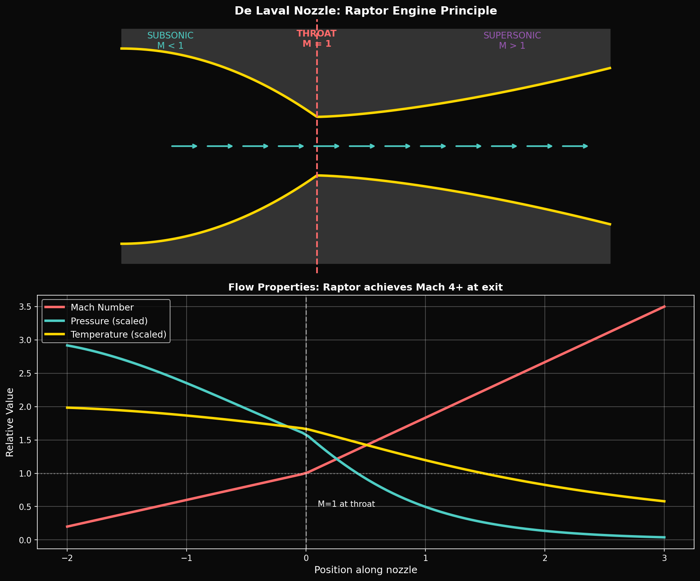
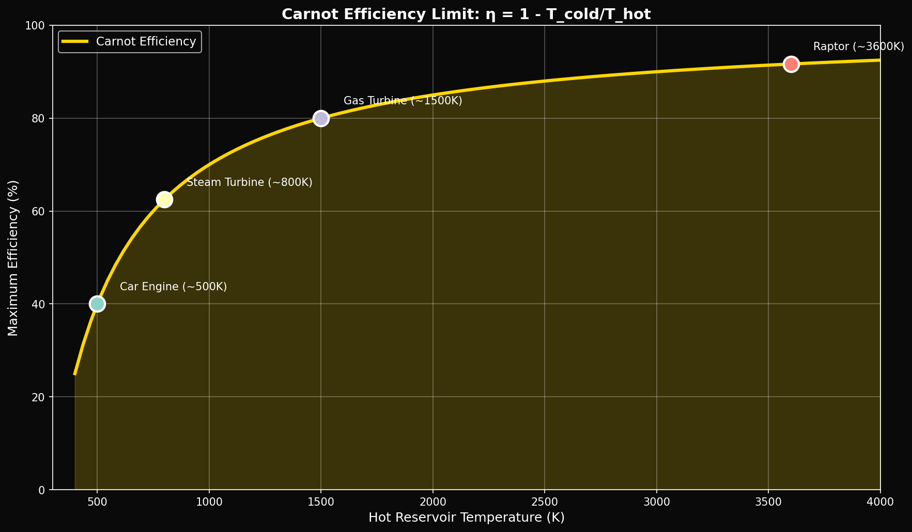

# Year 2, Unit 3: Thermodynamics & Fluids
## *Heat Engines, Nozzles, and the Physics of Propulsion*

**Duration:** 15 Days
**Grade Level:** 11th Grade
**Prerequisites:** Year 1 complete, Units 1-2 of Year 2

---

## Anchoring Question

> *The Raptor engine converts chemical energy into thrust with ~98% combustion efficiency. But thermodynamics says no heat engine can be 100% efficient. What is efficiency in a rocket engine, and what does the de Laval nozzle do that makes rocket propulsion possible?*


*De Laval nozzle: Subsonic to supersonic flow transition*


*Carnot efficiency limits for heat engines*

---

## Learning Objectives

By the end of this unit, you will be able to:
1. Apply the laws of thermodynamics to real systems
2. Calculate heat engine efficiency and Carnot limits
3. Analyze fluid flow using Bernoulli's principle
4. Understand compressible flow and choked conditions
5. Explain how rocket nozzles accelerate exhaust gases

---

## Day 1-2: Temperature and Heat

### Thermal Equilibrium

Two objects in thermal contact reach the same temperature (Zeroth Law).

### Heat Transfer Mechanisms

1. **Conduction:** Q = -kA(dT/dx) — through solids
2. **Convection:** Q = hA(T_surface - T_fluid) — through fluids
3. **Radiation:** Q = εσAT⁴ — electromagnetic waves

### Specific Heat

```
Q = mcΔT

Where:
  Q = heat transferred (J)
  m = mass (kg)
  c = specific heat (J/kg·K)
  ΔT = temperature change (K)
```

---

## Day 3-4: First Law of Thermodynamics

### Energy Conservation

```
ΔU = Q - W

Change in internal energy = Heat added - Work done by system
```

### For Ideal Gas Processes

| Process | Condition | W | Q | ΔU |
|---------|-----------|---|---|-----|
| Isothermal | T = const | nRT ln(V₂/V₁) | = W | 0 |
| Isobaric | P = const | PΔV | nCₚΔT | nCᵥΔT |
| Isochoric | V = const | 0 | nCᵥΔT | = Q |
| Adiabatic | Q = 0 | -ΔU | 0 | nCᵥΔT |

### Ideal Gas Law

```
PV = nRT

Where R = 8.314 J/(mol·K)
```

---

## Day 5-6: Second Law of Thermodynamics

### Entropy

```
ΔS ≥ Q/T

For reversible processes: ΔS = Q/T
For irreversible processes: ΔS > Q/T
```

### The Second Law

Heat flows spontaneously from hot to cold, never cold to hot.

Entropy of an isolated system never decreases.

### Carnot Efficiency

**Maximum possible efficiency** for a heat engine:

```
η_Carnot = 1 - T_cold/T_hot

Where temperatures are in Kelvin
```

### Example: Steam Power Plant

- T_hot = 600°C = 873 K (steam)
- T_cold = 30°C = 303 K (condenser)
- η_max = 1 - 303/873 = 65%

Real plants achieve ~40% due to irreversibilities.

---

## Day 7-8: Fluid Mechanics Fundamentals

### Pressure in Fluids

```
P = ρgh  (hydrostatic pressure)
P = F/A  (general definition)
```

### Pascal's Principle

Pressure applied to an enclosed fluid is transmitted undiminished.

### Continuity Equation

```
A₁v₁ = A₂v₂

Conservation of mass for incompressible flow
```

### Bernoulli's Equation

```
P₁ + ½ρv₁² + ρgh₁ = P₂ + ½ρv₂² + ρgh₂

Conservation of energy for ideal fluid flow
```

---

## Day 9-10: Compressible Flow

### When Bernoulli Fails

At high speeds (Mach > 0.3), density changes significantly.

### Mach Number

```
M = v/a

Where a = speed of sound = √(γRT/M_mol)
```

| Regime | Mach Range |
|--------|------------|
| Subsonic | M < 0.8 |
| Transonic | 0.8 < M < 1.2 |
| Supersonic | 1.2 < M < 5 |
| Hypersonic | M > 5 |

### Isentropic Flow Relations

```
T/T₀ = [1 + (γ-1)/2 × M²]⁻¹
P/P₀ = [1 + (γ-1)/2 × M²]^(-γ/(γ-1))
ρ/ρ₀ = [1 + (γ-1)/2 × M²]^(-1/(γ-1))
```

---

## Day 11-12: The de Laval Nozzle

### The Breakthrough

Swedish engineer Gustaf de Laval (1888) discovered how to accelerate gas beyond the speed of sound.

### Counterintuitive Physics

| Section | Area Change | Subsonic Effect | Supersonic Effect |
|---------|-------------|-----------------|-------------------|
| Converging | ↓ | Accelerates | Decelerates |
| Diverging | ↑ | Decelerates | Accelerates |

### Why This Happens

In supersonic flow, density decreases faster than velocity increases. To conserve mass (ρAv = constant), area must increase!

### Choked Flow

At the throat (minimum area), flow reaches M = 1 exactly.

```
ṁ_max = A_throat × P₀ × √(γ/RT₀) × [2/(γ+1)]^((γ+1)/(2(γ-1)))
```

### SpaceX Application: Raptor Nozzle

**Raptor Engine Specifications:**
- Chamber pressure: 330 bar (highest ever flown)
- Chamber temperature: ~3,500 K
- Throat diameter: ~0.23 m (estimated)
- Exit diameter: ~1.3 m (sea level), ~2.4 m (vacuum)
- Expansion ratio: ~40 (SL), ~200 (vacuum)
- Exit velocity: ~3,700 m/s

---

## Day 13: Rocket Engine Efficiency

### Types of Efficiency

1. **Combustion Efficiency:**
   ```
   η_c = (actual heat release) / (theoretical heat release)
   ```
   Raptor: ~98-99%

2. **Thermodynamic Efficiency:**
   ```
   η_th = (kinetic energy of exhaust) / (heat released)
   ```

3. **Nozzle Efficiency:**
   ```
   η_n = (actual exit velocity)² / (ideal exit velocity)²
   ```

4. **Overall Specific Impulse:**
   ```
   Isp = F / (ṁ × g₀) = v_e / g₀
   ```

### Why Rockets Aren't Carnot Engines

Rockets convert chemical energy directly to kinetic energy. The "cold reservoir" is the vacuum of space (T ≈ 0 K theoretically), giving near-100% Carnot efficiency — but real inefficiencies include:
- Incomplete combustion
- Nozzle losses
- Heat transfer to walls
- Non-ideal expansion

---

## Day 14-15: Lab and Assessment

### Simulation Exercise

Using `nozzle_flow.py`:

```python
import numpy as np

def nozzle_area_ratio(M, gamma=1.4):
    """Calculate A/A* for given Mach number"""
    term1 = (gamma + 1) / 2
    term2 = 1 + (gamma - 1) / 2 * M**2
    exponent = (gamma + 1) / (2 * (gamma - 1))
    return (1/M) * (term2 / term1)**exponent

def exit_velocity(T_chamber, M_exit, gamma=1.4, M_mol=0.020):
    """Calculate nozzle exit velocity"""
    R = 8.314 / M_mol
    T_exit = T_chamber / (1 + (gamma-1)/2 * M_exit**2)
    a_exit = np.sqrt(gamma * R * T_exit)
    return M_exit * a_exit

# Raptor parameters
T_chamber = 3500  # K
M_exit = 3.5      # approximate
v_exit = exit_velocity(T_chamber, M_exit)
print(f"Exit velocity: {v_exit:.0f} m/s")
```

---

## Unit Summary

| Concept | Key Equation | Application |
|---------|--------------|-------------|
| First Law | ΔU = Q - W | Energy balance |
| Carnot | η = 1 - T_c/T_h | Maximum efficiency |
| Bernoulli | P + ½ρv² + ρgh = const | Incompressible flow |
| Continuity | A₁v₁ = A₂v₂ | Mass conservation |
| Isentropic | T/T₀ = f(M) | Compressible flow |
| de Laval | M = 1 at throat | Supersonic acceleration |

---

## Problem Sets

### Tier 1: Foundation (Must Do)

1. A heat engine operates between 500°C and 25°C. Calculate the maximum possible efficiency.

2. Water flows through a pipe that narrows from 10 cm diameter to 5 cm. If the initial velocity is 2 m/s, what is the velocity in the narrow section?

3. The speed of sound in air at 300 K is 347 m/s. At what speed is a jet traveling if M = 0.8?

### Tier 2: Application (Should Do)

4. Calculate the area ratio A/A* for a nozzle designed to produce M = 3 exit flow (γ = 1.3 for combustion gases).

5. A rocket chamber at 300 bar and 3200 K uses gases with γ = 1.25 and M_mol = 22 g/mol. Calculate the theoretical exhaust velocity if expansion is to vacuum.

### Tier 3: Challenge (Want to Try?)

6. **Raptor Analysis:** Full-flow staged combustion means both fuel and oxidizer preburners run fuel-rich and oxygen-rich respectively. Why does this increase efficiency compared to gas-generator cycle?

7. **φ-Thermodynamics:** In the AAH model at criticality, energy levels form a Cantor set. If a "quantum heat engine" could operate between adjacent Cantor set energy levels, what would be the efficiency distribution? Speculate on implications.

---

## Resources

### References
- Sutton: "Rocket Propulsion Elements"
- Çengel & Boles: "Thermodynamics: An Engineering Approach"

### Videos
- Everyday Astronaut: "Why Full Flow is Best Flow"
- Scott Manley: "How Rocket Engines Work"

---

*© 2026 Thomas A. Husmann / iBuilt LTD. All rights reserved.*
*Licensed under CC BY-NC-SA 4.0 for academic and research use.*
