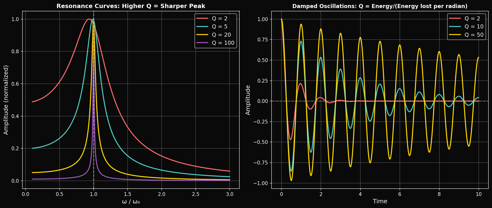
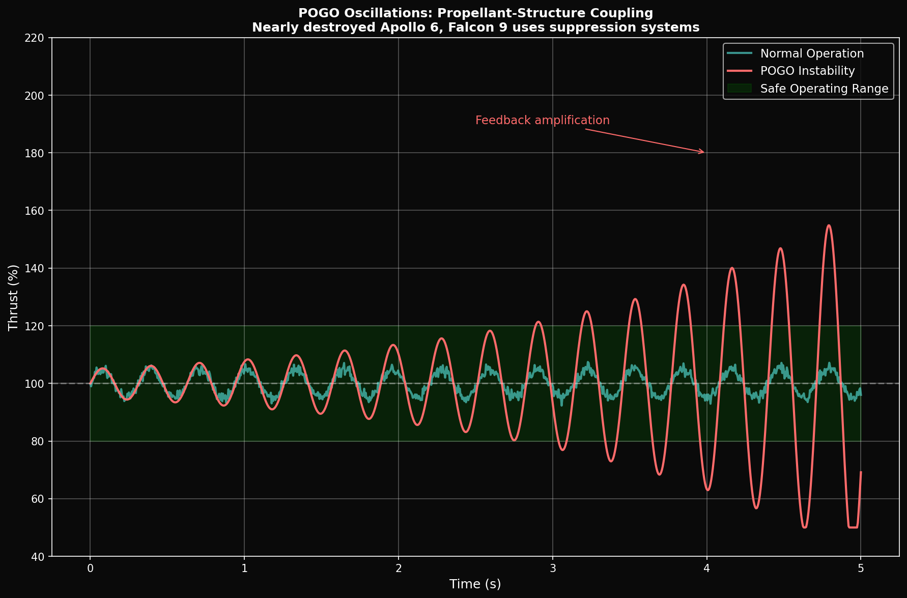

# Year 2, Unit 4: Oscillations & Waves
## *Resonance, Pogo, and Structural Modes*

**Duration:** 15 Days
**Grade Level:** 11th Grade
**Prerequisites:** Year 1 complete, Units 1-3 of Year 2

---

## Anchoring Question

> *The Saturn V nearly destroyed itself on Apollo 6 due to "pogo oscillations" — the engines, fuel lines, and structure formed a coupled oscillator that nearly tore the rocket apart. How do we understand, predict, and prevent resonance in complex systems?*


*Q-factor determines resonance sharpness and damping behavior*


*POGO instability: Propellant-structure feedback amplification*

---

## Learning Objectives

By the end of this unit, you will be able to:
1. Analyze simple harmonic motion mathematically
2. Solve the differential equation for SHM
3. Understand damped and driven oscillations
4. Calculate Q-factor and resonance behavior
5. Apply oscillation theory to real engineering systems

---

## Day 1-2: Simple Harmonic Motion Review

### Definition

Motion where the restoring force is proportional to displacement:

```
F = -kx

Where k = spring constant (or effective spring constant)
```

### The Differential Equation

```
m(d²x/dt²) = -kx

d²x/dt² + ω₀²x = 0

Where ω₀ = √(k/m) = natural frequency
```

### Solution

```
x(t) = A cos(ω₀t + φ)

Where:
  A = amplitude
  ω₀ = angular frequency (rad/s)
  φ = phase angle
```

### Related Quantities

```
Period:     T = 2π/ω₀ = 2π√(m/k)
Frequency:  f = 1/T = ω₀/(2π)
```

---

## Day 3-4: Energy in SHM

### Potential Energy

```
U = ½kx² = ½kA²cos²(ω₀t + φ)
```

### Kinetic Energy

```
K = ½mv² = ½mω₀²A²sin²(ω₀t + φ) = ½kA²sin²(ω₀t + φ)
```

### Total Energy

```
E = U + K = ½kA² = constant
```

Energy oscillates between kinetic and potential, but total is conserved.

---

## Day 5-6: Damped Oscillations

### Adding Friction

Real oscillators lose energy to friction/damping:

```
m(d²x/dt²) + b(dx/dt) + kx = 0

Where b = damping coefficient
```

### Damping Ratio

```
ζ = b / (2√(km)) = b / (2mω₀)
```

### Three Regimes

| Condition | Behavior | Example |
|-----------|----------|---------|
| ζ < 1 (underdamped) | Oscillates, decays | Tuning fork |
| ζ = 1 (critical) | Fastest non-oscillating decay | Car shock absorbers |
| ζ > 1 (overdamped) | Slow exponential decay | Door closer |

### Underdamped Solution

```
x(t) = Ae^(-γt)cos(ω't + φ)

Where:
  γ = b/(2m) = decay rate
  ω' = √(ω₀² - γ²) = damped frequency
```

---

## Day 7-8: Driven Oscillations and Resonance

### Driven Harmonic Oscillator

Add a periodic driving force:

```
m(d²x/dt²) + b(dx/dt) + kx = F₀cos(ωt)
```

### Steady-State Solution

```
x(t) = A(ω)cos(ωt - δ)

Amplitude: A(ω) = F₀ / √[(k - mω²)² + (bω)²]
Phase lag: tan δ = bω / (k - mω²)
```

### Resonance

Maximum amplitude occurs near ω = ω₀:

```
A_max = F₀ / (bω₀) = F₀Q / k
```

### Quality Factor (Q)

```
Q = ω₀m / b = ω₀ / (2γ) = f₀ / Δf

Where Δf = bandwidth at half-power
```

High Q = sharp resonance, low damping

---

## Day 9-10: Coupled Oscillators

### Two Masses, Two Springs

When oscillators are connected, they exchange energy:

```
m₁(d²x₁/dt²) = -k₁x₁ - k_c(x₁ - x₂)
m₂(d²x₂/dt²) = -k₂x₂ - k_c(x₂ - x₁)
```

### Normal Modes

Solutions where all parts oscillate at the same frequency:
- **Symmetric mode:** Both masses move in same direction
- **Antisymmetric mode:** Masses move in opposite directions

Each mode has its own natural frequency.

### SpaceX Application: Pogo Oscillations

**The Problem:**
1. Engine thrust varies slightly with combustion
2. Propellant lines act as acoustic cavities
3. Rocket structure is a spring-mass system
4. If these couple at the same frequency → RESONANCE

**The Falcon 9 Solution:**
- Pogo suppressors (accumulators) in propellant lines
- Decouple engine frequency from structural modes
- Active throttling to avoid resonant frequencies

**Saturn V Apollo 6 Pogo Event (1968):**
- J-2 engines oscillated at 5.5 Hz
- LOX feedline resonance at same frequency
- Thrust oscillations exceeded 200,000 pounds peak-to-peak
- Two engines shut down prematurely

---

## Day 11-12: Standing Waves and Modes

### Standing Waves on Strings

```
Wavelength: λₙ = 2L/n
Frequency:  fₙ = n × v/(2L) = n × f₁
```

### Harmonics

- **Fundamental (n=1):** λ₁ = 2L, one antinode
- **Second harmonic (n=2):** λ₂ = L, two antinodes
- **nth harmonic:** n antinodes

### Structural Modes

Rocket bodies have bending modes, torsional modes, breathing modes:

```
Each mode has a natural frequency:
f_bending,n ∝ n² × √(EI/ρA) / L²
```

### SpaceX Application: Starship Structural Modes

Starship is 50m tall, ~9m diameter. Its first bending mode is approximately:

```
f₁ ≈ 1-2 Hz (estimated)
```

Design requirement: Avoid coupling between:
- Engine thrust oscillation (typically 10-20 Hz)
- Propellant slosh (typically 0.1-1 Hz)
- Structural bending (typically 1-5 Hz)

---

## Day 13: Lab — Resonance Demonstration

### Forced Oscillation Experiment

**Setup:**
- Mass on spring with variable driving frequency
- Measure amplitude vs. driving frequency
- Plot resonance curve

**Procedure:**
1. Measure natural frequency f₀ with impulse response
2. Drive system at frequencies from 0.5f₀ to 2f₀
3. Record steady-state amplitude at each frequency
4. Plot A vs. f and identify resonance peak
5. Calculate Q from peak width

**Analysis Questions:**
1. How does damping affect peak height and width?
2. What is the phase relationship at resonance?
3. How would you design a system with Q = 10?

---

## Day 14-15: Assessment and Applications

### Real-World Resonance Examples

1. **Tacoma Narrows Bridge (1940):** Wind-induced torsional oscillation
2. **Millennium Bridge (2000):** Pedestrian-induced lateral oscillation
3. **Rocket Pogo:** Engine-propellant-structure coupling
4. **Car Vibration:** Engine firing frequency matching body resonance

### Simulation Code

```python
import numpy as np
from scipy.integrate import odeint

def driven_oscillator(y, t, omega_0, gamma, F0, omega_d):
    """Driven damped harmonic oscillator"""
    x, v = y
    dxdt = v
    dvdt = -omega_0**2 * x - 2*gamma*v + F0*np.cos(omega_d*t)
    return [dxdt, dvdt]

# Parameters
omega_0 = 10.0   # Natural frequency (rad/s)
gamma = 0.5     # Damping rate
F0 = 1.0        # Driving amplitude

# Sweep driving frequency
omega_d_values = np.linspace(5, 15, 100)
amplitudes = []

for omega_d in omega_d_values:
    t = np.linspace(0, 50, 5000)
    y0 = [0, 0]
    sol = odeint(driven_oscillator, y0, t, args=(omega_0, gamma, F0, omega_d))

    # Measure steady-state amplitude (last 10% of simulation)
    x = sol[-500:, 0]
    amp = (np.max(x) - np.min(x)) / 2
    amplitudes.append(amp)

# Plot resonance curve
```

---

## Unit Summary

| Concept | Key Equation | Application |
|---------|--------------|-------------|
| SHM | d²x/dt² + ω₀²x = 0 | Natural oscillation |
| Damped | x = Ae^(-γt)cos(ω't) | Energy dissipation |
| Driven | A = F₀/√[(k-mω²)² + (bω)²] | Forced response |
| Q-factor | Q = ω₀/(2γ) | Resonance sharpness |
| Resonance | ω ≈ ω₀ | Maximum amplitude |
| Pogo | Coupled modes | Rocket safety |

---

## Problem Sets

### Tier 1: Foundation (Must Do)

1. A 0.5 kg mass on a spring (k = 200 N/m) oscillates. Calculate (a) natural frequency, (b) period.

2. An oscillator with Q = 50 has natural frequency 100 Hz. What is the damping rate γ?

3. A string of length 2 m has wave speed 100 m/s. What are the frequencies of the first three harmonics?

### Tier 2: Application (Should Do)

4. A driven oscillator has ω₀ = 10 rad/s and Q = 20. At what driving frequencies is the amplitude half of maximum?

5. A rocket engine oscillates at 15 Hz. The propellant line has a resonance at 14.5 Hz. If the coupling coefficient is 0.1, calculate the beat frequency and explain why this is dangerous.

### Tier 3: Challenge (Want to Try?)

6. **Pogo Analysis:** Model a simplified rocket as two coupled oscillators (engine mass + propellant mass connected by a spring). Find the normal mode frequencies in terms of the individual frequencies and coupling strength.

7. **φ-Resonance:** In the AAH model, energy levels form a fractal pattern. If two levels separated by a φ-scaled gap were to form a "quantum oscillator," what would be the relationship between the natural frequency and φ? Speculate on whether physical systems might exhibit φ-ratio resonances.

---

## Resources

### Historical
- Apollo 6 Pogo Anomaly Report (NASA)
- Tacoma Narrows Bridge Collapse Analysis

### References
- French: "Vibrations and Waves"
- Crawford: "Waves"

---

*© 2026 Thomas A. Husmann / iBuilt LTD. All rights reserved.*
*Licensed under CC BY-NC-SA 4.0 for academic and research use.*
