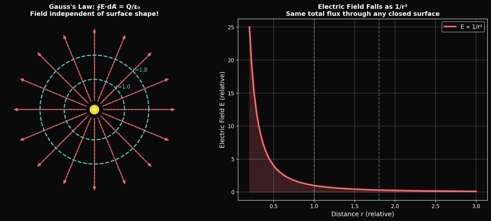
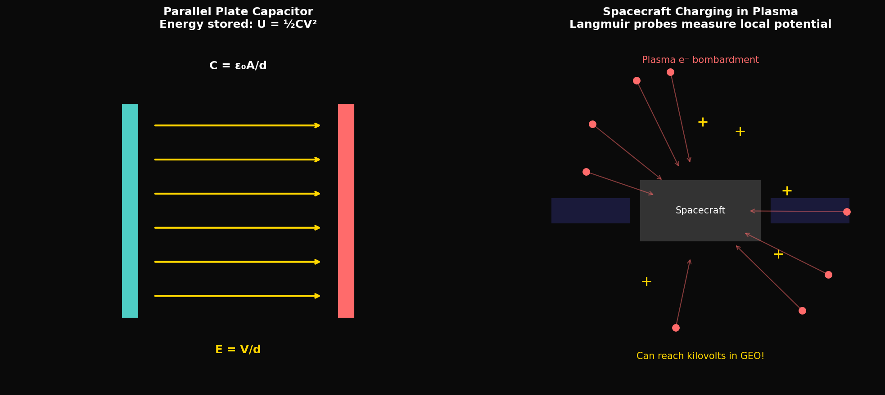

# Year 2, Unit 5: Electric Fields & Potential
## *Gauss's Law, Capacitance, and Spacecraft Charging*

**Duration:** 15 Days
**Grade Level:** 11th Grade
**Prerequisites:** Year 1 complete, Units 1-4 of Year 2

---

## Anchoring Question

> *A spacecraft in orbit accumulates electric charge from solar wind and photoelectron emission. This "spacecraft charging" can reach thousands of volts, causing arcing, instrument damage, and astronaut safety hazards. How do we understand and control electric fields in space?*


*Gauss's Law: Electric flux through any closed surface equals enclosed charge*


*Capacitors and spacecraft charging in plasma environments*

---

## Learning Objectives

By the end of this unit, you will be able to:
1. Calculate electric fields from charge distributions
2. Apply Gauss's Law to symmetric charge configurations
3. Understand electric potential and potential energy
4. Analyze capacitors and energy storage
5. Explain spacecraft charging physics

---

## Day 1-2: Electric Field Review

### Electric Field Definition

```
E = F/q = kQ/r² (point charge)

Where:
  k = 8.99 × 10⁹ N·m²/C² = 1/(4πε₀)
  ε₀ = 8.85 × 10⁻¹² C²/(N·m²)
```

### Superposition

For multiple charges, add field vectors:
```
E_total = E₁ + E₂ + E₃ + ...
```

### Field Lines

- Point away from positive charges
- Point toward negative charges
- Never cross
- Density indicates field strength

---

## Day 3-4: Electric Flux and Gauss's Law

### Electric Flux

```
Φ_E = ∫E⃗ · dA⃗ = EA cos θ (uniform field, flat surface)
```

### Gauss's Law

**The total electric flux through a closed surface equals the enclosed charge divided by ε₀:**

```
∮E⃗ · dA⃗ = Q_enclosed / ε₀
```

### Power of Symmetry

Gauss's Law is most useful when the charge distribution has symmetry:
- **Spherical:** Concentric shells, point charges
- **Cylindrical:** Long wires, charged cylinders
- **Planar:** Infinite sheets, parallel plates

---

## Day 5-6: Applying Gauss's Law

### Spherical Symmetry

**Point charge or spherical shell:**
```
E(r > R) = kQ/r² = Q/(4πε₀r²)
E(r < R) = 0 (inside conducting shell)
```

**Uniformly charged solid sphere:**
```
E(r > R) = kQ/r²
E(r < R) = kQr/R³ (linear inside)
```

### Cylindrical Symmetry

**Infinite line charge (λ = charge per length):**
```
E = λ/(2πε₀r)
```

### Planar Symmetry

**Infinite sheet (σ = charge per area):**
```
E = σ/(2ε₀) (constant, independent of distance!)
```

**Parallel plates:**
```
E = σ/ε₀ (between plates)
E = 0 (outside)
```

---

## Day 7-8: Electric Potential

### Definition

Electric potential is potential energy per unit charge:

```
V = U/q = kQ/r (point charge)
```

### Relationship to Field

```
E = -dV/dx (in 1D)
E⃗ = -∇V (in 3D)
```

### Voltage (Potential Difference)

```
ΔV = V_B - V_A = -∫E⃗ · dl⃗
```

### Equipotential Surfaces

- Surfaces of constant V
- Always perpendicular to field lines
- No work done moving along equipotential

---

## Day 9-10: Capacitance

### Definition

```
C = Q/V

Where:
  C = capacitance (Farads, F)
  Q = charge stored
  V = voltage across capacitor
```

### Parallel Plate Capacitor

```
C = ε₀A/d

Where:
  A = plate area
  d = separation
```

### Energy Stored

```
U = ½CV² = ½QV = Q²/(2C)
```

### Capacitors in Circuits

**Parallel:**
```
C_eq = C₁ + C₂ + C₃ + ...
```

**Series:**
```
1/C_eq = 1/C₁ + 1/C₂ + 1/C₃ + ...
```

---

## Day 11-12: Dielectrics

### Effect of Dielectric Material

Inserting a dielectric between capacitor plates:
- Increases capacitance: C = κC₀
- Reduces electric field: E = E₀/κ
- κ = dielectric constant

| Material | Dielectric Constant κ |
|----------|----------------------|
| Vacuum | 1.000 |
| Air | 1.0006 |
| Paper | 3.7 |
| Glass | 5-10 |
| Water | 80 |
| Titanium dioxide | 100 |

### Energy Density in Electric Field

```
u = ½ε₀E² (J/m³)

With dielectric: u = ½εE² = ½κε₀E²
```

---

## Day 13: Spacecraft Charging

### The Physics Problem

In space, spacecraft interact with:
1. **Solar wind:** Protons and electrons (mostly)
2. **Photoelectrons:** UV light ejects electrons from surfaces
3. **Plasma wake:** Electrons faster than ions → differential charging
4. **Secondary emission:** High-energy particles knock out electrons

### Charging Mechanisms

**In sunlight:**
- Photoelectrons emitted → spacecraft charges positive
- Equilibrium at a few volts positive

**In eclipse/shadow:**
- No photoelectrons
- Electron flux > ion flux
- Spacecraft charges negative (can reach -10 kV!)

**Differential charging:**
- Different surfaces charge differently
- Creates potential gradients → arcing

### SpaceX Dragon Charging

Dragon spacecraft includes:
- Conductive outer surfaces (grounding)
- Electrostatic discharge (ESD) protection
- Charge monitoring
- Pre-docking discharge procedures

### ISS Plasma Contactor

The ISS uses plasma contactors (hollow cathode devices) to:
- Emit electrons to neutralize positive charging
- Or attract electrons to neutralize negative charging
- Maintain hull near plasma potential

---

## Day 14: Lab — Capacitor Energy Storage

### Experiment

**Materials:**
- Various capacitors (1 µF, 10 µF, 100 µF)
- Power supply (0-30 V)
- LED with known forward voltage
- Multimeter

**Procedure:**
1. Charge capacitor to voltage V
2. Calculate stored energy: U = ½CV²
3. Discharge through LED and time light duration
4. Compare theoretical and measured energy

**Questions:**
1. How does energy scale with voltage?
2. How does capacitance affect discharge time?
3. Design a capacitor bank to store 1 J at 10 V

---

## Day 15: Assessment

### Unit Summary

| Concept | Key Equation | Application |
|---------|--------------|-------------|
| Electric field | E = kQ/r² | Force per charge |
| Gauss's Law | ∮E·dA = Q/ε₀ | Symmetric charges |
| Potential | V = kQ/r | Energy per charge |
| Capacitance | C = Q/V | Charge storage |
| Parallel plates | C = ε₀A/d | Common design |
| Energy | U = ½CV² | Storage capacity |

---

## Problem Sets

### Tier 1: Foundation (Must Do)

1. Use Gauss's Law to find the electric field at distance r from an infinite line charge with λ = 2 µC/m.

2. A parallel plate capacitor has plates of area 0.01 m² separated by 1 mm. Calculate (a) capacitance, (b) charge at 100 V, (c) energy stored.

3. Calculate the potential at 10 cm from a 5 µC point charge.

### Tier 2: Application (Should Do)

4. A spherical conductor of radius 10 cm carries charge Q = 10 µC. Find (a) electric field at r = 5 cm, (b) electric field at r = 20 cm, (c) potential at the surface.

5. A spacecraft in Earth's shadow charges to -5 kV. If its capacitance is 100 pF, how much charge has accumulated? What energy is stored?

### Tier 3: Challenge (Want to Try?)

6. **Langmuir Probe:** A small spherical probe in plasma collects current I = A × n_e × √(kT/m_e) × exp(eV/kT). Explain how sweeping probe voltage V can measure plasma density n_e and temperature T.

7. **φ in Electrostatics:** The potential at a point due to charges q₁ and q₂ at distances r₁ and r₂ is V = kq₁/r₁ + kq₂/r₂. If q₂/q₁ = φ and r₂/r₁ = φ², what is V in terms of kq₁/r₁?

---

## Resources

### SpaceX/NASA
- ISS Plasma Contactor documentation
- Dragon ESD requirements

### References
- Purcell: "Electricity and Magnetism"
- Garrett: "Spacecraft Charging Handbook"

---

*© 2026 Thomas A. Husmann / iBuilt LTD. All rights reserved.*
*Licensed under CC BY-NC-SA 4.0 for academic and research use.*
