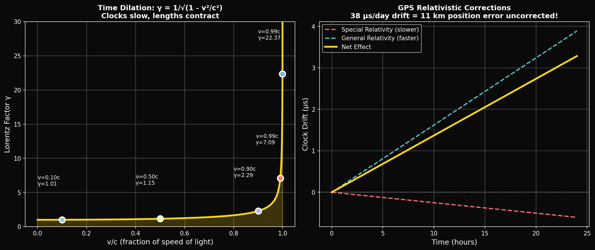
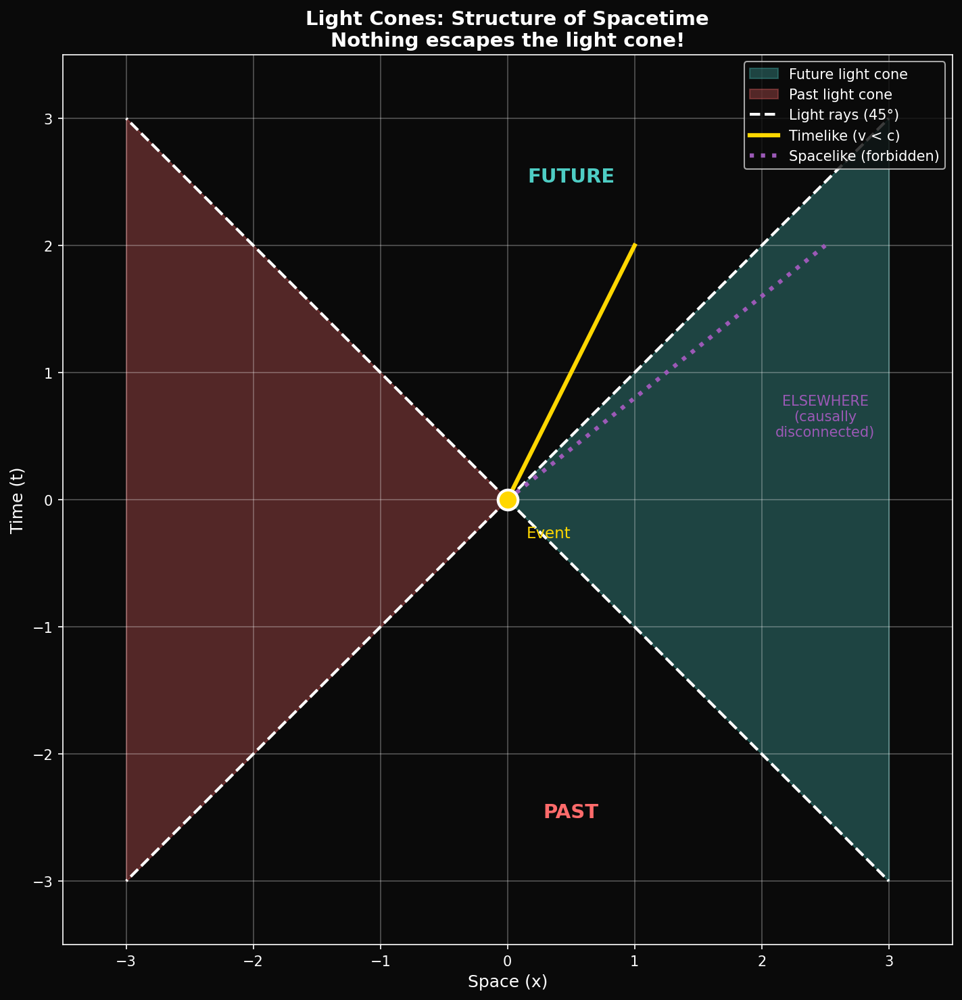

# Year 2, Unit 8: Special Relativity
## *Time Dilation, Length Contraction, and GPS*

**Duration:** 15 Days
**Grade Level:** 11th Grade
**Prerequisites:** Year 1 complete, Units 1-7 of Year 2

---

## Anchoring Question

> *GPS satellites orbit at 20,200 km altitude, moving at 3.9 km/s. Their atomic clocks run faster than ground clocks by 45 microseconds per day due to general relativity, but slower by 7 microseconds per day due to special relativity. Without these corrections, GPS would drift by 10 km per day. How does Einstein's relativity affect everyday technology?*


*Time dilation: Moving clocks run slower by factor γ*


*Spacetime light cones: Past, present, and future in relativity*

---

## Learning Objectives

By the end of this unit, you will be able to:
1. State Einstein's postulates of special relativity
2. Derive time dilation and length contraction
3. Calculate relativistic effects for moving objects
4. Understand the relativistic Doppler effect
5. Apply relativity to real-world systems like GPS

---

## Day 1-2: The Crisis of Classical Physics

### The Problem of Light

**Classical expectation:** Speed of light should depend on motion of source/observer (like sound).

**Michelson-Morley experiment (1887):** Speed of light is the SAME in all directions, regardless of Earth's motion.

**The dilemma:** Either there's no ether, or physics is broken.

### Einstein's Solution (1905)

**Two postulates:**
1. **Relativity principle:** Laws of physics are the same in all inertial frames
2. **Constancy of light:** Speed of light c is the same for all observers

These simple postulates have profound consequences.

---

## Day 3-4: Time Dilation

### The Light Clock Thought Experiment

Imagine a clock made of two mirrors with light bouncing between them:
- In the clock's rest frame: Light travels distance 2L in time t₀ = 2L/c
- In a moving frame: Light travels a longer diagonal path

### The Derivation

If clock moves at velocity v:
```
Light path (moving frame): 2√(L² + (vt/2)²)
Time (moving frame): t = 2√(L² + (vt/2)²) / c

Solving: t = t₀ / √(1 - v²/c²) = γt₀

Where γ = 1/√(1 - v²/c²) = Lorentz factor
```

### Time Dilation Formula

```
Δt = γΔt₀

Moving clocks run SLOW!
```

### Example: Muon Decay

Muons created in the upper atmosphere have half-life τ₀ = 2.2 µs.
At v = 0.998c:
- γ = 15.8
- Observed half-life: τ = 15.8 × 2.2 µs = 35 µs
- They travel much farther than classically expected!

---

## Day 5-6: Length Contraction

### The Argument

If time dilates for moving observers, space must contract to keep c constant.

### Length Contraction Formula

```
L = L₀/γ = L₀√(1 - v²/c²)

Moving objects are SHORTER in direction of motion!
```

### Example: Muon's Perspective

From the muon's frame:
- It lives 2.2 µs (proper time)
- But the atmosphere is length-contracted!
- L = 10 km / 15.8 = 630 m
- Muon can traverse this in its short lifetime

Both perspectives give the same answer — this is the power of relativity.

---

## Day 7-8: The Lorentz Transformation

### Transforming Between Frames

For frame S' moving at velocity v relative to S:

```
x' = γ(x - vt)
t' = γ(t - vx/c²)
y' = y
z' = z
```

### Inverse Transformation

```
x = γ(x' + vt')
t = γ(t' + vx'/c²)
```

### Spacetime Interval (Invariant)

```
(Δs)² = c²(Δt)² - (Δx)² - (Δy)² - (Δz)²

This quantity is the SAME in all frames!
```

---

## Day 9-10: Relativistic Velocity Addition

### The Problem

If a spaceship travels at 0.8c and fires a projectile at 0.5c (relative to ship), what is the projectile's speed relative to Earth?

Classical: 0.8c + 0.5c = 1.3c (impossible!)

### The Solution

```
u = (v + u') / (1 + vu'/c²)

Where:
  v = velocity of frame S' relative to S
  u' = velocity of object in frame S'
  u = velocity of object in frame S
```

### Example

```
u = (0.8c + 0.5c) / (1 + 0.8 × 0.5)
  = 1.3c / 1.4
  = 0.929c
```

Speed is always less than c!

---

## Day 11-12: Relativistic Momentum and Energy

### Relativistic Momentum

```
p = γmv = mv/√(1 - v²/c²)
```

As v → c, p → ∞. Infinite momentum needed to reach c!

### Relativistic Energy

**Total energy:**
```
E = γmc² = mc²/√(1 - v²/c²)
```

**Rest energy:**
```
E₀ = mc²
```

**Kinetic energy:**
```
KE = E - E₀ = (γ - 1)mc²
```

### Energy-Momentum Relation

```
E² = (pc)² + (mc²)²
```

For photons (m = 0):
```
E = pc
```

---

## Day 13: GPS and Relativity

### The System

- 31 satellites at 20,200 km altitude
- Orbital velocity: 3.9 km/s
- Each carries atomic clocks accurate to nanoseconds

### Relativistic Corrections

**Special relativity (time dilation):**
```
γ = 1/√(1 - v²/c²) = 1/√(1 - (3900)²/(3×10⁸)²)
γ ≈ 1 + 8.5×10⁻¹¹

Time runs SLOWER by: Δt_SR = -7.2 µs/day
```

**General relativity (gravitational time dilation):**
```
Higher altitude = weaker gravity = faster clocks
Time runs FASTER by: Δt_GR = +45.9 µs/day
```

**Net effect:**
```
Δt_total = +38.7 µs/day faster
```

### Without Corrections

Position error would accumulate:
```
Error = c × Δt = (3×10⁸ m/s) × (38.7×10⁻⁶ s/day)
      = 11.6 km/day!
```

GPS satellites pre-adjust their clock frequencies to compensate.

---

## Day 14: Relativistic Doppler Effect

### Classical Doppler (Sound)

```
f_observed = f_source × (v_sound ± v_observer) / (v_sound ∓ v_source)
```

### Relativistic Doppler (Light)

For source moving away:
```
f = f₀ × √((1 - v/c)/(1 + v/c))
```

For source approaching:
```
f = f₀ × √((1 + v/c)/(1 - v/c))
```

### Redshift Parameter

```
z = (λ_observed - λ_emitted) / λ_emitted = (f_emitted - f_observed) / f_observed
```

### SpaceX Application: Starlink Doppler

Starlink satellites move at ~7.5 km/s. For 12 GHz signals:
```
Doppler shift = f × v/c = 12×10⁹ × 7500/(3×10⁸) = 300 kHz
```

Terminals must track this frequency shift continuously.

---

## Day 15: Assessment and Preview

### Year 2 Summary

You've now learned:
- Advanced kinematics and the rocket equation
- Rotational mechanics and attitude control
- Thermodynamics and nozzle physics
- Oscillations, resonance, and structural modes
- Electric fields, capacitance, and spacecraft charging
- AC circuits, EM waves, and phased arrays
- Quasicrystals and the AAH model introduction
- Special relativity and GPS corrections

### Preview: Year 3

- Orbital mechanics and mission design
- Rocket propulsion in depth
- Space environment and radiation
- **Quantum mechanics foundations**
- Cosmology and the φ-framework
- Maxwell's equations in full
- Capstone mission projects

---

## Unit Summary

| Concept | Key Equation | Application |
|---------|--------------|-------------|
| Time dilation | Δt = γΔt₀ | Moving clocks |
| Length contraction | L = L₀/γ | Moving objects |
| Lorentz factor | γ = 1/√(1-v²/c²) | Relativistic calculations |
| Velocity addition | u = (v+u')/(1+vu'/c²) | Combining velocities |
| Mass-energy | E = mc² | Nuclear energy |
| GPS correction | ±38.7 µs/day | Navigation |

---

## Problem Sets

### Tier 1: Foundation (Must Do)

1. Calculate the Lorentz factor γ for (a) v = 0.1c, (b) v = 0.5c, (c) v = 0.9c, (d) v = 0.99c.

2. A muon with rest half-life 2.2 µs travels at 0.95c. What is its observed half-life in the lab frame?

3. A spaceship is measured as 100 m long when at rest. If it travels at 0.6c, what length do Earth observers measure?

### Tier 2: Application (Should Do)

4. A spacecraft travels at 0.8c relative to Earth. It fires a probe forward at 0.5c relative to itself. What is the probe's speed relative to Earth?

5. Calculate the relativistic kinetic energy of an electron (m = 9.11×10⁻³¹ kg) traveling at 0.99c. Express in MeV.

### Tier 3: Challenge (Want to Try?)

6. **Twin Paradox:** One twin stays on Earth while the other travels to a star 10 light-years away at 0.9c and returns. How much time passes for each twin? Explain why this isn't symmetric.

7. **φ and Relativity:** The γ factor at v = c√(1-1/φ²) ≈ 0.786c is exactly γ = φ. Calculate this and verify. Is there any physical significance to traveling at the "golden velocity"?

---

## Resources

### Videos
- PBS Space Time: "What is the Speed of Light?"
- Veritasium: "How GPS Actually Works"

### References
- Taylor & Wheeler: "Spacetime Physics"
- Einstein: "On the Electrodynamics of Moving Bodies" (1905)

---

*© 2026 Thomas A. Husmann / iBuilt LTD. All rights reserved.*
*Licensed under CC BY-NC-SA 4.0 for academic and research use.*
