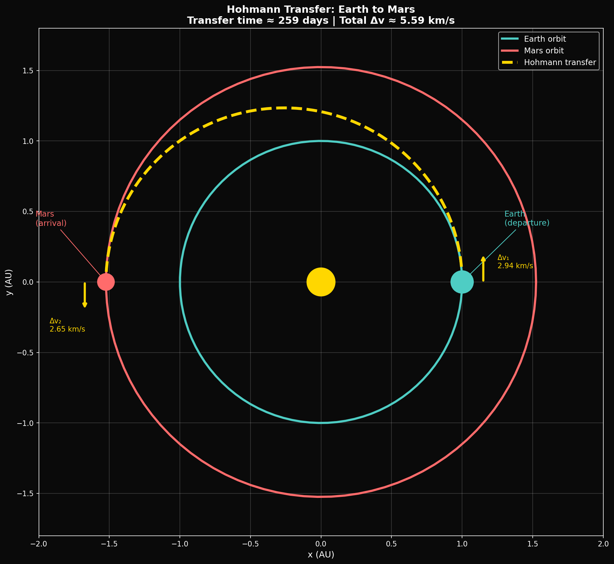
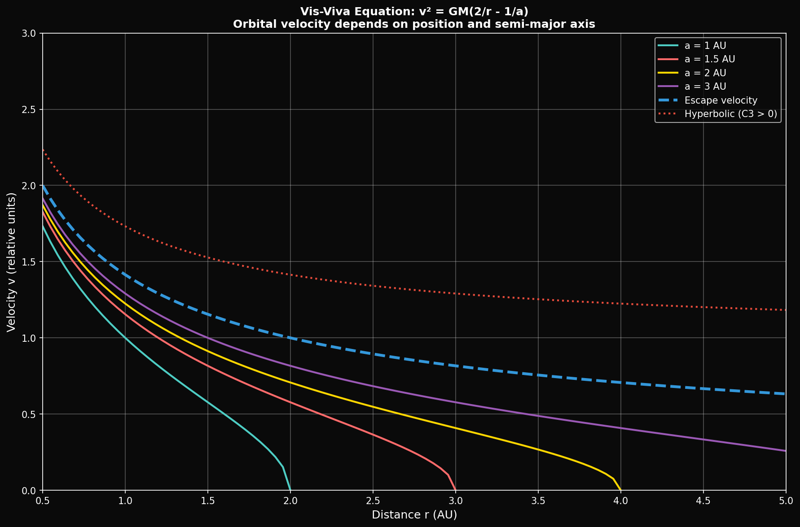

# Year 3, Unit 1: Orbital Mechanics
## *The Mathematics of Space Navigation*

**Duration:** 20 Days
**Grade Level:** 12th Grade
**Prerequisites:** Year 1-2 complete, Calculus

---

## Anchoring Question

> *Starship is designed to reach Mars. The trajectory from Earth to Mars is not a straight line — it's an elliptical arc called a Hohmann transfer, calculated from the same physics Newton derived in 1687. Calculate the minimum Δv required to send Starship to Mars — and verify it against publicly available SpaceX mission parameters.*


*Hohmann transfer orbit: Minimum-energy path between circular orbits*


*Vis-viva equation: The master equation of orbital mechanics*

---

## Learning Objectives

By the end of this unit, you will be able to:
1. Derive Kepler's laws from Newton's law of gravitation
2. Apply conservation of energy and angular momentum to orbits
3. Calculate orbital velocities, periods, and energies
4. Analyze Hohmann transfer orbits and Δv budgets
5. Understand gravity assists and their energy source
6. Apply the vis-viva equation to any orbital problem
7. Explore φ-perturbations in the Husmann framework

---

## Day 1-2: Kepler's Laws — The Empirical Foundation

### The Three Laws

**First Law (1609):** Planets move in ellipses with the Sun at one focus.

**Second Law (1609):** A line from planet to Sun sweeps equal areas in equal times.

**Third Law (1619):** T² ∝ a³ — orbital period squared is proportional to semi-major axis cubed.

### Kepler's Achievement

Kepler derived these from Tycho Brahe's meticulous observations of Mars. He had no explanation for WHY they were true — that would require Newton.

---

## Day 3-4: Newton's Law of Gravitation

### The Universal Law

```
F = G × (m₁ × m₂) / r²

Where G = 6.674 × 10⁻¹¹ N·m²/kg²
```

### The Profound Implication

The same force that makes an apple fall:
- Keeps the Moon in orbit
- Governs planetary motion
- Structures galaxies

**"If I have seen further, it is by standing on the shoulders of giants."** — Newton

---

## Day 5-6: Deriving Kepler's Laws from Newton

### The Derivation (with calculus)

Starting from:
- Newton's Second Law: F = ma
- Newton's Gravity: F = GMm/r²
- Conservation of Angular Momentum: L = mr²(dθ/dt) = constant

**Key steps:**
1. Combine to get equation of motion in polar coordinates
2. Change variable from t to θ using angular momentum
3. Solve differential equation for r(θ)
4. Result: r = a(1-e²)/(1+e cos θ) — an ellipse!

### Kepler's Second Law: Automatic!

Angular momentum conservation immediately gives:

```
dA/dt = (1/2)r²(dθ/dt) = L/(2m) = constant

Equal areas in equal times!
```

### Kepler's Third Law: Derived

For circular orbit (e = 0):

```
Gravitational force = Centripetal force
GMm/r² = mv²/r

v = √(GM/r)

Period T = 2πr/v = 2πr/√(GM/r) = 2π√(r³/GM)

T² = (4π²/GM) × r³

T² ∝ r³ ✓
```

For ellipse, replace r with semi-major axis a.

---

## Day 7-8: Orbital Energy and the Vis-Viva Equation

### Total Orbital Energy

```
E = KE + PE = ½mv² - GMm/r
```

For bound orbits, E < 0 (negative total energy).

### The Vis-Viva Equation

The most useful equation in orbital mechanics:

```
v² = GM(2/r - 1/a)

Where:
  v = orbital velocity at distance r
  a = semi-major axis
  GM = gravitational parameter
```

**Special cases:**
- Circular orbit (r = a): v² = GM/a
- Escape (a = ∞): v² = 2GM/r

---

## Day 9-10: Hohmann Transfer Orbits

### The Concept

A Hohmann transfer is the minimum-energy path between two circular orbits:
1. Burn at periapsis to raise apoapsis to target orbit
2. Coast along transfer ellipse
3. Burn at apoapsis to circularize

### Earth-to-Mars Calculation

**Given:**
- r_Earth = 1.496 × 10¹¹ m (1 AU)
- r_Mars = 2.279 × 10¹¹ m (1.524 AU)
- GM_Sun = 1.327 × 10²⁰ m³/s²

**Transfer ellipse:**
```
a_transfer = (r_Earth + r_Mars)/2 = 1.888 × 10¹¹ m
```

**Earth orbital velocity:**
```
v_Earth = √(GM/r_Earth) = √(1.327×10²⁰ / 1.496×10¹¹) = 29.78 km/s
```

**Velocity at perihelion of transfer (using vis-viva):**
```
v_perihelion² = GM(2/r_Earth - 1/a_transfer)
v_perihelion = √(1.327×10²⁰ × (2/1.496×10¹¹ - 1/1.888×10¹¹))
v_perihelion = 32.73 km/s
```

**Δv₁ (Earth departure):**
```
Δv₁ = 32.73 - 29.78 = 2.95 km/s
```

**Similarly, Δv₂ (Mars arrival):** ~2.65 km/s

**Transfer time:**
```
T = π × √(a³/GM) = π × √((1.888×10¹¹)³ / 1.327×10²⁰) = 2.24 × 10⁷ s = 259 days
```

**Total Δv for Mars transfer:** ~5.6 km/s (just for heliocentric transfer, not including escape from Earth or capture at Mars!)

---

## Day 11-12: The Full Mars Mission Δv Budget

### Complete Budget

| Maneuver | Δv (km/s) |
|----------|-----------|
| LEO to Earth escape | 3.2 |
| Earth-Mars transfer | 2.95 |
| Mars capture | 0.7 |
| Mars orbit to surface | 4.1 |
| **Total to Mars surface** | **11.0** |
| Mars ascent | 4.1 |
| Mars escape to Earth | 2.65 |
| Earth capture/aerobrake | 0 (aerobraking) |
| **Round trip total** | **~17.75** |

### SpaceX Starship Parameters

- Raptor Isp (vacuum): 380 s → v_e = 3,730 m/s
- Starship dry mass: ~100 tons
- Propellant capacity: ~1,200 tons

Using the rocket equation:
```
Δv = v_e × ln(m_initial/m_final)
   = 3730 × ln(1300/100)
   = 3730 × 2.56
   = 9.5 km/s per stage
```

**This is why Mars missions need orbital refueling!** A single Starship can't carry enough propellant for round trip.

---

## Day 13-14: Gravity Assists

### The Concept

Use a planet's gravity and motion to change spacecraft velocity without using propellant.

### The Physics

In the planet's reference frame, the spacecraft:
- Enters at velocity v_in
- Exits at velocity v_out (same magnitude, different direction)
- Just a hyperbolic flyby — no energy change

In the Sun's reference frame:
- Planet is moving at v_planet
- Spacecraft can gain up to 2 × v_planet

### Example: Jupiter Flyby

Jupiter orbital velocity: 13.1 km/s

Maximum velocity gain from Jupiter flyby: up to 26.2 km/s!

**Voyager 1** used Jupiter's gravity to achieve solar escape velocity.

---

## Day 15-18: Husmann Orbital Mechanics Extension

### The Standard Model

Newtonian gravity: V(r) = -GM/r

### The Husmann Perturbation

What if the vacuum has φ-based structure? The potential might include:

```
V(r) = -GM/r + ε × φ² × f(r)

Where:
  ε = small perturbation parameter
  f(r) = quasiperiodic modulation from AAH model
```

### Running the Simulation

Using `orbital_mechanics_sim.py`:

```python
import numpy as np
from scipy.integrate import odeint

phi = (1 + np.sqrt(5)) / 2
GM = 1.327e20  # Sun's gravitational parameter

def acceleration(state, t, epsilon):
    x, y, vx, vy = state
    r = np.sqrt(x**2 + y**2)

    # Newtonian gravity
    a_newton = -GM / r**3

    # φ-perturbation (simplified model)
    bracket = np.log(r / 1.616e-35) / np.log(phi)
    f_r = np.cos(2 * np.pi * bracket / phi**2)
    a_phi = epsilon * phi**2 * f_r / r**2

    ax = (a_newton + a_phi) * x
    ay = (a_newton + a_phi) * y

    return [vx, vy, ax, ay]
```

### Investigation Questions

1. For what values of ε does the perturbation produce stable orbital precession?
2. Do any perturbation strengths produce Fibonacci-ratio orbital resonances?
3. How would you design an observation to constrain ε?

---

## Day 19-20: Review and Assessment

### Unit Summary

| Concept | Key Equation | Application |
|---------|--------------|-------------|
| Newton's gravity | F = GMm/r² | Universal |
| Kepler's Third | T² = (4π²/GM)a³ | Orbital periods |
| Vis-viva | v² = GM(2/r - 1/a) | Any orbital velocity |
| Hohmann Δv | Calculate from vis-viva | Mission planning |
| Gravity assist | Δv ≤ 2v_planet | Deep space missions |
| φ-perturbation | V = -GM/r + εφ²f(r) | Framework research |

---

## Problem Sets

### Tier 1: Foundation (Must Do)

1. Calculate the orbital velocity and period of the ISS at 400 km altitude.

2. A satellite transfers from 200 km circular orbit to 35,800 km (GEO). Calculate Δv₁ and Δv₂ for the Hohmann transfer.

3. Using the vis-viva equation, calculate the velocity of a comet at perihelion (0.5 AU) if its aphelion is at 50 AU.

### Tier 2: Application (Should Do)

4. Design a Hohmann transfer from Earth to Venus. Calculate: (a) transfer orbit semi-major axis, (b) Δv at Earth, (c) Δv at Venus, (d) transfer time.

5. A spacecraft does a gravity assist at Jupiter. It approaches Jupiter at 10 km/s relative to Jupiter, and exits at 180° direction change. Jupiter's orbital velocity is 13.1 km/s. What is the spacecraft's new heliocentric velocity?

### Tier 3: Challenge (Want to Try?)

6. **Bracket Analysis:** Calculate the bracket positions of Earth's orbit (1 AU), Mars's orbit (1.524 AU), and Jupiter's orbit (5.2 AU). What is the bracket difference between adjacent planets? Is it related to φ?

7. **Orbital Resonances:** Jupiter and Saturn are in near 5:2 resonance (5 Jupiter orbits ≈ 2 Saturn orbits). Calculate the actual period ratio. The ratio 5/2 = 2.5. What Fibonacci ratio is closest? Does this suggest φ-structure in planetary formation?

---

## Resources

### Software
- NASA GMAT (General Mission Analysis Tool) — free
- `orbital_mechanics_sim.py` from repository

### References
- Bate, Mueller, White: "Fundamentals of Astrodynamics"
- NASA trajectory browser

---

*© 2026 Thomas A. Husmann / iBuilt LTD. All rights reserved.*
*Licensed under CC BY-NC-SA 4.0 for academic and research use.*
