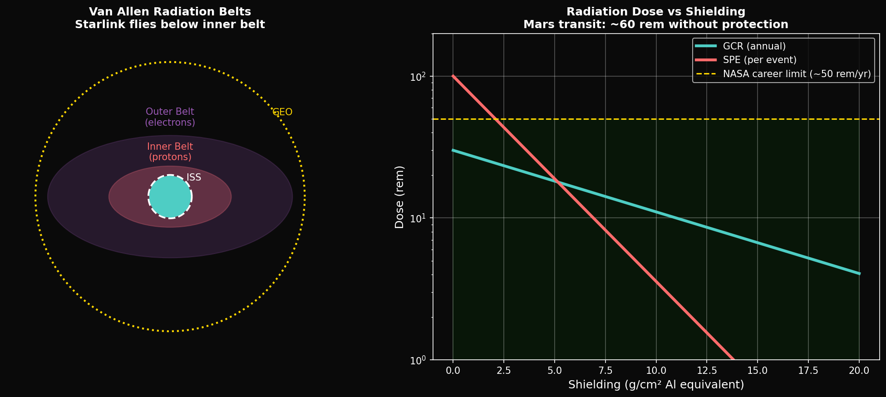
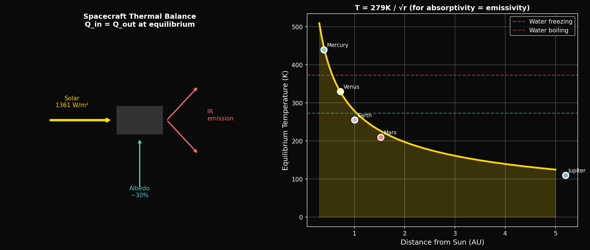

# Year 3, Unit 3: Space Environment
## *Radiation, Plasma, and Material Degradation*

**Duration:** 20 Days
**Grade Level:** 12th Grade
**Prerequisites:** Year 1-2, Units 1-2 of Year 3, Calculus

---

## Anchoring Question

> *Astronauts on the ISS receive about 150 millisieverts per year — 50× the average ground dose. A Mars mission might expose crew to 1 sievert or more. What is space radiation, how does it damage biology and equipment, and how do we protect against it?*


*Space radiation sources: GCR, SPE, and Van Allen belts*


*Thermal challenges in space: Heating and cooling extremes*

---

## Learning Objectives

By the end of this unit, you will be able to:
1. Identify sources and types of space radiation
2. Calculate radiation doses and biological effects
3. Analyze shielding strategies and their tradeoffs
4. Understand plasma physics and spacecraft interactions
5. Evaluate material degradation mechanisms in space

---

## Day 1-2: Space Radiation Sources

### Galactic Cosmic Rays (GCR)

- **Origin:** Supernova explosions throughout the galaxy
- **Composition:** 85% protons, 14% helium nuclei, 1% heavy ions (HZE)
- **Energy:** 100 MeV to 10 GeV per nucleon
- **Flux:** ~2-4 particles/cm²/s

**GCR is continuous and nearly impossible to fully shield.**

### Solar Particle Events (SPE)

- **Origin:** Solar flares and coronal mass ejections
- **Composition:** Mainly protons (>95%)
- **Energy:** 10 MeV to 1 GeV
- **Duration:** Hours to days
- **Intensity:** Varies wildly; worst events can be lethal in hours

**SPE is episodic but potentially extremely dangerous.**

### Van Allen Belts

- **Inner Belt:** 1,000-6,000 km altitude; mainly protons
- **Outer Belt:** 13,000-60,000 km; mainly electrons
- **Origin:** Solar wind particles trapped by Earth's magnetic field

**ISS (400 km) is below the belts; GPS satellites (20,200 km) are between them.**

---

## Day 3-4: Radiation Physics

### Particle Interactions

**Ionization:**
```
Charged particle → Strips electrons from atoms
Energy loss: dE/dx ∝ z²/v² (Bethe formula)
```

**Nuclear interactions:**
```
High-energy particle + nucleus → Secondary particles
Creates shower of lower-energy particles
```

### Dose Units

```
Absorbed Dose: D = Energy/Mass (Gray, Gy = J/kg)
Equivalent Dose: H = D × Q (Sievert, Sv)

Where Q = quality factor (depends on radiation type)
```

| Radiation | Q Factor |
|-----------|----------|
| Gamma, X-ray | 1 |
| Protons | 2-5 |
| Alpha | 20 |
| Heavy ions | 20-40 |

### Biological Effects

| Dose (Sv) | Effect |
|-----------|--------|
| 0.001 | Background per year |
| 0.02 | Chest X-ray |
| 0.25 | Detectable blood changes |
| 1 | Mild radiation sickness |
| 4 | LD50 (lethal to 50%) |
| 10 | Death in days |

---

## Day 5-6: Radiation Shielding

### Mass Shielding

**Stopping power scales with density and thickness:**
```
I = I₀ × e^(-μx)

Where μ = absorption coefficient
```

**Problem:** High-Z materials (lead) create secondary radiation from GCR
**Solution:** Low-Z materials (hydrogen-rich) better for GCR

### Material Comparison

| Material | Density (g/cm³) | GCR Protection | SPE Protection |
|----------|-----------------|----------------|----------------|
| Aluminum | 2.7 | Poor | Good |
| Polyethylene | 0.95 | Good | Good |
| Water | 1.0 | Good | Good |
| Regolith | 1.5 | Fair | Good |

### Active Shielding Concepts

**Magnetic shielding:**
- Create artificial magnetosphere
- Deflect charged particles
- Requires superconducting magnets (massive)

**Electrostatic shielding:**
- High-voltage sphere repels protons
- Attracts electrons (problematic)
- Charge leakage issues

---

## Day 7-8: Astronaut Dose Limits

### NASA Career Limits

| Age at Exposure | Male (Sv) | Female (Sv) |
|-----------------|-----------|-------------|
| 25 | 1.5 | 1.0 |
| 35 | 2.5 | 1.75 |
| 45 | 3.25 | 2.5 |
| 55 | 4.0 | 3.0 |

These limits target <3% increase in cancer mortality.

### Mission Doses

| Mission | Duration | Dose (mSv) |
|---------|----------|------------|
| ISS (6 months) | 180 days | 80-160 |
| Apollo (lunar) | 12 days | 2-12 |
| Mars (round trip) | 900 days | 600-1000+ |

**Mars mission exceeds career limits for most astronauts!**

### Mitigation Strategies

1. **Storm shelter:** Low-mass, high-protection area for SPE
2. **Faster transit:** Reduce GCR exposure time
3. **Pharmaceuticals:** Radioprotective drugs (research stage)
4. **Selection:** Choose older astronauts (lower cancer risk)

---

## Day 9-10: Plasma Environment

### What is Plasma?

Fourth state of matter: ionized gas with free electrons and ions

```
Debye length: λ_D = √(ε₀kT / ne²)

Characteristic scale over which charge is screened
```

### Space Plasmas

| Region | Density (cm⁻³) | Temperature (eV) |
|--------|----------------|------------------|
| Solar wind (1 AU) | 5 | 10 |
| Magnetosphere | 1-1000 | 10-10000 |
| LEO ionosphere | 10⁵-10⁶ | 0.1 |
| Interplanetary | 0.1 | 10 |

### Spacecraft-Plasma Interactions

1. **Photoelectron emission:** UV ejects electrons → positive charging
2. **Electron collection:** Faster electrons preferentially collected → negative charging
3. **Differential charging:** Shadowed vs. sunlit surfaces at different potentials

---

## Day 11-12: Spacecraft Charging

### Surface Charging

**In eclipse:**
```
J_e >> J_i (electrons faster than ions)
V → negative (can reach -10 kV!)
```

**In sunlight:**
```
J_photo dominates
V → positive (few volts typically)
```

### Electrostatic Discharge (ESD)

When potential difference exceeds breakdown threshold:
- Surface arcs
- Electronics damage
- Sensor contamination
- Telemetry anomalies

### Mitigation

1. **Conductive surfaces:** Equalize potential
2. **Grounding:** Connect all surfaces
3. **Charge bleeders:** Slow discharge paths
4. **Plasma contactors:** Active neutralization (ISS)

---

## Day 13-14: Material Degradation

### Atomic Oxygen (LEO)

- Altitude: 200-700 km
- Flux: ~10¹⁴ atoms/cm²/s
- Energy: 5 eV (ram direction)

**Effects:**
- Oxidizes polymers
- Erodes organic materials
- Degrades thermal coatings

**Protection:**
- SiO₂ coatings
- Metal foils
- Atomic oxygen resistant polymers

### UV Degradation

- Unfiltered solar UV below 200 nm
- Breaks chemical bonds
- Embrittles polymers
- Darkens optical materials

### Micrometeorites and Debris

**Flux:** ~10⁻⁴ impacts/m²/year (>1 cm objects)

**Velocity:** 10-70 km/s (relative)

**Kinetic energy:** KE = ½mv²
- A 1 cm aluminum sphere at 10 km/s: E = 170 kJ (equivalent to hand grenade)

**Protection:**
- Whipple shields (multiple thin layers)
- Stuffed Whipple (intermediate materials)
- Debris avoidance maneuvers

---

## Day 15-16: Heat Shield Physics

### Atmospheric Entry Heating

**Stagnation point heat flux:**
```
q = ρ½ × v³ (simplified)

At 7.5 km/s in Earth's atmosphere: q ~ 100 W/cm²
At 11 km/s (Mars return): q ~ 300 W/cm²
```

### Thermal Protection Strategies

**Ablative:**
- Material pyrolyzes and carries heat away
- PICA-X on Dragon
- One-time use

**Reusable:**
- High-temperature ceramics
- Space Shuttle tiles
- Starship steel + tiles

### SpaceX Heat Shield Challenge

**The Problem:**
- Starship tiles: hexagonal ceramic
- Edge gaps allow plasma penetration
- Thermal shock causes spalling
- "The biggest remaining problem" (Elon Musk)

**Framework Contribution:**
- Patent 63/995,401: Quasicrystalline coating
- φ-structured surface resists crack propagation
- No preferred planes for thermal shock

---

## Day 17-18: ECLSS and Life Support

### Environmental Control and Life Support System

**Atmosphere:**
- Maintain O₂: 21 kPa
- Remove CO₂: <0.7 kPa
- Control humidity: 40-60%
- Filter particulates

**Water:**
- Reclaim from humidity, urine, hygiene
- ISS recovers 90%+ of water

**Thermal:**
- Reject metabolic heat (~100 W/person)
- Electronics heat
- Radiators to space

### Radiation in ECLSS

Heavy ions can:
- Disrupt electronics
- Contaminate water
- Damage biological filters

---

## Day 19-20: Assessment

### Unit Summary

| Hazard | Source | Mitigation |
|--------|--------|------------|
| GCR | Galaxy | Low-Z shielding, speed |
| SPE | Sun | Storm shelter, warning |
| Charging | Plasma | Grounding, contactors |
| Atomic O | LEO | Resistant coatings |
| Micrometeoroids | Debris | Whipple shields |
| Thermal | Entry | Ablatives, ceramics |

---

## Problem Sets

### Tier 1: Foundation (Must Do)

1. An astronaut receives 150 mSv in 6 months on ISS. What is the daily dose rate? How long until they reach 1 Sv career limit at this rate?

2. Calculate the kinetic energy of a 1 mm aluminum particle (ρ = 2700 kg/m³) traveling at 15 km/s.

3. If a spacecraft charges to -5 kV and has capacitance 50 pF, how much charge has accumulated?

### Tier 2: Application (Should Do)

4. A proton with energy 100 MeV passes through 10 cm of polyethylene (density 0.95 g/cm³). Using the approximation that stopping power ≈ 2 MeV·cm²/g, estimate the energy loss.

5. Design a storm shelter for a Mars transit vehicle. If the shelter must reduce SPE dose by factor of 10 and polyethylene provides 50% reduction per 5 g/cm², how thick must the walls be?

### Tier 3: Challenge (Want to Try?)

6. **Magnetic Shielding:** A solenoid with field B deflects a proton with momentum p by angle θ = qBL/(pc) over length L. What field strength deflects 100 MeV protons by 90° over 2 meters?

7. **φ-Shielding:** If a quasicrystalline material has self-similar voids at φ-scaled intervals, speculate on how this might affect particle stopping power compared to a periodic crystal. What experiment could test this?

---

## Resources

### NASA Technical
- "Space Radiation Cancer Risk Projections"
- "Atomic Oxygen Effects Handbook"

### References
- Tribble: "The Space Environment"
- Pisacane: "The Space Environment and Its Effects on Space Systems"

---

*© 2026 Thomas A. Husmann / iBuilt LTD. All rights reserved.*
*Licensed under CC BY-NC-SA 4.0 for academic and research use.*
