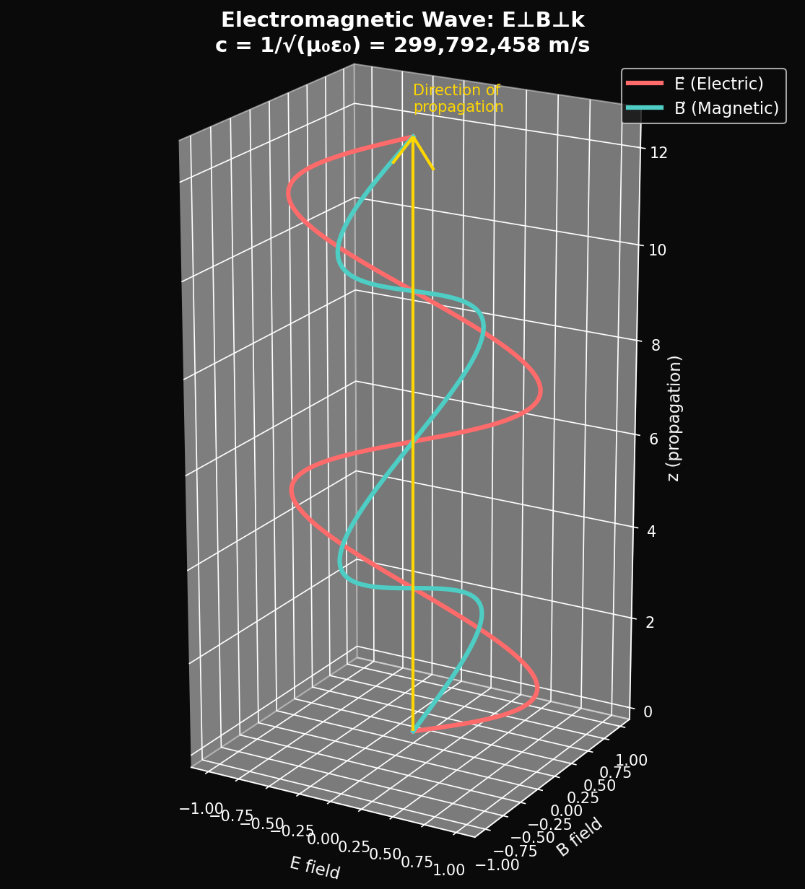
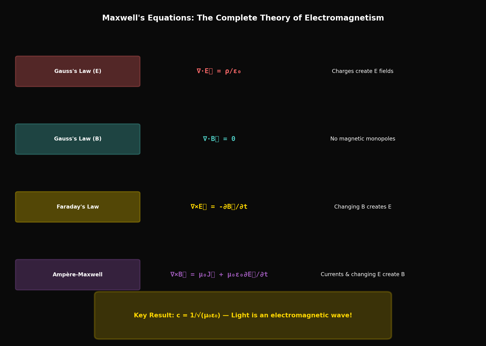

# Year 3, Unit 6: Maxwell's Equations
## *The Unified Theory of Light and Electromagnetism*

**Duration:** 20 Days
**Grade Level:** 12th Grade
**Prerequisites:** Year 1-2, Units 1-5 of Year 3, Calculus (Vector)

---

## Anchoring Question

> *In 1865, James Clerk Maxwell unified electricity and magnetism with four equations — and accidentally discovered that light is an electromagnetic wave. This was the first unification in physics. What are these equations, and what do they tell us about the nature of reality?*


*Electromagnetic wave: E and B fields oscillating perpendicular to propagation*


*Maxwell's four equations: The complete theory of electromagnetism*

---

## Learning Objectives

By the end of this unit, you will be able to:
1. State Maxwell's equations in differential and integral form
2. Derive the wave equation from Maxwell's equations
3. Calculate the speed of light from fundamental constants
4. Understand electromagnetic wave properties
5. Relate classical electromagnetism to the φ-framework preview

---

## Day 1-2: The Four Laws

### Gauss's Law for Electricity

**Integral form:**
```
∮ E⃗ · dA⃗ = Q_enclosed / ε₀
```

**Differential form:**
```
∇ · E⃗ = ρ / ε₀
```

**Meaning:** Electric field lines originate on positive charges and terminate on negative charges.

### Gauss's Law for Magnetism

**Integral form:**
```
∮ B⃗ · dA⃗ = 0
```

**Differential form:**
```
∇ · B⃗ = 0
```

**Meaning:** No magnetic monopoles exist. Magnetic field lines always form closed loops.

### Faraday's Law

**Integral form:**
```
∮ E⃗ · dl⃗ = -dΦ_B/dt
```

**Differential form:**
```
∇ × E⃗ = -∂B⃗/∂t
```

**Meaning:** A changing magnetic field creates an electric field.

### Ampère-Maxwell Law

**Integral form:**
```
∮ B⃗ · dl⃗ = μ₀I_enclosed + μ₀ε₀ dΦ_E/dt
```

**Differential form:**
```
∇ × B⃗ = μ₀J⃗ + μ₀ε₀ ∂E⃗/∂t
```

**Meaning:** Currents AND changing electric fields create magnetic fields.

---

## Day 3-4: The Displacement Current

### Maxwell's Crucial Addition

Ampère's original law:
```
∇ × B⃗ = μ₀J⃗
```

**Problem:** Violates conservation of charge for time-varying fields!

**Maxwell's fix:** Add displacement current term:
```
J_D = ε₀ ∂E⃗/∂t
```

### Physical Interpretation

Between capacitor plates:
- No conduction current J
- But electric field is changing
- This "displacement current" maintains continuity

### Symmetry Achieved

Now the equations are symmetric:
- Changing B → creates E (Faraday)
- Changing E → creates B (Ampère-Maxwell)

This symmetry allows self-sustaining waves!

---

## Day 5-6: Deriving the Wave Equation

### Starting Point (Free Space)

In free space (no charges or currents):
```
∇ · E⃗ = 0
∇ · B⃗ = 0
∇ × E⃗ = -∂B⃗/∂t
∇ × B⃗ = μ₀ε₀ ∂E⃗/∂t
```

### The Derivation

Take curl of Faraday's law:
```
∇ × (∇ × E⃗) = -∂/∂t (∇ × B⃗)
```

Use vector identity: ∇ × (∇ × E⃗) = ∇(∇ · E⃗) - ∇²E⃗ = -∇²E⃗

Substitute Ampère-Maxwell:
```
-∇²E⃗ = -∂/∂t (μ₀ε₀ ∂E⃗/∂t)

∇²E⃗ = μ₀ε₀ ∂²E⃗/∂t²
```

### The Wave Equation!

```
∇²E⃗ = (1/c²) ∂²E⃗/∂t²

Where c = 1/√(μ₀ε₀)
```

The same equation applies to B⃗.

---

## Day 7-8: The Speed of Light

### Calculating c

```
μ₀ = 4π × 10⁻⁷ H/m (permeability of free space)
ε₀ = 8.854 × 10⁻¹² F/m (permittivity of free space)

c = 1/√(μ₀ε₀) = 1/√(4π×10⁻⁷ × 8.854×10⁻¹²)
c = 2.998 × 10⁸ m/s
```

**This is the speed of light!**

### Maxwell's Revelation

Maxwell (1865): "The velocity of transverse undulations in our hypothetical medium, calculated from the electro-magnetic experiments of MM. Kohlrausch and Weber, agrees so exactly with the velocity of light... that we can scarcely avoid the inference that light consists in the transverse undulations of the same medium which is the cause of electric and magnetic phenomena."

**Light is an electromagnetic wave.**

---

## Day 9-10: EM Wave Properties

### Plane Wave Solution

```
E⃗ = E₀ cos(kz - ωt) x̂
B⃗ = B₀ cos(kz - ωt) ŷ

Where:
  k = 2π/λ (wave number)
  ω = 2πf (angular frequency)
  c = ω/k = fλ
```

### Relationships

1. E and B are perpendicular to each other
2. Both perpendicular to direction of propagation (transverse)
3. E and B are in phase
4. Magnitude ratio: E/B = c

### Energy and Momentum

**Energy density:**
```
u = ε₀E² = B²/μ₀
```

**Poynting vector (energy flow):**
```
S⃗ = (1/μ₀) E⃗ × B⃗
|S| = (1/μ₀) EB = c ε₀ E²
```

**Radiation pressure:**
```
P = S/c = u (for absorbed radiation)
```

---

## Day 11-12: The EM Spectrum

### Frequency and Wavelength

```
c = fλ = 3 × 10⁸ m/s (always!)
```

### Spectrum Ranges

| Type | Wavelength | Frequency | Energy per photon |
|------|------------|-----------|-------------------|
| Radio | > 1 m | < 300 MHz | < 1 μeV |
| Microwave | 1 mm - 1 m | 300 MHz - 300 GHz | 1 μeV - 1 meV |
| Infrared | 700 nm - 1 mm | 300 GHz - 430 THz | 1 meV - 1.8 eV |
| Visible | 400 - 700 nm | 430 - 750 THz | 1.8 - 3.1 eV |
| Ultraviolet | 10 - 400 nm | 750 THz - 30 PHz | 3.1 - 124 eV |
| X-ray | 0.01 - 10 nm | 30 PHz - 30 EHz | 124 eV - 124 keV |
| Gamma | < 0.01 nm | > 30 EHz | > 124 keV |

### SpaceX Applications

- **Radio:** Ground communication
- **Ku/Ka band:** Starlink user links (10-30 GHz)
- **Optical:** Inter-satellite laser links (1550 nm)
- **Infrared:** Heat signatures, thermal imaging

---

## Day 13-14: Electromagnetic Potentials

### Scalar and Vector Potentials

Define:
```
B⃗ = ∇ × A⃗ (magnetic vector potential)
E⃗ = -∇V - ∂A⃗/∂t (electric scalar + vector potential)
```

### Gauge Freedom

These potentials aren't unique. Adding:
```
A⃗' = A⃗ + ∇χ
V' = V - ∂χ/∂t
```
gives the same E⃗ and B⃗ for any function χ.

### The Lorenz Gauge

Choose χ such that:
```
∇ · A⃗ + (1/c²) ∂V/∂t = 0
```

Then both potentials satisfy wave equations:
```
∇²A⃗ - (1/c²) ∂²A⃗/∂t² = -μ₀J⃗
∇²V - (1/c²) ∂²V/∂t² = -ρ/ε₀
```

---

## Day 15-16: Connection to Quantum Mechanics

### The Photon

Quantum theory: EM waves come in packets (photons)
```
E = hf = ℏω
p = h/λ = ℏk
```

### Quantum Electrodynamics (QED)

The most precise theory in physics:
- Electromagnetic interaction via photon exchange
- Predictions match experiment to 10+ decimal places
- The fine structure constant α = e²/(4πε₀ℏc) ≈ 1/137

### Preview: The φ-Framework

The Husmann framework claims:
```
α = 1/(N × W) where N ≈ 294, W ≈ 0.467

W = φ^(1/φ) - 1/φ (the hinge constant)
```

If true, Maxwell's equations + QED + φ-structure would be deeply connected.

---

## Day 17-18: Radiation from Accelerating Charges

### Larmor Formula

Power radiated by accelerating charge:
```
P = (q²a²)/(6πε₀c³)
```

### Why Doesn't an Orbiting Electron Radiate?

**Classical prediction:** Accelerating electron should radiate, spiral into nucleus in ~10⁻¹² s.

**Quantum resolution:** Electron isn't a classical particle orbiting. It's a standing wave (orbitals). No net acceleration in stationary states.

### Synchrotron Radiation

Relativistic electrons in curved paths:
```
P = (q²c/6πε₀)(γ⁴/ρ²)
```

High-energy physics uses this for X-ray sources.

---

## Day 19-20: Assessment

### Unit Summary

| Equation | Name | Meaning |
|----------|------|---------|
| ∇ · E⃗ = ρ/ε₀ | Gauss (E) | Charges source E fields |
| ∇ · B⃗ = 0 | Gauss (B) | No magnetic monopoles |
| ∇ × E⃗ = -∂B⃗/∂t | Faraday | Changing B creates E |
| ∇ × B⃗ = μ₀J⃗ + μ₀ε₀∂E⃗/∂t | Ampère-Maxwell | Currents and changing E create B |

**Key Result:** c = 1/√(μ₀ε₀) — Light is an EM wave!

---

## Problem Sets

### Tier 1: Foundation (Must Do)

1. Calculate c from μ₀ and ε₀. Express your answer in m/s.

2. An EM wave has E₀ = 100 V/m. Calculate (a) B₀, (b) intensity, (c) radiation pressure.

3. A radio station broadcasts at 100 MHz. What is the wavelength?

### Tier 2: Application (Should Do)

4. Starting from Faraday's and Ampère-Maxwell's laws in free space, derive the wave equation for B⃗ (similar to the E⃗ derivation shown).

5. Calculate the power radiated by an electron accelerating at 10¹⁵ m/s². Compare to typical atomic energies.

### Tier 3: Challenge (Want to Try?)

6. **Magnetic Monopoles:** If magnetic monopoles existed, Gauss's law for magnetism would become ∇ · B⃗ = μ₀ρ_m. How would this change Faraday's law? (Hint: add a magnetic current term.)

7. **Fine Structure from Maxwell:** The fine structure constant α = e²/(4πε₀ℏc) can be rewritten using μ₀ and ε₀. Show that α = μ₀ce²/(2h). Does this form suggest any connection to the φ-framework's derivation?

---

## Resources

### Historical
- Maxwell: "A Dynamical Theory of the Electromagnetic Field" (1865)
- Hertz's experimental confirmation (1887)

### References
- Griffiths: "Introduction to Electrodynamics"
- Feynman: "QED: The Strange Theory of Light and Matter"

---

*© 2026 Thomas A. Husmann / iBuilt LTD. All rights reserved.*
*Licensed under CC BY-NC-SA 4.0 for academic and research use.*
