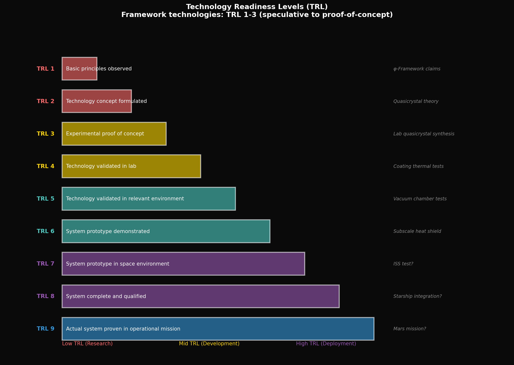
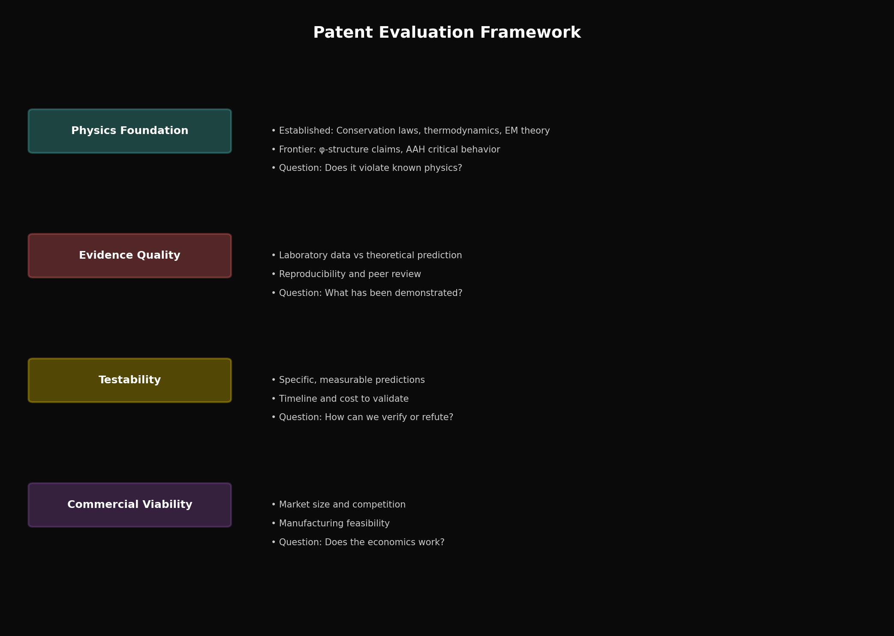

# Year 3, Unit 7: Emerging Technologies
## *Patent Analysis and SpaceX Pitch Format*

**Duration:** 20 Days
**Grade Level:** 12th Grade
**Prerequisites:** Year 1-2, Units 1-6 of Year 3

---

## Anchoring Question

> *SpaceX revolutionized space access through engineering innovation. The Husmann framework proposes new technologies based on φ-structured materials and systems. How do we evaluate frontier technology claims, and how would you pitch a new idea to SpaceX?*

*Technology Readiness Levels: From concept to flight-proven*

*Patent evaluation framework: Claims, evidence, and testability*

---

## Learning Objectives

By the end of this unit, you will be able to:
1. Read and analyze patent documents
2. Distinguish established physics from speculative claims
3. Identify testable predictions
4. Evaluate commercialization potential
5. Present technical ideas in professional format

---

## Day 1-2: Patent Analysis Framework

### Anatomy of a Patent

1. **Title:** Brief descriptive name
2. **Abstract:** One-paragraph summary
3. **Background:** Prior art and problem being solved
4. **Summary:** Core innovation
5. **Detailed Description:** Complete specification
6. **Claims:** Legal scope of protection

### Reading Patents Critically

**Established physics:** What's already known and accepted?
**Novel claim:** What's new?
**Evidence provided:** What supports the claim?
**Testable predictions:** How could it be verified?
**Red flags:** Overly broad claims, perpetual motion hints, missing mechanisms

---

## Day 3-4: The Husmann Patent Portfolio

### Overview of Filed Patents

| Patent | Title | Core Claim |
|--------|-------|------------|
| 63/995,401 | Quasicrystalline Coating | φ-structured heat shield |
| 63/995,513 | QC Thermoelectric Sensing | φ-based sensors |
| 63/995,735 | Parametric Cascade Propulsion | φ-staged engines |
| 63/995,816 | Monopole Gravitational Conductor | Novel propulsion concept |
| 63/996,045 | Breathing Universe Cycle | Cosmological framework |
| 63/996,533 | AAH-Based Navigation | Quantum navigation |

### Analysis Rubric

For each patent, identify:
1. **The problem it solves**
2. **The physics foundation** (established vs. speculative)
3. **The key innovation**
4. **Required evidence for validation**
5. **Commercial viability**

---

## Day 5-8: Deep Dive — Quasicrystalline Coating

### Patent 63/995,401 Analysis

**Problem:** Heat shield degradation during reentry
- Starship tiles chip, crack, spall
- Ablative shields are single-use
- Thermal shock causes failure along crystal planes

**Established Physics:**
- Quasicrystals exist (Nobel Prize 2011)
- They lack periodic planes (no preferred crack paths)
- Golden angle (137.5°) provides optimal packing
- Penrose tilings are self-similar at all scales

**Novel Claim:**
- Deliberate quasicrystalline deposition improves heat shield performance
- Golden-angle helical architecture prevents crack propagation
- Self-similar structure distributes thermal stress across scales

**Required Evidence:**
1. Laboratory comparison: QC vs. crystalline coatings
2. Measured thermal conductivity difference
3. Fracture toughness testing
4. Simulated reentry conditions
5. Atomic oxygen erosion resistance

**Commercial Viability:**
- If validated: Huge market (every reentry vehicle)
- Manufacturing challenge: Controlled QC deposition at scale
- IP value: Composition of matter patent (strongest)

### Student Assignment

Write a 1-page "Investor Brief" summarizing:
- The opportunity
- The technology
- The evidence needed
- The risk assessment

---

## Day 9-12: Deep Dive — Parametric Cascade

### Patent 63/995,735 Analysis

**Problem:** Combustion instability and pogo oscillations
- Resonance between engine, structure, and propellant
- Can destroy rockets (Apollo 6 near-failure)
- Requires complex suppression systems

**Established Physics:**
- Resonance occurs when driving frequency matches natural frequency
- Quasiperiodic forcing reduces resonance buildup
- Fibonacci sequences avoid integer ratios
- φ-spacing is maximally incommensurate

**Novel Claim:**
- Engine chambers sized in φ ratios
- Ignition timing follows Fibonacci sequence
- Thrust attachment points at φ-scaled positions
- System resists pogo-like instabilities

**Required Evidence:**
1. Vibration analysis: φ vs. regular spacing
2. Scale model testing
3. Computational fluid dynamics with φ-timing
4. Structural finite element analysis
5. Comparison to conventional pogo suppressors

**Technical Skepticism:**
- Why would φ-spacing be better than other irrational ratios?
- Manufacturing precision requirements?
- Weight penalty for multiple chamber sizes?

---

## Day 13-14: The SpaceX Pitch Format

### How SpaceX Evaluates Ideas

From public talks and employee interviews:

1. **First Principles:** Does it violate physics? If yes, reject.
2. **10× Improvement:** Is it transformative, not incremental?
3. **Testable:** Can we verify it quickly and cheaply?
4. **Scalable:** Does it work at production scale?
5. **Economic:** Does the math work financially?

### Pitch Structure (5 minutes)

**Slide 1: The Problem (30 sec)**
- One sentence problem statement
- Quantify the impact

**Slide 2: Current Solutions (30 sec)**
- What exists today
- Why it's inadequate

**Slide 3: Your Innovation (60 sec)**
- Core technical concept
- Key differentiator

**Slide 4: Evidence (60 sec)**
- What you've demonstrated
- What needs validation

**Slide 5: Path Forward (60 sec)**
- Test plan
- Timeline
- Resources needed

**Slide 6: Why SpaceX (30 sec)**
- Specific application
- Alignment with SpaceX goals

---

## Day 15-16: Technology Evaluation Exercise

### In-Class Analysis

Students work in teams to evaluate one patent:

**Team 1:** QC Coating (63/995,401)
**Team 2:** QC Thermoelectric (63/995,513)
**Team 3:** Parametric Cascade (63/995,735)
**Team 4:** Monopole Conductor (63/995,816)

### Evaluation Criteria

| Criterion | Weight | Description |
|-----------|--------|-------------|
| Physics validity | 30% | Does it violate known physics? |
| Evidence quality | 25% | What support exists? |
| Testability | 20% | How easy to verify? |
| Impact potential | 15% | How transformative if true? |
| Implementation path | 10% | How to build it? |

### Team Presentations

Each team presents:
1. 5-minute summary
2. Evidence assessment
3. Recommended next steps
4. Personal probability estimate

---

## Day 17-18: Writing Your Own Patent Concept

### Assignment

Identify a problem in space exploration and propose a solution inspired by φ-mathematics or quasicrystal concepts.

**Not required:** That it actually work (this is practice)
**Required:**
- Clear problem statement
- Physics-based solution
- Testable predictions
- Honest assessment of uncertainties

### Format (2,000 words)

1. **Title**
2. **Abstract** (200 words)
3. **Background** (400 words)
4. **Summary of Innovation** (300 words)
5. **Detailed Description** (600 words)
6. **Claims** (3-5 specific claims)
7. **Critical Self-Assessment** (500 words)

---

## Day 19-20: Final Presentations

### Pitch Day

Each student delivers a 5-minute pitch of their patent concept.

**Judging criteria:**
- Technical clarity
- Evidence awareness
- Honest uncertainty acknowledgment
- Presentation quality

### Reflection Questions

1. What did you learn about evaluating frontier claims?
2. How do you now think about the difference between speculation and science?
3. What role should φ-mathematics play in engineering?

---

## Unit Summary

### Key Lessons

1. **Patents are claims, not proofs**
2. **Distinguish established from speculative physics**
3. **Demand testable predictions**
4. **Evaluate commercial viability separately from scientific validity**
5. **Present ideas clearly and honestly**

### Framework Assessment

The Husmann patents represent:
- Creative application of quasicrystal physics
- Interesting mathematical relationships
- Testable engineering claims
- Speculative cosmological extensions

**Your job:** Evaluate rigorously, not dismiss or accept uncritically.

---

## Problem Sets

### Tier 1: Foundation (Must Do)

1. Define: prior art, claims, specification, provisional patent.

2. For Patent 63/995,401 (QC Coating), list three established physics principles and three speculative claims.

3. Design a simple experiment to test whether φ-spacing reduces vibration coupling compared to regular spacing.

### Tier 2: Application (Should Do)

4. Compare the evidence requirements for a pharmaceutical patent vs. a mechanical device patent. Why might physics-based patents be harder to evaluate?

5. Write a one-page "patent rejection" memo for one of the Husmann patents, explaining why the evidence is insufficient (even if you personally find it plausible).

### Tier 3: Challenge (Want to Try?)

6. **Counter-Patent:** Design a competing technology that solves the same problem as one Husmann patent but uses different (non-φ) approaches. Compare the approaches fairly.

7. **SpaceX Integration:** Write a detailed proposal for how SpaceX could test one Husmann patent claim using existing Starship test flights. Include timeline, measurements, and success criteria.

---

## Resources

### Patent Databases
- USPTO Patent Full-Text Database
- Google Patents
- Espacenet

### SpaceX Technical
- Starship User's Guide
- Raptor engine documentation (public)
- SpaceX update presentations

---

*© 2026 Thomas A. Husmann / iBuilt LTD. All rights reserved.*
*Licensed under CC BY-NC-SA 4.0 for academic and research use.*
