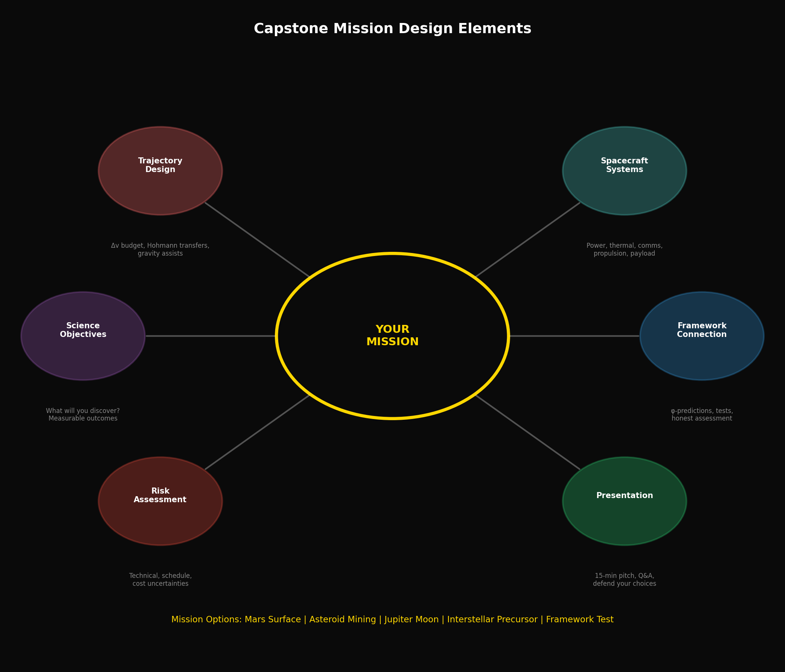
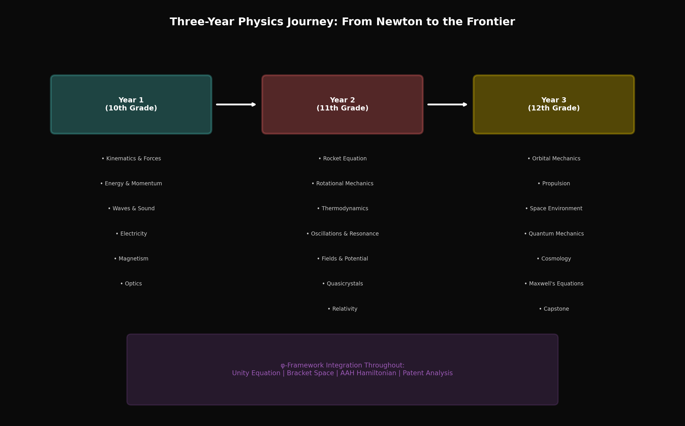

# Year 3, Unit 8: Capstone Project
## *Design Your Mission to the Frontier*

**Duration:** 20 Days
**Grade Level:** 12th Grade
**Prerequisites:** All Year 1-3 Units

---

## Anchoring Question

> *You have spent three years learning physics — from Newton's laws to quantum mechanics, from Kepler's orbits to the φ-framework. Now it's your turn. Design a mission that integrates everything you've learned. Where will you go, and what will you discover?*


*Capstone project elements: Science, engineering, and integration*


*Three-year curriculum summary: From fundamentals to frontier*

---

## Learning Objectives

By the end of this unit, you will be able to:
1. Synthesize three years of physics into a coherent project
2. Design a complete space mission with realistic parameters
3. Present technical work professionally
4. Defend design choices under questioning
5. Reflect on the frontier between known and unknown physics

---

## Project Overview

### The Challenge

Design a complete space mission that includes:
1. **Scientific objective** (what are you investigating?)
2. **Mission architecture** (how do you get there?)
3. **Spacecraft design** (what do you build?)
4. **Physics integration** (which concepts from this curriculum apply?)
5. **Framework connection** (how does the φ-framework relate, if at all?)

### Mission Options

Choose ONE:

**Option A: Mars Surface Science Mission**
- Design a crewed or robotic mission to Mars surface
- Include Δv budget, radiation protection, landing system
- Propose a scientific investigation (geology, biology search, etc.)

**Option B: Asteroid Mining Mission**
- Design a mission to a near-Earth asteroid
- Include trajectory, capture/landing, resource extraction
- Calculate economic viability

**Option C: Jupiter Moon Explorer**
- Design an orbiter or lander for Europa, Ganymede, or Enceladus
- Include radiation shielding, power systems, communication
- Propose subsurface ocean investigation

**Option D: Interstellar Precursor**
- Design a mission to the outer solar system (100+ AU)
- Include propulsion trades, power for deep space
- Propose observations at the heliopause

**Option E: Framework Test Mission**
- Design a mission specifically to test φ-framework predictions
- Include measurable quantities, statistical analysis plan
- Propose what you would conclude from various outcomes

---

## Day 1-2: Project Selection and Scoping

### Selection Criteria

Choose based on:
- Your interests
- Available resources
- Complexity level you're comfortable with
- Team composition (if working in groups)

### Scoping Exercise

For your chosen mission:
1. What's the primary scientific question?
2. What's the minimum viable mission?
3. What would make it exceptional?
4. What are the hardest technical challenges?

### Project Proposal (Due Day 2)

One-page document:
- Mission name
- One-sentence objective
- Three key technical challenges
- Preliminary timeline

---

## Day 3-5: Mission Architecture

### Trajectory Design

For all missions:
- Calculate required Δv
- Design trajectory (Hohmann, gravity assist, etc.)
- Estimate transit time
- Consider launch windows

### Example: Mars Mission

```python
import numpy as np

# Constants
mu_sun = 1.327e20  # m³/s²
r_earth = 1.496e11  # m
r_mars = 2.279e11   # m

# Hohmann transfer
a_transfer = (r_earth + r_mars) / 2
v_earth = np.sqrt(mu_sun / r_earth)
v_perihelion = np.sqrt(mu_sun * (2/r_earth - 1/a_transfer))
delta_v1 = v_perihelion - v_earth

print(f"Earth departure Δv: {delta_v1/1000:.2f} km/s")

# Transfer time
T_transfer = np.pi * np.sqrt(a_transfer**3 / mu_sun)
print(f"Transfer time: {T_transfer / (24*3600):.0f} days")
```

### Architecture Trades

Document your decisions:
- Direct vs. gravity assist
- Chemical vs. nuclear vs. electric propulsion
- Crewed vs. robotic
- Single vs. multiple spacecraft

---

## Day 6-8: Spacecraft Design

### Subsystems to Address

1. **Structure:** Mass, configuration, materials
2. **Power:** Solar, RTG, nuclear
3. **Propulsion:** Main engine, RCS
4. **Thermal:** Active/passive, heat rejection
5. **Communications:** Data rate, latency
6. **Payload:** Instruments, capabilities
7. **Life support:** (if crewed)

### Mass Budget Example

| Subsystem | Mass (kg) | Notes |
|-----------|-----------|-------|
| Structure | 500 | 15% of dry mass |
| Power | 200 | Solar arrays + batteries |
| Propulsion | 150 | Engine + RCS |
| Thermal | 100 | Radiators + MLI |
| Communications | 50 | HGA + transponders |
| Payload | 300 | Instruments |
| Margin | 200 | 20% contingency |
| **Dry Mass** | **1500** | |
| Propellant | 3000 | For Δv budget |
| **Wet Mass** | **4500** | |

### Design Reviews

Informal peer reviews on Day 8:
- Present current design
- Receive feedback
- Identify gaps

---

## Day 9-11: Physics Integration

### Curriculum Connection Document

List how each curriculum element applies to your mission:

**Year 1 Physics:**
- Kinematics: [How used in mission]
- Newton's Laws: [How used]
- Energy: [How used]
- Waves: [How used]
- Electricity: [How used]
- Magnetism: [How used]
- Optics: [How used]

**Year 2 Physics:**
- Advanced Kinematics: [How used]
- Rotational Mechanics: [How used]
- Thermodynamics: [How used]
- Oscillations: [How used]
- Electric Fields: [How used]
- AC/EM Waves: [How used]
- Quasicrystals: [How used]
- Relativity: [How used]

**Year 3 Physics:**
- Orbital Mechanics: [How used]
- Propulsion: [How used]
- Space Environment: [How used]
- Quantum Mechanics: [How used]
- Cosmology: [How used]
- Maxwell's Equations: [How used]
- Technology Evaluation: [How used]

---

## Day 12-14: Framework Integration

### The φ-Connection (Optional but Encouraged)

How might the Husmann framework relate to your mission?

**Possible connections:**
1. **Materials:** Quasicrystalline coatings for heat shields
2. **Structures:** φ-ratio structural elements
3. **Propulsion:** Parametric cascade concepts
4. **Navigation:** AAH-based positioning
5. **Cosmology:** Testing dark matter/energy predictions
6. **Fine structure:** Precision measurements of α

### Critical Assessment

For any framework connection:
1. What's the established physics foundation?
2. What's the speculative extension?
3. What would you measure?
4. What result would support/refute the framework?

### Intellectual Honesty

You're not required to believe the framework works.

You ARE required to:
- Understand it well enough to evaluate it
- Propose specific tests
- Accept the result either way

---

## Day 15-17: Documentation

### Final Report Requirements

**Length:** 4,000-5,000 words + figures

**Sections:**
1. **Executive Summary** (300 words)
2. **Mission Objectives** (400 words)
3. **Architecture Overview** (500 words)
4. **Trajectory Analysis** (600 words + calculations)
5. **Spacecraft Design** (800 words + diagrams)
6. **Physics Integration** (600 words)
7. **Framework Analysis** (500 words)
8. **Risk Assessment** (400 words)
9. **Conclusions** (400 words)
10. **Appendices** (calculations, code, detailed budgets)

### Figures Required

- Mission trajectory diagram
- Spacecraft configuration drawing
- Δv budget table
- Mass budget table
- Power budget (if applicable)
- At least one original simulation output

---

## Day 18-19: Presentations

### Presentation Format

**15 minutes per student/team:**
- 10 minutes presentation
- 5 minutes Q&A

### Slide Structure (10-12 slides)

1. Title and mission patch
2. The Big Picture — why this mission?
3. Scientific objectives
4. Mission architecture
5. Trajectory details
6. Spacecraft overview
7. Key technical challenges and solutions
8. Physics integration highlights
9. Framework connection (if applicable)
10. Risk and uncertainty
11. Conclusion and next steps
12. Backup slides for Q&A

### Evaluation Criteria

| Criterion | Weight |
|-----------|--------|
| Technical accuracy | 25% |
| Physics integration | 25% |
| Creativity and ambition | 15% |
| Realistic assessment | 15% |
| Presentation quality | 10% |
| Response to questions | 10% |

---

## Day 20: Reflection and Closing

### Three-Year Reflection Paper

**500 words:** Respond to these questions:

1. What physics concept from this curriculum was most surprising or paradigm-shifting?

2. How has your thinking about "frontier science" changed? Do you view speculative frameworks differently?

3. If you could advise your Day 1 (Year 1) self, what would you say?

4. What question do you most want to see answered in your lifetime?

### Course Closing

> *"The frontier is open. You've been given maps to known territory and hints about what might lie beyond. The next discoveries will be made by people who learned to think precisely, question carefully, and explore boldly. That's you."*

---

## Assessment Rubric

### Final Report (40% of unit grade)

| Component | Excellent (A) | Good (B) | Adequate (C) | Needs Work (D) |
|-----------|---------------|----------|--------------|----------------|
| Technical accuracy | All calculations correct, realistic parameters | Minor errors, mostly realistic | Some significant errors | Major conceptual errors |
| Physics integration | All curriculum areas connected meaningfully | Most areas connected | Some connections made | Minimal integration |
| Framework analysis | Thoughtful, specific, honest assessment | Good analysis with minor gaps | Basic analysis | Superficial treatment |
| Documentation | Clear, professional, complete | Clear with minor gaps | Adequate but incomplete | Unclear or missing sections |

### Presentation (30% of unit grade)

| Component | Excellent (A) | Good (B) | Adequate (C) | Needs Work (D) |
|-----------|---------------|----------|--------------|----------------|
| Content | Comprehensive, accurate, insightful | Good coverage with minor gaps | Adequate coverage | Missing key elements |
| Delivery | Confident, clear, engaging | Clear with minor issues | Adequate delivery | Difficult to follow |
| Q&A | Handles questions expertly | Good responses | Adequate responses | Struggles with questions |

### Reflection (15% of unit grade)

| Component | Excellent (A) | Good (B) | Adequate (C) | Needs Work (D) |
|-----------|---------------|----------|--------------|----------------|
| Depth | Thoughtful, personal, specific | Good reflection | Adequate reflection | Superficial |
| Growth evidence | Clear intellectual growth | Some growth evident | Limited growth shown | No growth shown |

### Participation (15% of unit grade)

| Component | Excellent (A) | Good (B) | Adequate (C) | Needs Work (D) |
|-----------|---------------|----------|--------------|----------------|
| Design reviews | Active, helpful, constructive | Good participation | Adequate participation | Minimal participation |
| Peer feedback | Thoughtful feedback given/received | Good feedback | Adequate feedback | Limited engagement |

---

## Sample Mission: Teegarden's Star Explorer

### Example Project Outline

**Objective:** Send a probe to Teegarden's Star (12.5 light-years) to investigate its potentially habitable planets.

**Key Challenges:**
1. Propulsion: Need ~0.1c velocity (requires breakthrough propulsion)
2. Communication: Signal at 12.5 ly takes 12.5 years
3. Power: Solar doesn't work; nuclear decay for centuries
4. Navigation: Interstellar medium navigation

**Framework Connection:**
- Could test if fine structure constant varies over parsec scales
- Measure vacuum properties at different bracket positions
- Compare observations to AAH predictions

**Physics Integration:**
- Relativity: Time dilation at 0.1c
- Propulsion: Beyond chemical (laser sail? antimatter?)
- Radiation: Interstellar medium shielding
- Communication: Relativistic Doppler corrections

---

## Resources

### NASA Mission Design
- JPL Mission Design Handbook
- NASA Systems Engineering Handbook

### SpaceX Technical
- Starship User's Guide
- Starlink system documentation

### Framework Materials
- All course theory documents
- Patent portfolio analysis from Unit 7

---

*Congratulations on completing the Husmann Physics Curriculum.*

*"We stand at the edge of what we know. The universe doesn't care about our theories — it just is. Our job is to find out what that 'is' actually means."*

---

*© 2026 Thomas A. Husmann / iBuilt LTD. All rights reserved.*
*Licensed under CC BY-NC-SA 4.0 for academic and research use.*
