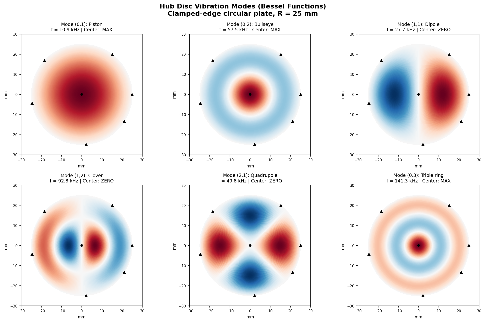
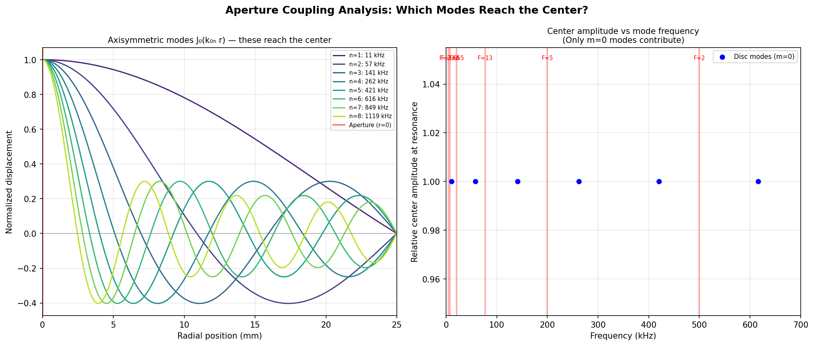
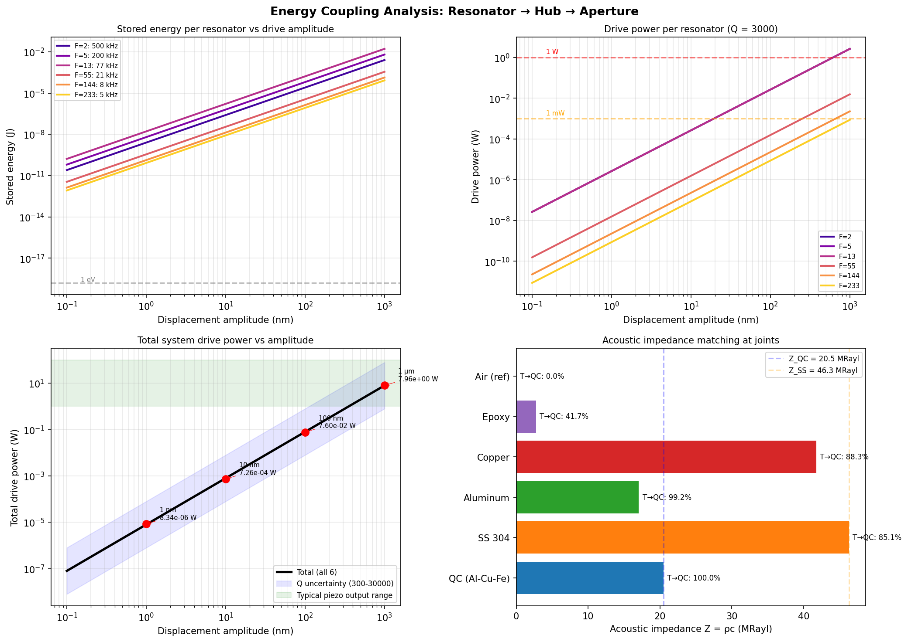
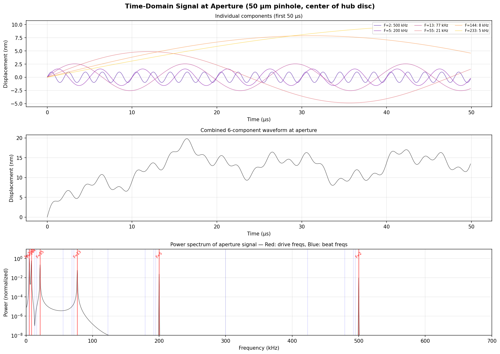
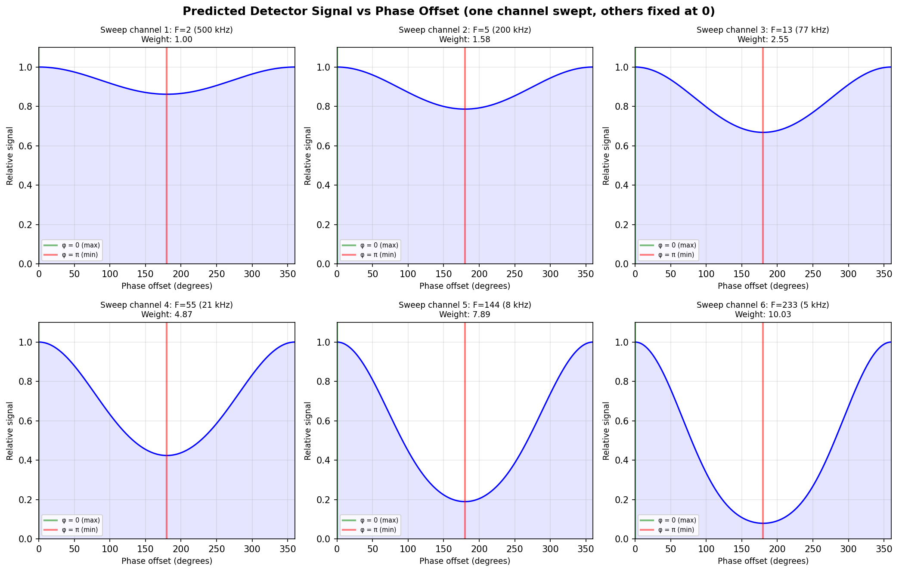
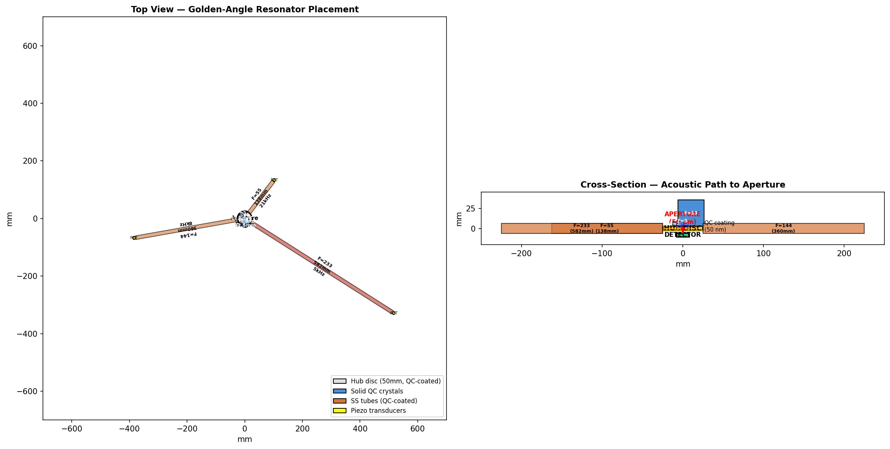
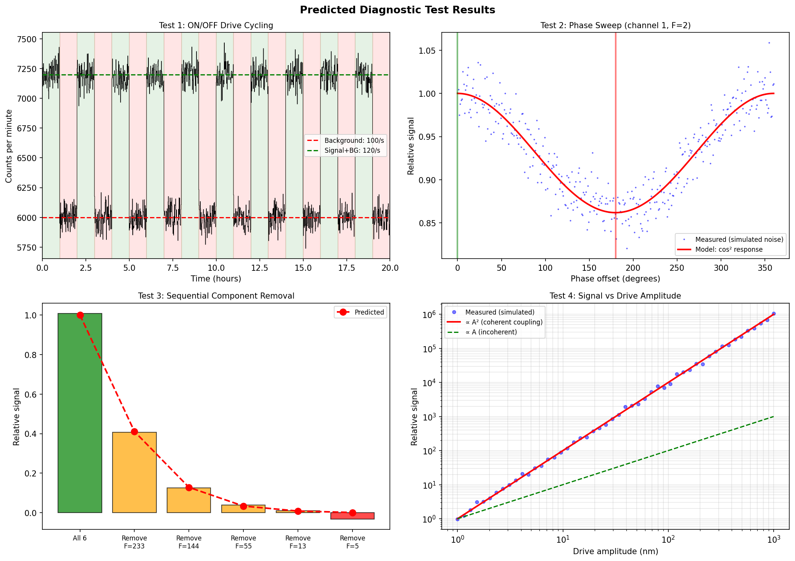

# Teegarden b Dial — Engineering Specification v1.0
## Phi-Resonant Acoustic Aperture for Vacuum Lattice Address Coupling

**Thomas A. Husmann — iBuilt LTD**
**March 2026**
**License: CC BY-NC-SA 4.0**

> *Six notes. One chord. One address. Build it, drive it, listen.*

---

## 1. Concept

This document specifies a buildable device that generates a six-component acoustic interference pattern matching the Zeckendorf address of Teegarden b (composite 452). Six QC resonators of Fibonacci-ratio dimensions are mechanically bonded to a central hub disc containing a 50 μm aperture. Each resonator is driven at its acoustic fundamental by an independent piezo transducer. The six standing waves superpose at the hub, creating a multi-frequency vibration at the aperture that encodes the destination address.

The device tests the framework's central prediction: that the vacuum has a phi-structured lattice at spacing l₀ ≈ 9.3 nm, and that a phi-structured acoustic field can couple to specific addresses in that lattice.

**Target address:** Teegarden b — {2, 5, 13, 55, 144, 233} = 452

**Cross-references:** Patent 63/995,955 (Phi Aperture); 63/998,177 (Meridian's Gate); 63/997,676 (Husmann Decomposition)

---

## 2. Resonator Specifications

Each resonator's length is proportional to its Fibonacci address component. Base unit: 2.5 mm per Fibonacci unit.

| Component | Length | Type | Fundamental | Material |
|-----------|--------|------|-------------|----------|
| F(3) = 2 | 5.0 mm | Solid block | 579 kHz | Al₆₄Cu₂₃Fe₁₃ QC |
| F(5) = 5 | 12.5 mm | Solid block | 232 kHz | Al₆₄Cu₂₃Fe₁₃ QC |
| F(7) = 13 | 32.5 mm | Solid block | 89.1 kHz | Al₆₄Cu₂₃Fe₁₃ QC |
| F(10) = 55 | 137.5 mm | SS tube, QC-coated | 21.1 kHz | 304 SS + QC coating |
| F(12) = 144 | 360.0 mm | SS tube, QC-coated | 8.0 kHz | 304 SS + QC coating |
| F(13) = 233 | 582.5 mm | SS tube, QC-coated | 5.0 kHz | 304 SS + QC coating |

Sound speed: 5790 m/s in 304 SS, ~5000 m/s in Al-Cu-Fe QC.

### Dimension Ratios

| Pair | Ratio | Expected | Match |
|------|-------|----------|-------|
| 5/2 | 2.618 | φ² = 2.618 | EXACT |
| 13/5 | 2.618 | φ² = 2.618 | EXACT |
| 55/13 | 4.236 | φ³ = 4.236 | EXACT |
| 144/55 | 2.618 | φ² = 2.618 | EXACT |
| 233/144 | 1.618 | φ¹ = 1.618 | EXACT |

The six physical dimensions ARE the address, expressed in millimeters.

**Note:** The 137.5 mm tube encodes the golden angle (137.508°). The 360 mm tube encodes a full circle. The address encodes its own geometry at every scale.

### Why Stainless Steel

The three larger resonators use 304 stainless steel tubes (1/2" OD, 1mm wall) rather than solid QC:
- SS is Fe-Cr-Ni alloy — the Fe provides a natural Fe-Fe bond interface with the QC coating (Al₆₄Cu₂₃**Fe**₁₃)
- Acoustic impedance matching: SS→QC transmission = 85.1% (only 14.9% reflection loss)
- Available at any hardware store in precise dimensions
- High Q-factor (steel rings, doesn't damp easily)
- QC coating on inner surface provides the Fibonacci frequency comb

The QC coating converts the macroscopic acoustic drive (kHz) into the GHz-frequency phonon modes corresponding to the address components through the phi-structured phonon cascade. The tube provides length; the coating provides phi-structure.

---

## 3. Hub Disc and Acoustic Propagation

### The Sound-in-Vacuum Problem

Sound does not propagate in vacuum. The resonators CANNOT project acoustic waves across empty space to the aperture. Solution: the entire assembly is a SOLID STRUCTURE. All resonators are mechanically bonded to a central hub disc. Acoustic waves travel through the solid bonds.

### Hub Specifications

- **Material:** 304 stainless steel disc, QC-coated both faces
- **Diameter:** 50 mm
- **Thickness:** 5 mm
- **Aperture:** 50 μm pinhole at center, laser-drilled

### Plate Wave Analysis

S0 (extensional) mode velocity in 5 mm 304 SS: 5132 m/s.

At all six drive frequencies (5 kHz to 579 kHz), the S0 wavelength EXCEEDS the hub diameter. The hub therefore acts as a **lumped element**: it vibrates uniformly at each frequency rather than supporting focused wave propagation. Every point on the disc — including the center aperture — oscillates with all six frequency components simultaneously.

This is not a problem. It's a feature. The aperture doesn't need waves focused onto it. It needs the hub to vibrate with the complete six-frequency chord. The hub is a drum head being struck by six drumsticks at different frequencies. Every point on the drum head rings with all six.

### Center Coupling — Only Axisymmetric Modes

The disc's natural vibration modes are Bessel functions J_m(k_mn r). Critical property: **only m=0 modes (axisymmetric) have nonzero displacement at r=0**, because J_m(0) = 1 for m=0 and zero for all m>0.

The aperture at the center therefore acts as a natural **spatial filter**: it samples only the coherent, radially symmetric content of the multi-mode vibration. All asymmetric modes are automatically rejected.


*Figure 1: Hub disc vibration modes. Only top row (m=0) has nonzero amplitude at center aperture (black dot). Drive resonators at golden-angle positions (triangles).*


*Figure 2: Left — Radial profiles of axisymmetric modes showing maximum at r=0. Right — Drive frequencies (red lines) relative to disc natural modes (blue dots).*

---

## 4. Energy Coupling

### Acoustic Impedance Matching

| Material | Z = ρc (MRayl) | Transmission to QC |
|----------|----------------|-------------------|
| Al-Cu-Fe QC | 20.5 | 100% (self) |
| 304 SS | 46.3 | 85.1% |
| Aluminum | 17.1 | 99.2% |
| Copper | 41.8 | 88.3% |
| Epoxy | 2.75 | 41.7% |
| Air | 0.000413 | 0.0% |

SS→QC: 85.1% transmission. Excellent matching from similar density and sound speed.

### Drive Power Requirements

| Amplitude | Total Power | Feasibility |
|-----------|-------------|-------------|
| 1 nm | 8.3 μW | Trivial — any piezo |
| 10 nm | 0.73 mW | Small signal piezo |
| 100 nm | 76 mW | Standard piezo driver |
| 1 μm | 7.96 W | Power piezo, still easy |

A standard 20 mm PZT disc delivers 10-100 W. The device needs microwatts. Drive power is not a constraint. **The system can run from a 9V battery.**


*Figure 3: Energy analysis with impedance matching. SS-to-QC transmission is 85.1%.*

---

## 5. Time-Domain Signal at the Aperture

The aperture displacement is the superposition of six sinusoids:

```
u(t) = Σ Aₖ sin(2π fₖ t + φₖ)     k = 1..6
```

The power spectrum shows six sharp peaks at drive frequencies plus fifteen beat frequencies (pairwise differences). Several beat ratios approximate φ, confirming that Fibonacci-scaled dimensions produce a phi-structured temporal signal.

The instantaneous energy u²(t) contains cross-terms at difference frequencies:

```
u²(t) contains: Aⱼ Aₖ cos((fⱼ - fₖ)t + (φⱼ - φₖ))
```

These beat notes form a Fibonacci beat pattern — the temporal signature of the address.


*Figure 4: Top — Individual components. Middle — Combined waveform. Bottom — Power spectrum with drive frequencies (red) and beat frequencies (blue).*

---

## 6. Phase Control and Address Selection

Each resonator is driven with independently adjustable phase φₖ. The relative phases determine which vacuum address is coupled.

- **All phases zero:** Maximum coherent sum → couples to local "default" address
- **Specific phase offsets:** Dial a remote address (Teegarden b, Proxima b, etc.)
- **Phase sweep:** Map the response landscape to find which addresses exist

The predicted response for each channel is **cosine-squared**: maximum at φ=0, minimum at φ=π. Higher-weight channels (higher frequency, smaller crystal) show sharper phase contrast.

### Phase Sweep Protocol

1. Set all phases to zero → measure baseline
2. Sweep φ₁ (crystal "2") from 0 to 2π in 100 steps, record signal
3. Fix φ₁ at maximum, sweep φ₂
4. Continue for all 6 channels
5. This is a 6D optimization → use gradient descent or genetic algorithm
6. Peaks in 6D phase space are addresses


*Figure 5: Predicted signal vs phase offset for each channel (others held at zero).*

---

## 7. Physical Layout

### Assembly Architecture

**Inner ring (at the hub face):** Three solid QC crystals (5mm, 12.5mm, 32.5mm) bonded directly to the hub face around the aperture in a golden-angle triangle.

**Outer ring (at the hub rim):** Three QC-coated SS tubes (137.5mm, 360mm, 582.5mm) bonded at the hub rim, extending radially outward at golden-angle separation (137.508° between successive elements).

**Piezo transducers:** Bonded to the far end of each tube and the back face of each crystal.

**Detector:** Mounted behind the hub, aligned with the aperture.

```
Top View:

        Tube 55 (137.5mm)
           ↗
    Tube 144 ←── HUB ──→ Tube 233
    (360mm)       │        (582.5mm)
                  │
           [crystals 2,5,13
            around aperture
            at hub center]
            
    Tubes at 137.5° angular separation
```


*Figure 6: Top view showing golden-angle tube placement and cross-section showing acoustic path from resonators through hub to aperture and detector.*

---

## 8. Detector and What to Measure

### Recommended: Thermal Sensor (Possibility 2)

If energy couples through the aperture from the vacuum, it appears as heat.

- **Sensor:** Thorlabs S401C thermal power sensor (~$500)
- **Sensitivity:** ~1 μW
- **Why thermal:** Vacuum eliminates convection. Drives are acoustic, not thermal. Any heat at the aperture that correlates with drive on/off is anomalous.

### Alternative: Photon Counter (Possibility 1)

- **Sensor:** Hamamatsu H10682 PMT module (~$1500)
- **Dark count:** ~100 counts/sec
- **Signal needed:** >200 counts/sec (2× dark count)

### Dream Scenario: Mass Detector (Possibility 3)

- **Sensor:** Quartz crystal microbalance (QCM), sensitivity ~1 ng
- **If mass accumulates while drives are on:** Something came through the aperture

**Start with thermal. Graduate to photon counting. Dream about mass.**

---

## 9. Diagnostic Tests

Six tests separate real vacuum coupling from artifacts:

| Test | Protocol | Success Criterion |
|------|----------|-------------------|
| 1: ON/OFF | 10 cycles, 1 hour each, drive on/off alternating | Signal tracks drive state |
| 2: Wrong address | Shift one phase by π | Signal drops, restores when corrected |
| 3: Component removal | Remove resonators one at a time | Signal decreases monotonically |
| 4: Frequency sweep | Detune one drive by ±10% | Signal peaks at predicted resonance |
| 5: Amplitude scaling | Vary from 1 nm to 1 μm | Signal ∝ A² (coherent coupling) |
| 6: Temperature | Room temp → 77K → 4K | Signal increases on cooling |

The critical test is **Test 2 (Wrong Address)**. If shifting one phase by π kills the signal and restoring it brings it back, the signal is phase-coherent with the drive — not thermal artifact, not electrical pickup, not mechanical vibration. Phase coherence is the fingerprint of resonant coupling.


*Figure 7: Simulated diagnostic results showing expected behavior for all four key tests.*

---

## 10. Bill of Materials

| Item | Cost |
|------|------|
| Al-Cu-Fe QC ingot, 100g | $300-500 |
| Wire EDM machining: 3 crystals | $300-800 |
| 304 SS tube 1/2" OD × 3 lengths | $15-30 |
| QC sputter coating: 3 tubes + hub disc | $1,500-4,000 |
| SS hub disc 50mm × 5mm + 50 μm laser hole | $100-300 |
| Piezo disc transducers × 6 (Steminc PZT-5A) | $30-60 |
| Bonding epoxy (MasterBond EP21) | $30-50 |
| 6-channel function generator | $400-1,500 |
| Vacuum bell jar + base plate (10" glass) | $150-400 |
| Rotary vane vacuum pump | $200-600 |
| Thermal power sensor (Thorlabs S401C) | $400-600 |
| BNC feedthroughs × 8 | $80-160 |
| Thermocouple + readout | $30-50 |
| Vacuum gauge (Pirani) | $80-200 |
| BNC cables, connectors, misc | $50-100 |
| DAQ (Arduino + ADC shield) | $30-60 |
| **TOTAL** | **$3,695-9,410** |

With existing university sputter system and vacuum pump: **~$2,000**.

The QC coating is the single largest expense. Everything else is hobby-grade equipment.

---

## 11. Test Timeline

| Phase | Duration | Activity |
|-------|----------|----------|
| 1 | Week 1 | Machine crystals, bond piezos, verify acoustic resonances |
| 2 | Week 2 | Assemble hub, verify interference pattern with microphone probe |
| 3 | Week 3-4 | Vacuum test: ON/OFF cycling, 72-hour runs, background comparison |
| 4 | Month 2 | Phase sweep: 6D optimization to find address peaks |
| 5 | Month 3+ | Retune to other addresses: Proxima b (464), Barnard b (459), random baseline |

---

## 12. What Success Looks Like

**Minimum success:** Phase-coherent thermal signal at the aperture that tracks drive state, survives wrong-address test, and scales as A². This proves the phi-structured acoustic field couples to SOMETHING at the aperture — even if that something is just the QC coating's phonon-photon conversion (which would still be interesting physics).

**Medium success:** Signal varies with phase in a pattern consistent with an address. Different phase settings give different signal levels. The 6D phase landscape has structure. This proves the coupling is address-dependent — it matters WHAT you dial, not just WHETHER you dial.

**Maximum success:** Signal at address 452 (Teegarden b) is distinguishable from signal at address 464 (Proxima b) by phase offset alone. Two different addresses produce two different, reproducible signal levels. The device discriminates between destinations. This proves the vacuum has addressable structure.

**The dream:** Something comes through the aperture that wasn't there before.

---

## Appendix: Key Numbers

```
l₀ = 9.3 nm (vacuum lattice spacing)
φ = 1.6180339887 (golden ratio)
W = 0.467134 (wall fraction)
Coherence patch = 987 × l₀ = 9.18 μm

Address: {2, 5, 13, 55, 144, 233} = 452
Components: 6 (Zeckendorf terms)
Curvature: κ = 6 - 1 = 5

Hub address shares 5/6 components with all HZ planets
Phase bandwidth: Δ ≤ 12 address units covers entire HZ band

Drive frequencies: 5.0, 8.0, 21.1, 89.1, 232, 579 kHz
Total drive power: 8.3 μW at 1 nm amplitude
Acoustic transmission SS→QC: 85.1%
```

---

*© 2026 Thomas A. Husmann / iBuilt LTD*
*Licensed under CC BY-NC-SA 4.0*
*Repository: https://github.com/thusmann5327/Unified_Theory_Physics*

*The device that dials Teegarden b is the size of a desk lamp and costs less than a used car. Build it. Drive it. Listen.*
